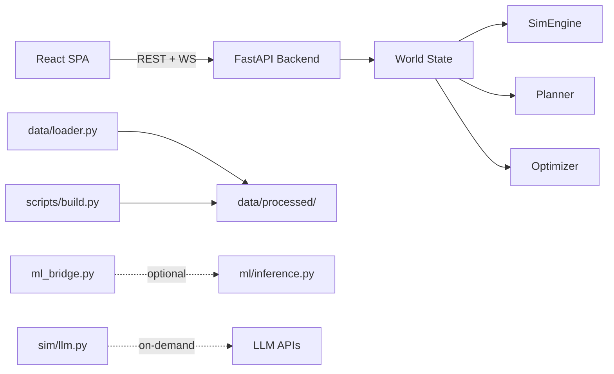
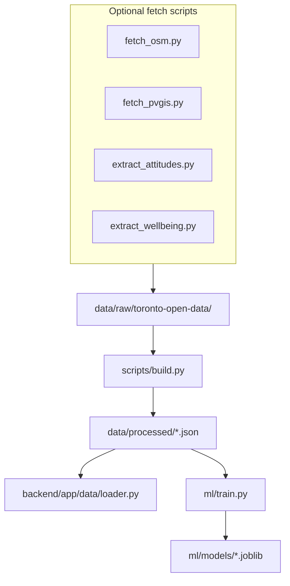

# WattIf — Architecture & System Design

> **Documentation trust order:** Running code → [project_details.md](./project_details.md) → [status_contract.md](./status_contract.md) → audit docs (if present) → this document.

This document describes the technical architecture of WattIf **as implemented today**. For the **target vision** (Supabase, uploads, cohort agents), see [project_plan.md](./project_plan.md).

For a non-technical product overview, see [OVERVIEW.md](./OVERVIEW.md).

For **implementation status labels**, see [status_contract.md](./status_contract.md). For an architecture audit (if present), see [audit/complete_system_architecture.md](./audit/complete_system_architecture.md).

---

## System context

WattIf is a monorepo with a React SPA talking to a FastAPI backend over REST and WebSockets. All simulation state lives in a single in-memory `World` object on the server.



**Design principle:** The simulation tick loop is deterministic and fast. LLM calls and ML inference are optional enrichments on on-demand endpoints — they never block or slow the hot path.

---

## Monorepo layout

| Path | Stack | Role |
|------|-------|------|
| [`frontend/`](../frontend/) | React 19, Vite, TypeScript, Tailwind, deck.gl, MapLibre/Mapbox | Single-page 3D map UI |
| [`backend/`](../backend/) | FastAPI, Python 3.11+, OR-Tools, Pydantic v2 | Simulation, optimizer, planner, REST + WS |
| [`data/processed/`](../data/processed/) | JSON fixtures | 16 processed files loaded at backend boot |
| [`scripts/`](../scripts/) | Python (stdlib + optional fetch scripts) | Reproducible data pipeline |
| [`ml/`](../ml/) | scikit-learn, joblib | Optional demand/adoption/clustering models |
| [`docs/`](./) | Markdown | Project documentation |

There is no committed root README. Code references a `docs/PLAN.md` API contract that may be restored separately; the live contract is shared between [`frontend/src/types.ts`](../frontend/src/types.ts) and [`backend/app/models.py`](../backend/app/models.py).

---

## Frontend architecture

### Structure

The frontend is a **single-page application with no router**. Layout and composition live in [`frontend/src/App.tsx`](../frontend/src/App.tsx):

```
App
├── MapView          (hero — MapLibre/Mapbox + deck.gl layers)
├── TopBar           (brand, live/mock badge, guided demo)
├── LeftDock         (Build | Events | Map layers)
├── RightDock        (Chat | Activity | Voices | Stats | Assets)
├── Timeline         (play / pause / step / reset)
└── Welcome, ScenarioBanner, OverlayLegend, Toasts
```

Key components:

| Component | File | Responsibility |
|-----------|------|----------------|
| MapView | [`components/MapView.tsx`](../frontend/src/components/MapView.tsx) | Map instance, click handlers, layer mounting |
| BuildTab | [`components/BuildTab.tsx`](../frontend/src/components/BuildTab.tsx) | Infra kinds, manual/AI placement modes, optimizer |
| ChatPanel | [`components/ChatPanel.tsx`](../frontend/src/components/ChatPanel.tsx) | AI planner WebSocket chat |
| ScenarioControls | [`components/ScenarioControls.tsx`](../frontend/src/components/ScenarioControls.tsx) | Scenario presets and zone targeting |
| LayersPanel | [`components/LayersPanel.tsx`](../frontend/src/components/LayersPanel.tsx) | Toggle 13+ map overlays |
| Hud | [`components/Hud.tsx`](../frontend/src/components/Hud.tsx) | Recharts metrics dashboard |

Map layers are pure functions in [`frontend/src/map/layers.ts`](../frontend/src/map/layers.ts): zone choropleths (equity, sentiment, demand, flood), 3D GLB infrastructure models, energy-flow arcs, animated agents, facilities, constraints, etc.

### State management

Central state is a **Zustand store** in [`frontend/src/store.ts`](../frontend/src/store.ts):

- World data: zones, agents, infrastructure, metrics, sentiment, flows, voices
- Simulation: tick, playing/paused, speed
- UI: selected zone/infra, active layers, placement mode, chat messages, demo state
- Scenarios: active events, banners

### API client and offline fallback

[`frontend/src/api/client.ts`](../frontend/src/api/client.ts) wraps all backend communication:

- REST calls with a 2.5s timeout
- WebSocket connections for `/ws/sim` (live tick streaming) and `/ws/planner` (chat)
- On any failure → graceful fallback to [`frontend/src/data/mock.ts`](../frontend/src/data/mock.ts)

Default API URL: `http://localhost:8000` (override via `VITE_API_URL` in `.env`).

### Init sequence

On app load, `store.init()`:

1. Fetches `/api/zones` and `/api/agents` (retries, then mock)
2. Seeds infrastructure, resets sim, loads sentiment/flows/voices
3. Loads v3 overlay layers (facilities, flood, constraints, etc.) in background
4. Opens `WS /ws/sim` for live tick events

---

## Backend architecture

### Entry point

[`backend/app/main.py`](../backend/app/main.py) — FastAPI app with CORS, lifespan logging, ~30 REST routes, and two WebSockets.

### Central state: `World`

[`backend/app/state.py`](../backend/app/state.py) holds a process-wide singleton via `get_world()`:

```
World
├── zones, agents          (from load_world())
├── engine: SimEngine      (tick simulation)
├── active_scenarios       (injected events)
└── session helpers        (place/remove infra, reset, sentiment, voices, flows)
```

Boot sequence:

1. `load_world()` reads `data/processed/zones.json` + `agents.json`, or falls back to [`data/seed.py`](../backend/app/data/seed.py)
2. Apply per-zone archetype mix from `archetypes.json` when present
3. Construct `SimEngine(zones, agents)`

### Simulation engine

[`backend/app/sim/engine.py`](../backend/app/sim/engine.py) — **1 tick = 1 simulated month**.

Each tick orchestrates:

| Module | File | Role |
|--------|------|------|
| Agent adoption | [`sim/agents.py`](../backend/app/sim/agents.py) | Vectorized rooftop solar adoption by income, zone potential, nearby infra |
| Sentiment | [`sim/sentiment.py`](../backend/app/sim/sentiment.py) | Per-agent opinion drift toward scenario/placement targets |
| Voices | [`sim/voices.py`](../backend/app/sim/voices.py) | Rule-templated opinion posts (large template library) |
| Flows | `engine.py` | Power flow arcs from infra to zones |
| Metrics | `engine.py` | Coverage, emissions, equity, approval, grid load, cost |

The engine also loads optional constraint/flood/heat/environment/district-energy layers from [`data/loader.py`](../backend/app/data/loader.py) at init.

### Optimizer

[`backend/app/optimizer.py`](../backend/app/optimizer.py):

- Ranks one candidate site per zone by **marginal coverage gain + equity weight − cost**, with constraint and diversity penalties
- `optimize_greedy()` — default path
- `optimize_ortools()` — optional CP-SAT knapsack (falls back to greedy)
- Used by REST `/api/optimize` and the planner's `optimize` tool

### Planner

[`backend/app/planner.py`](../backend/app/planner.py) — agentic tool-calling loop.

**Seven tools** exposed to the LLM (or demo script):

| Tool | Action |
|------|--------|
| `get_city_state` | Zones, equity targets, current infra |
| `get_metrics` | Current SimMetrics |
| `get_budget` | Remaining CAD budget |
| `optimize` | Run siting optimizer |
| `place_infrastructure` | Place solar/wind/battery/microgrid |
| `remove_infrastructure` | Remove a placement |
| `run_simulation` | Fast-forward N ticks |

**Provider paths** (via [`config.py`](../backend/app/config.py)):

1. Anthropic tool-use (`ANTHROPIC_API_KEY`)
2. Feather / OpenAI-compatible function calling (`FEATHER_API_KEY` + `FEATHER_BASE_URL`)
3. **Demo script** (`WATTIF_DEMO_LLM=1`, default) — deterministic, no network, full tool loop
4. **Planner-lite** — bare greedy optimizer when demo is disabled and no keys are set

`PlannerChat` maintains multi-turn conversation state over WebSocket `/ws/planner`, including mid-turn scenario injection.

### Scenarios

[`backend/app/scenarios.py`](../backend/app/scenarios.py) — ~15 deterministic presets (blackout, heatwave, ice storm, gas spike, earthquake, policy incentive, etc.) that mutate engine levers: demand multipliers, zone outages, adoption incentives, agent gathering hints.

Optional ML hook: `ml_bridge.scenario_adoption()` nudges per-archetype sentiment targets during events.

### Data loading

[`backend/app/data/loader.py`](../backend/app/data/loader.py):

| Priority | Source | Result |
|----------|--------|--------|
| 1 | `data/processed/zones.json` + `agents.json` | `source: "processed"` |
| 2 | [`data/seed.py`](../backend/app/data/seed.py) synthetic build | `source: "seed"` |

Additional loaders (facilities, constraints, flood, heat, archetypes, attitudes, etc.) are defensive — return `None` if files are missing.

Paths configured in [`config.py`](../backend/app/config.py): `DATA_PROCESSED_DIR = REPO_ROOT / "data" / "processed"`.

---

## Data pipeline



**Main builder:** [`scripts/build.py`](../scripts/build.py)

- Deterministic seed (1729), 44 curated neighbourhoods, ~4000 agents
- Real inputs: Toronto Open Data boundaries + 2016 Census profiles
- Modelled fields: demand curves, solar/wind potential (fed by real demographics + optional OSM/PVGIS)
- Outputs 16 JSON files to `data/processed/`

**Optional fetch scripts** (run before `build.py` to populate raw caches):

- `scripts/fetch_osm.py` — Overpass API building stats
- `scripts/fetch_pvgis.py` — PVGIS solar yield
- `scripts/extract_attitudes.py` — Toronto Climate Perceptions study
- `scripts/extract_wellbeing.py` — Wellbeing Toronto indicators

---

## ML module (optional)

| File | Role |
|------|------|
| [`ml/train.py`](../ml/train.py) | Train 4 sklearn models from processed + synthetic data |
| [`ml/inference.py`](../ml/inference.py) | Load models, predict with heuristic fallbacks |
| [`ml/features.py`](../ml/features.py) | Shared feature engineering |
| [`backend/app/ml_bridge.py`](../backend/app/ml_bridge.py) | Defensive import wrapper; never breaks boot |

**Models** (saved to `ml/models/*.joblib`):

| Model | Type | Use |
|-------|------|-----|
| `demand_zone` | HistGradientBoostingRegressor | Zone monthly kWh forecast |
| `demand_agent` | HistGradientBoostingRegressor | Agent monthly kWh forecast |
| `adoption` | HistGradientBoostingClassifier | P(adopt solar/EV) |
| `cluster` | StandardScaler + KMeans (k=4) | Equity archetype labels |

**Backend exposure** (all off the sim hot path):

| Bridge function | Endpoint / caller |
|-----------------|-------------------|
| `forecast_demand()` | `GET /api/forecast` |
| `zone_clusters()` | `GET /api/zones/clusters` |
| `scenario_adoption()` | `scenarios.py` during event application |

Train with: `python -m ml.train` from repo root.

---

## LLM integration

Config: [`backend/app/config.py`](../backend/app/config.py). Implementation: [`backend/app/sim/llm.py`](../backend/app/sim/llm.py) + [`backend/app/planner.py`](../backend/app/planner.py).

### Provider priority

| Priority | Provider | Trigger | Network? |
|----------|----------|---------|----------|
| 1 | Anthropic | `ANTHROPIC_API_KEY` set | Yes |
| 2 | Feather | `FEATHER_API_KEY` + `FEATHER_BASE_URL` set | Yes |
| 3 | Demo | `WATTIF_DEMO_LLM=1` (default) | No |
| 4 | None | Demo disabled, no keys | No |

### Where LLMs are used

| Feature | Function | Hot path? | Fallback |
|---------|----------|-----------|----------|
| Agent rationales | `generate_rationales()` → `/api/rationales` | No | Rule-based templates by archetype/income/burden |
| Voice enrichment | `enrich_voices()` → `/api/agents/voices?enrich=true` | No | Unchanged rule-based voice text |
| Planner (auto/step) | `run_planner()` → `/api/planner/run`, WS | No | Demo script or planner-lite |
| Planner chat | `PlannerChat.turn()` → WS `/ws/planner` | No | Demo turn with heuristic intent parsing |

**Critical:** Sim ticks and `/ws/sim` streaming use **rule-based voices only**. LLM calls never run during play/step.

Note: `real_llm_provider()` excludes the demo script. Rationales and voice enrichment use rule-based output whenever only the demo provider is active (no Anthropic/Feather key).

---

## API surface

### REST endpoints

| Group | Routes |
|-------|--------|
| Health | `GET /api/health` |
| World | `GET /api/zones`, `GET /api/agents`, `GET /api/archetypes` |
| Infrastructure | `GET/POST /api/infra`, `DELETE /api/infra/{id}` |
| Simulation | `POST /api/sim/reset`, `POST /api/sim/step`, `GET /api/sim/metrics`, `GET /api/activity` |
| Session | `POST /api/session/reset` |
| Planning | `POST /api/optimize`, `POST /api/planner/run` |
| Scenarios | `POST /api/scenario`, `GET /api/scenarios` |
| Opinion | `GET /api/sentiment`, `GET /api/agents/voices`, `GET /api/rationales` |
| Flows | `GET /api/flows` |
| Map layers | `GET /api/facilities`, `/api/constraints`, `/api/environment`, `/api/district-energy`, `/api/flood`, `/api/heat-vulnerability`, `/api/existing_infra`, `/api/generation-mix`, `/api/sbei` |
| ML (optional) | `GET /api/forecast`, `GET /api/zones/clusters` |

### WebSockets

**`/ws/sim`** — bidirectional simulation stream

| Client → server | Server → client |
|-----------------|-----------------|
| `play`, `pause`, `step`, `reset`, `speed`, `scenario` | `state`, `tick_start`, `tick`, `activity`, `voices`, `tick_complete`, `scenario` |

**`/ws/planner`** — multi-turn agentic chat

| Client → server | Server → client |
|-----------------|-----------------|
| `user_message`, `approve`/`reject`, `scenario`, `stop` | `turn_start`, `thought`, `tool_call`, `tool_result`, `placement`, `awaiting_approval`, `done`, `voices` |

---

## Key data models

Shared contract in [`backend/app/models.py`](../backend/app/models.py) (mirrored in frontend types):

| Model | Key fields |
|-------|------------|
| `Zone` | id, name, polygon, centroid, demographics, demand, solar/wind potential |
| `Demographics` | population, medianIncome, renterPct, energyBurdenIndex |
| `Agent` | zoneId, position, archetype, demandKwh, incomeBracket, hasRooftop, evOwner, solarAdopted |
| `Infra` | id, kind (solar/wind/battery/microgrid), zoneId, position, capacityKw |
| `SimMetrics` | tick, year, demandKwh, supplyKwh, coveragePct, gridLoadPct, emissionsTco2, costCad, equityScore, approvalPct |
| `Scenario` | type, label, description, zoneId, effects, durationTicks |
| `AgentVoice` | agentId, zoneId, archetype, stance, topic, text |
| `Flow` | fromInfraId, toZoneId, powerKw |
| `Recommendation` | kind, zoneId, rationale, score |

---

## Request flow examples

### Place infrastructure

```
POST /api/infra  { kind, zoneId, position }
  → World.place_infra()
  → SimEngine.add_infra() + reset tick to 0
  → refresh sentiment, flows, voices
  → return Infra
```

### Advance simulation

```
POST /api/sim/step  { ticks: N }
  → SimEngine.step_many(N)
    → agents.adopt() + sentiment.drift() + compute metrics
  → return SimMetrics

— or via WS /ws/sim —
client: { action: "step", ticks: 1 }
server: tick_start → tick → activity → voices → tick_complete
```

### AI planner chat

```
WS /ws/planner
client: { type: "user_message", text: "Prioritize high-burden zones" }
  → PlannerChat.turn()
    → (demo | anthropic | feather) reasoning loop
    → tool calls: get_metrics → optimize → place_infrastructure → run_simulation
  → stream: thought, tool_call, tool_result, placement, done
```

### Inject scenario

```
POST /api/scenario  { type: "blackout", zoneId: null }
  → World.apply_scenario()
  → scenarios.apply_scenario() → mutate engine levers
  → optional ml_bridge.scenario_adoption() nudge
  → return Scenario
```

---

## Key design decisions

| Decision | Rationale |
|----------|-----------|
| **Offline-first frontend** | Mock fallback in `api/client.ts` ensures the UI never blocks on backend availability |
| **Deterministic sim hot path** | Ticks are fast, reproducible, and testable; LLM/ML are enrichments only |
| **Singleton in-memory World** | Hackathon-scale simplicity; one session per server process |
| **Equity-weighted optimizer** | Siting scores combine coverage gain with energy-burden priority, not pure cost minimization |
| **Graceful degradation everywhere** | Missing processed data → synthetic seed; missing ML → heuristics; missing LLM keys → demo script + rule-based text; API failures → mock data |
| **Provider-agnostic LLM layer** | Anthropic and OpenAI-compatible gateways share the same tool interface; demo script preserves full UX without keys |
| **Processed JSON as source of truth** | Reproducible `scripts/build.py` pipeline decouples data fetching from runtime |

---

## Environment variables

### Backend (`backend/.env`)

| Variable | Purpose |
|----------|---------|
| `ANTHROPIC_API_KEY` | Claude for planner + rationales |
| `FEATHER_API_KEY`, `FEATHER_BASE_URL`, `FEATHER_MODEL` | OpenAI-compatible gateway |
| `WATTIF_DEMO_LLM` | Enable/disable scripted demo planner (default: on) |
| `WATTIF_NUM_AGENTS`, `WATTIF_SEED`, `WATTIF_TICK_SECONDS` | Sim tuning |
| `WATTIF_CORS_ORIGINS` | Allowed frontend origins |

### Frontend (`frontend/.env`)

| Variable | Purpose |
|----------|---------|
| `VITE_API_URL` | Backend URL (default: `http://localhost:8000`) |
| `VITE_MAPBOX_TOKEN` | Mapbox 3D basemap (optional) |
| `VITE_GOOGLE_MAPS_KEY` | Google 3D tiles (optional) |

---

## Running tests

```bash
cd backend
uv run pytest
```

Tests cover the optimizer, simulation, planner (demo + lite paths), LLM fallbacks, and API edge cases.

---

## Related documentation

- [OVERVIEW.md](./OVERVIEW.md) — product overview and user journey for non-developers
