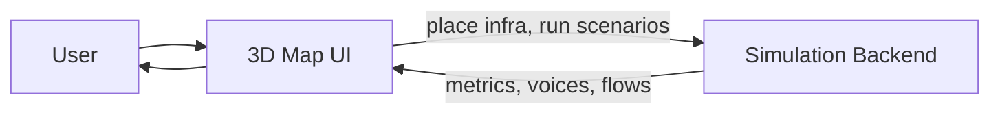

# WattIf — Project Overview

> **Documentation trust order:** Running code → [project_details.md](./project_details.md) → [status_contract.md](./status_contract.md) → audit docs (if present) → this overview. Do not treat older vision language as proof a feature is shipped.

WattIf is a **Toronto energy-equity simulator**: an interactive 3D map where you plan renewable infrastructure and watch how coverage, cost, public approval, and **energy equity** play out over time — by hand or with an AI planning agent.

**Current scope:** Toronto-only fixtures, in-memory sessions, solar/wind/battery/microgrid placement. **Target vision:** uploadable city datasets, Supabase persistence, cohort AI agents — see [project_plan.md](./project_plan.md).

For technical details on how the system is built, see [ARCHITECTURE.md](./ARCHITECTURE.md).

For **current implementation truth**, see [project_details.md](./project_details.md). For an audit deep-dive (if present), see [audit/current_project_details.md](./audit/current_project_details.md).

---

## The problem

Where cities put solar panels, batteries, and microgrids is not just a geography question. It is an equity question:

- Renters often cannot install rooftop solar but still pay high energy bills.
- Some neighbourhoods carry a disproportionate **energy burden** relative to income.
- A plan that maximizes clean-energy coverage alone may leave the people who need relief the most underserved.

WattIf lets planners and policymakers **explore trade-offs before committing budget** — seeing not only how much renewable capacity gets built, but who benefits and how the public reacts.

---

## How it works

At a high level, WattIf connects a visual city map to a living simulation of Toronto's neighbourhoods and residents.



### The user journey

1. **Open the map** — 44 Toronto neighbourhoods appear as interactive zones on a 3D map. Toggle overlays for equity, demand, flood risk, existing renewables, and more.

2. **Build infrastructure** — Choose solar, wind, battery storage, or community microgrids. Place them manually by clicking the map, or let the AI planner propose sites.

3. **Run time forward** — Each tick is one simulated month (up to 60 months). Press play and watch metrics update: renewable coverage, emissions, grid load, public approval, and equity score.

4. **Stress-test with scenarios** — Trigger events like a city-wide blackout, heatwave, ice storm, gas price spike, or new policy incentive. See how the grid and public sentiment respond.

5. **Listen to the city** — Sampled residents post short opinions ("voices") as placements and events unfold. Sentiment choropleths show approval shifting zone by zone.

6. **Chat with the AI planner** — Ask the planning agent to optimize siting within a budget, prioritize high-burden neighbourhoods, or adapt when a scenario hits mid-conversation.

### Guided demo

New users can run a **6-step guided tour** from the welcome screen:

1. Equity overlay — where energy burden is highest
2. Demand overlay — where electricity use concentrates
3. AI planner — auto-places a mix of renewables in underserved zones
4. Simulation — energy flows and rooftop adoption spread over time
5. Blackout scenario — city-wide grid stress test
6. Resilience — microgrid-served zones stay powered

---

## Key concepts

| Concept | What it means |
|---------|---------------|
| **Zones** | Toronto neighbourhoods with real boundaries, demographics, solar/wind potential, and an energy-burden index |
| **Agents** | ~4,000 simulated households and small businesses — renters, owners, high-rise tenants, businesses — each with income, demand, and housing type |
| **Infrastructure** | Four kinds: rooftop/community **solar**, **wind**, **battery** storage, and **microgrids** that serve whole neighbourhoods |
| **Metrics** | City-wide dashboard: renewable coverage, cost spent, emissions avoided, grid load, **equity score**, and **public approval** |
| **Scenarios** | What-if events (blackout, earthquake, heatwave, etc.) that change demand, cause outages, or shift adoption incentives |
| **Voices** | Short first-person opinion posts from sampled agents reacting to placements and events |
| **AI planner** | A conversational agent that inspects city state, runs the optimizer, places infrastructure, and fast-forwards the simulation — available in Auto mode (runs to completion) or Step mode (approve each action) |

---

## Real Toronto data

WattIf is grounded in open data about Toronto, not a generic fictional city:

- **Neighbourhood boundaries and census demographics** from Toronto Open Data
- **Optional enrichment layers**: OpenStreetMap building stats, PVGIS solar yield, climate attitudes, wellbeing indicators
- **Runtime overlays**: flood risk, heat vulnerability, existing solar/EV chargers, cooling centres and libraries, environmental justice scores, district energy service areas, and siting constraints

A reproducible data pipeline (`scripts/build.py`) generates the processed fixtures the backend loads at startup. If those files are missing, the backend falls back to a deterministic synthetic Toronto.

---

## What makes WattIf different

- **Equity-weighted planning** — The optimizer ranks sites by coverage *and* energy burden, not just cost or capacity alone.
- **A living city** — Animated agents, energy-flow arcs, sentiment maps, and an opinion feed make consequences visible, not just numbers on a chart.
- **Resilience under stress** — Scenarios reveal which neighbourhoods stay powered when the grid fails and how public opinion shifts.
- **Works without keys** — No LLM API key, no backend, and no trained ML models required. The frontend runs on built-in mock data; the backend uses a scripted demo planner and rule-based agent voices when real AI providers are unavailable.

---

## Getting started

### Frontend only (works offline)

```bash
cd frontend
npm install
npm run dev
```

Open http://localhost:5173. The app uses built-in mock data if the backend is unreachable.

Optional: copy `frontend/.env.example` to `.env` and set `VITE_MAPBOX_TOKEN` for Mapbox 3D buildings (MapLibre works without a token).

### Full stack (frontend + backend)

**Terminal 1 — backend:**

```bash
cd backend
uv sync
uv run uvicorn app.main:app --reload --host 0.0.0.0 --port 8000
```

Verify: http://localhost:8000/api/health

**Terminal 2 — frontend:**

```bash
cd frontend
npm run dev
```

Optional: copy `backend/.env.example` to `backend/.env` and set `ANTHROPIC_API_KEY` or `FEATHER_API_KEY` + `FEATHER_BASE_URL` for **real LLM** planner chat and voice enrichment. Without keys, the **demo planner** runs locally with no network calls.

Status labels: [status_contract.md](./status_contract.md).

### Optional ML models

From the repo root, after processed data exists:

```bash
python -m ml.train
```

This trains sklearn models for demand forecasting, adoption prediction, and zone clustering. The backend uses them when available and falls back to heuristics otherwise.

---

## Repository layout (at a glance)

| Folder | Role |
|--------|------|
| `frontend/` | React map UI |
| `backend/` | FastAPI simulation server |
| `data/processed/` | Toronto zone/agent/layer JSON fixtures |
| `scripts/` | Data build pipeline |
| `ml/` | Optional machine-learning models |
| `docs/` | This documentation |

---

## Learn more

- [ARCHITECTURE.md](./ARCHITECTURE.md) — code structure, API endpoints, data flows, and design decisions for developers
