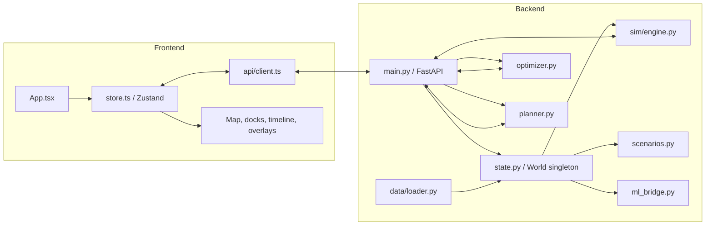
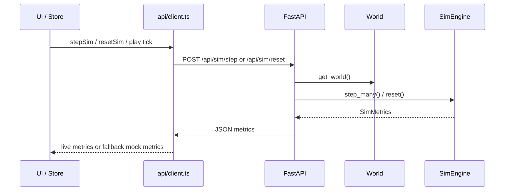

# WattIf Architecture

This document summarizes the codebase structure, the main runtime loops, and how data moves through the system.

## High-Level Shape

WattIf is split into three active layers:

- `backend/` owns the authoritative city world, simulation, optimization, planner, and API surface.
- `frontend/` owns the interactive map UI, global client state, and live presentation of backend data.
- `ml/` is optional and is used through a defensive bridge so the app still works when ML artifacts are missing.

The processed city datasets live in `data/processed/`, and the scripts in `scripts/` generate or refresh those assets.

## Folder Structure

```text
code/
├── backend/
│   ├── pyproject.toml
│   └── app/
│       ├── main.py          # FastAPI routes and WebSocket entrypoints
│       ├── state.py         # Singleton world state and session lifecycle
│       ├── models.py        # Shared Pydantic contract for API payloads
│       ├── sim/
│       │   ├── engine.py    # Tick-based simulation engine
│       │   ├── agents.py    # Agent arrays and adoption math
│       │   ├── sentiment.py # Public-opinion model
│       │   ├── voices.py    # Human-readable agent voices
│       │   ├── llm.py       # Optional LLM enrichment
│       │   └── ...
│       ├── planner.py       # Agentic tool-calling planner
│       ├── optimizer.py     # Renewable siting optimizer
│       ├── scenarios.py     # Scenario/event mutation engine
│       ├── ml_bridge.py     # Optional bridge to repo-root ml/
│       └── data/
│           ├── loader.py    # Reads processed JSON or falls back to seeded data
│           └── seed.py      # Synthetic world generator
├── frontend/
│   ├── package.json
│   └── src/
│       ├── main.tsx         # React bootstrap
│       ├── App.tsx          # Page composition and layout
│       ├── store.ts         # Zustand state and orchestration layer
│       ├── api/client.ts    # REST/WebSocket client with mock fallback
│       ├── types.ts         # Shared frontend contract
│       └── components/      # Map, docks, controls, timeline, overlays
├── ml/
│   ├── inference.py         # Optional ML inference entrypoint
│   ├── features.py
│   ├── train.py
│   └── ...
├── data/
│   └── processed/           # Toronto zoning, agents, constraints, risk layers, etc.
└── scripts/                 # Data extraction and preprocessing helpers
```

## Runtime Architecture



## Backend Data Flow

1. Startup begins in [backend/app/main.py](../backend/app/main.py). The FastAPI lifespan handler calls `get_world()` and logs the loaded zone and agent counts.
2. `get_world()` in [backend/app/state.py](../backend/app/state.py) lazily builds a single `World` instance.
3. `World` loads zones and agents through [backend/app/data/loader.py](../backend/app/data/loader.py), which prefers `data/processed/` JSON and falls back to synthetic seed data if needed.
4. `World` constructs the [sim engine](../backend/app/sim/engine.py) and keeps session-scoped state for scenarios, sentiment, infra, and planning.
5. API endpoints in [backend/app/main.py](../backend/app/main.py) expose that world over REST and WebSocket.

### What the backend owns

- City topology and agents
- Simulation ticks and metrics
- Infrastructure placement and removal
- Scenario application and session reset
- Public sentiment, voices, and flows
- Optimization recommendations
- Planner execution and step approval
- Optional ML-backed predictions through [backend/app/ml_bridge.py](../backend/app/ml_bridge.py)

## Frontend Data Flow

1. The app boots in [frontend/src/main.tsx](../frontend/src/main.tsx) and renders [frontend/src/App.tsx](../frontend/src/App.tsx).
2. `App.tsx` calls `useStore().init()` on mount.
3. The store in [frontend/src/store.ts](../frontend/src/store.ts) fetches zones, agents, metrics, sentiment, flows, and optional layers through [frontend/src/api/client.ts](../frontend/src/api/client.ts).
4. The store keeps the canonical client-side view of the world and derives UI state such as selected zones, overlays, planner status, chat, and timeline history.
5. Components under `frontend/src/components/` render the map, panels, logs, and controls from that shared store.

### What the frontend owns

- Layout and interaction state
- Map layers and panel toggles
- Optimistic UI behavior for placements and planner events
- WebSocket reconnect handling and live status
- Mock fallback when the backend is unreachable

## Main Runtime Loops

### 1. Simulation loop

User action or planner action triggers a simulation step:



The engine in [backend/app/sim/engine.py](../backend/app/sim/engine.py) advances demand, rooftop adoption, infra supply, emissions, equity, and activity logs.

### 2. Scenario loop

Scenarios are applied through [backend/app/scenarios.py](../backend/app/scenarios.py), which mutates the active session engine and returns a typed `Scenario` contract. The frontend keeps a scenario list, highlights affected zones, and updates sentiment/voices after the scenario lands.

### 3. Optimization loop

The optimizer in [backend/app/optimizer.py](../backend/app/optimizer.py) ranks candidate siting options by coverage gain, equity gain, cost, and constraints. The frontend uses the results for recommendations and the planner also calls the optimizer as a tool.

### 4. Planner loop

The planner in [backend/app/planner.py](../backend/app/planner.py) is an async tool-calling agent with three modes of operation:

- Provider-backed auto mode
- Provider-backed step mode with approvals
- Deterministic planner-lite fallback when no model key is configured

Planner events stream back to the frontend over WebSocket and are turned into chat entries, placements, and follow-up refreshes.

## Optional ML Path

The optional `ml/` package is not on the hot tick path. [backend/app/ml_bridge.py](../backend/app/ml_bridge.py) loads it defensively and returns `None` when models are absent or fail.

Used ML endpoints include:

- Demand forecasting for a zone
- Equity clustering for zones
- Scenario-specific adoption propensity

If the ML package is missing, the backend falls back to rule-based behavior without breaking boot or simulation.

## Shared Contracts

The backend and frontend mirror the same conceptual schema:

- Backend Pydantic models: [backend/app/models.py](../backend/app/models.py)
- Frontend TypeScript types: [frontend/src/types.ts](../frontend/src/types.ts)

These two files define the data contract for zones, agents, infra, metrics, scenarios, sentiment, and planner events.

## Key Boundaries

- `backend/app/state.py` is the authoritative world/session boundary.
- `backend/app/sim/engine.py` is the physics and accounting boundary.
- `backend/app/planner.py` is the decision-making boundary.
- `frontend/src/store.ts` is the client orchestration boundary.
- `frontend/src/api/client.ts` is the network and fallback boundary.
- `ml_bridge.py` isolates optional ML dependencies so the app remains resilient.

## Mental Model

If you want to understand any feature, trace it through this order:

1. UI component
2. Zustand action in [frontend/src/store.ts](../frontend/src/store.ts)
3. API call in [frontend/src/api/client.ts](../frontend/src/api/client.ts)
4. Route in [backend/app/main.py](../backend/app/main.py)
5. World mutation in [backend/app/state.py](../backend/app/state.py)
6. Simulation or planner logic in the relevant backend module

That path covers almost every user-visible behavior in the codebase.