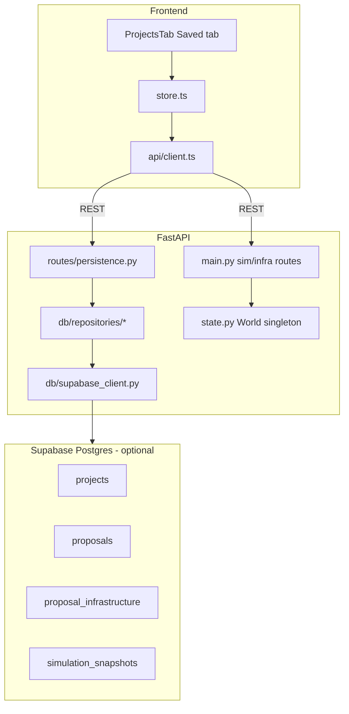

# WattIf — Complete System Architecture (Audit)

**Audit date:** Reflects codebase after Phase 3 proposal persistence.  
**Trust order:** Running code → [schema_contracts.md](../schema_contracts.md) → this audit → older vision notes.

When this document disagrees with pre–Phase 3 audit copies, **trust the code**.

---

## Executive summary

WattIf is a **React + FastAPI** Toronto energy-equity simulator with an optional **Supabase Postgres** persistence layer (Phase 2–3). The **live simulation** still runs in a singleton in-memory `World`; **saved projects, proposals, proposal-scoped infrastructure, and manual simulation snapshots** persist to Supabase when configured.

There is **no frontend Supabase client** (backend service role only). There is **no auth/RLS**, **no dataset upload**, and **no automatic full sim-state persistence on every tick**.

---

## Persistence architecture (current)

| Layer | Persisted? | Mechanism |
|-------|------------|-----------|
| Live sim tick / metrics | **No** (in-memory) | `World` / `SimEngine` |
| Session infra (`POST /api/infra`) | **In-memory only** | Until proposal reload or reset |
| Proposal infrastructure | **Yes** (when Supabase on) | `proposal_infrastructure` table |
| Manual snapshots | **Yes** | `simulation_snapshots` (metrics, scenarios, infrastructure JSONB) |
| Project/proposal metadata | **Yes** | `projects`, `proposals` |

---

## Supabase configuration

[`backend/app/config.py`](../../backend/app/config.py):

- `SUPABASE_URL`, `SUPABASE_SERVICE_ROLE_KEY`
- `supabase_enabled()` — both vars set
- `persistence_provider()` → `"supabase"` or `"memory"`

[`backend/app/db/supabase_client.py`](../../backend/app/db/supabase_client.py): lazy client; returns `None` when unset; logs warning on init failure.

[`GET /api/health`](../../backend/app/main.py): `persistenceProvider`, `supabaseConfigured` (plus existing LLM/ML fields).

---

## Database migrations

| File | Purpose |
|------|---------|
| [`supabase/migrations/20250525120000_initial_persistence.sql`](../../supabase/migrations/20250525120000_initial_persistence.sql) | Base tables: projects, proposals, proposal_infrastructure, simulation_snapshots, asset_definitions, uploaded_datasets, agent_profiles, agent_concerns, planner_runs |
| [`supabase/migrations/20250526120000_snapshot_extras.sql`](../../supabase/migrations/20250526120000_snapshot_extras.sql) | Adds `simulation_snapshots.scenarios` and `simulation_snapshots.infrastructure` JSONB columns |

Migrations are **manual** (SQL editor or Supabase CLI) — not applied at app startup. RLS/auth deferred.

---

## Persistence REST API

Module: [`backend/app/routes/persistence.py`](../../backend/app/routes/persistence.py)

| Method | Path | Repository |
|--------|------|------------|
| GET | `/api/projects` | `projects.list_projects` |
| POST | `/api/projects` | `projects.create_project` |
| GET | `/api/proposals?projectId=` | `proposals.list_proposals` |
| POST | `/api/proposals` | `proposals.create_proposal` |
| GET | `/api/proposals/{id}/infrastructure` | `proposal_infrastructure.list_by_proposal` |
| POST | `/api/proposals/{id}/infrastructure` | `proposal_infrastructure.create` |
| DELETE | `/api/proposals/{id}/infrastructure/{infraId}` | `proposal_infrastructure.delete` |
| GET | `/api/proposals/{id}/snapshots` | `simulation_snapshots.list_by_proposal` |
| POST | `/api/proposals/{id}/snapshots` | `simulation_snapshots.create` |
| GET | `/api/proposals/{id}/snapshots/latest` | `simulation_snapshots.get_latest` |
| GET/POST | `/api/assets/definitions` | `assets` (metadata registry only) |

When Supabase is not configured: **503** with `{ available: false }`. Live sim routes unchanged.

Models: [`backend/app/persistence_models.py`](../../backend/app/persistence_models.py). Shapes documented in [`docs/schema_contracts.md`](../schema_contracts.md).

---

## Repository layer

[`backend/app/db/repositories/`](../../backend/app/db/repositories/):

| Module | Phase 3 status |
|--------|----------------|
| `projects.py` | create, list, get |
| `proposals.py` | create, list, get |
| `proposal_infrastructure.py` | list_by_proposal, create, update_metadata, delete |
| `simulation_snapshots.py` | list_by_proposal, get_latest, create (metrics + scenarios + infrastructure) |
| `assets.py` | create, list definitions |
| `datasets.py`, `agents.py`, `planner_runs.py` | list/get skeletons only |

---

## Frontend persistence flow

**Saved tab:** [`frontend/src/components/ProjectsTab.tsx`](../../frontend/src/components/ProjectsTab.tsx) in LeftDock tab `"saved"`.

**State:** [`frontend/src/store.ts`](../../frontend/src/store.ts):

- `projects`, `proposals`, `selectedProjectId`, `selectedProposalId` (also `localStorage` keys `wattif:selectedProjectId`, `wattif:selectedProposalId`)
- `proposalInfrastructure`, `latestSnapshot`, `persistedInfraIds`
- `persistenceMode`: `"memory"` | `"supabase-no-proposal"` | `"supabase-proposal"`

**API client:** [`frontend/src/api/client.ts`](../../frontend/src/api/client.ts) — all persistence via FastAPI (no Supabase JS SDK).

### Select proposal → reload infrastructure

`selectProposal()` ([`store.ts`](../../frontend/src/store.ts) ~L749):

1. `resetSession()` clears live sim
2. `GET /api/proposals/{id}/infrastructure`
3. Each row → `persistedToInfra()` → `POST /api/infra` to repopulate live sim
4. `GET /api/proposals/{id}/snapshots/latest` for display metadata
5. Refresh sentiment, flows, siting priority

### Place infrastructure → dual write

`addInfraAt()` (~L1203): when a proposal is selected and `persistenceProvider === "supabase"`:

1. `POST /api/infra` (live sim)
2. `POST /api/proposals/{id}/infrastructure` (persisted row)
3. Maps live infra id → persisted row id in `persistedInfraIds`

### Save snapshot

`saveSnapshot()` (~L804): `POST /api/proposals/{id}/snapshots` with current `metrics`, `scenarios`, and `infra` array. Does **not** replace proposal_infrastructure rows.

### Remove infrastructure

`removeInfra()` deletes persisted row when `persistedInfraIds` mapping exists.

**Note:** Snapshot JSON is stored but **not automatically applied** to restore sim state on select — reload uses `proposal_infrastructure` rows, not snapshot payload.

---

## Live simulation (unchanged core)

Still in-memory [`World`](../../backend/app/state.py) + [`SimEngine`](../../backend/app/sim/engine.py):

- `POST /api/infra`, `/api/sim/step`, `/ws/sim` operate on live world
- No DB write on tick
- Template voices on hot path; optional LLM enrich on REST only

---

## Mock / fallback paths

| Condition | Behavior |
|-----------|----------|
| No Supabase env | Persistence routes 503; Saved tab shows Memory mode |
| Backend offline | Frontend mock in `mock.ts`; no persistence |
| Supabase env but tables missing | Persistence routes 502 |
| Demo planner / template voices | Unchanged from Phase 1 |

---

## Key Takeaways

1. **Persistence is partially implemented** — projects, proposals, proposal infrastructure, and manual snapshots in Supabase when configured.
2. **Live sim remains in-memory** — persistence is proposal-scoped, not a full simulation database.
3. **Backend-only Supabase writer** — frontend uses FastAPI REST exclusively.
4. **Infrastructure reload on proposal select is real**; **snapshot restore to live sim** replays stored infra JSON without modifying `proposal_infrastructure`.
5. **Auth, dataset upload, and report export are still missing.**
