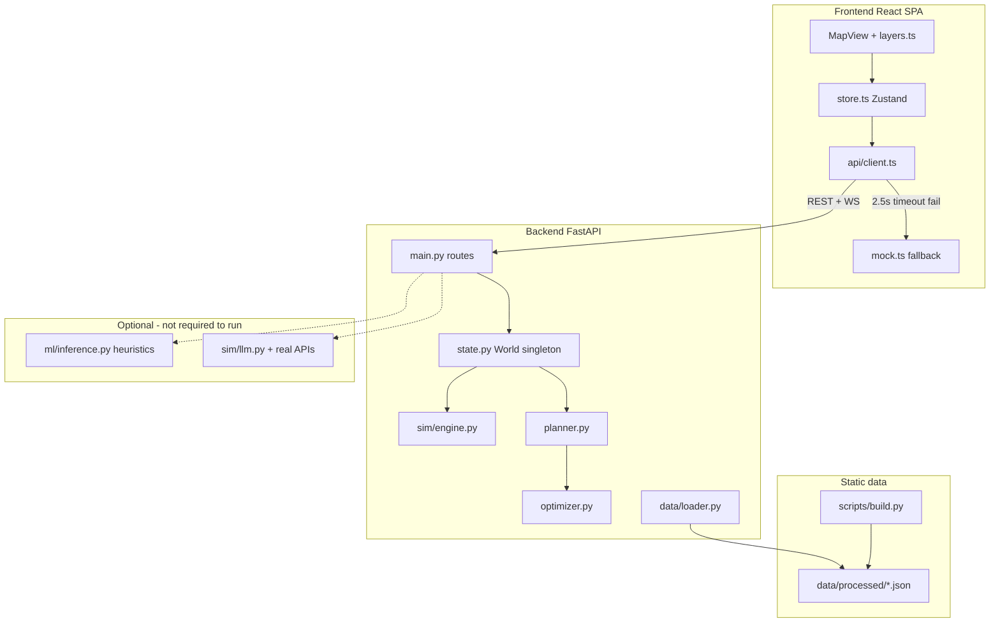

# WattIf Complete System Architecture Audit

Audit date: 2026-05-25

Purpose: document what the current repository actually implements. This is code-first audit documentation, not a roadmap and not a pitch deck.

## Executive Summary

WattIf is currently a Toronto-focused clean-energy planning demo with a polished React/deck.gl map frontend and a FastAPI backend. It has a real in-memory simulation engine, optional Supabase persistence for projects/proposals/placements/snapshots, REST APIs, and WebSocket streams for simulation and planner chat.

The system is not yet a general city-designer sandbox. There is no user dataset upload flow, no authenticated multi-user project model, no arbitrary GIS import, and no true persistent resident AI agents. Resident-like behavior is a representative-agent simulation plus sentiment vectors and rule-templated voices, optionally LLM-rewritten when real keys exist. The operator/planner agent can be real LLM-backed if configured, but the default path is a scripted/demo planner.

## Repository Structure

| Area | Current role | Evidence |
|---|---|---|
| `frontend/` | React/Vite SPA for the map, docks, planner chat, scenario controls, metrics, and persistence UI | `frontend/package.json`, `frontend/src/App.tsx`, `frontend/src/store.ts` |
| `backend/` | FastAPI app with REST routes, WebSockets, simulation, optimizer, planner, data loading, Supabase repositories | `backend/app/main.py`, `backend/app/routes/persistence.py`, `backend/app/sim/engine.py` |
| `data/processed/` | Committed processed Toronto JSON fixtures and contextual layers | `data/processed/facilities.json`, `data/processed/constraints.json`, `data/processed/flood.json` |
| `supabase/migrations/` | Manual SQL migrations for persistence schema | `supabase/migrations/20250525120000_initial_persistence.sql`, `supabase/migrations/20250526120000_snapshot_extras.sql` |
| `docs/audit/` | This audit package | `docs/audit/complete_system_architecture.md` |

Notable absence: there is no committed `ml/` source directory in the inspected tree, although the backend has an optional bridge for a repo-root `ml.inference` module.

## Frontend Stack

The frontend is a Vite React 19 TypeScript app.

| Layer | Implementation |
|---|---|
| Build/runtime | Vite, TypeScript, React 19, React DOM |
| UI | Tailwind CSS, Radix primitives, lucide-react icons |
| State | Zustand store in `frontend/src/store.ts` |
| Mapping | `react-map-gl`, MapLibre by default, Mapbox when `VITE_MAPBOX_TOKEN` exists |
| 3D/GIS rendering | deck.gl layers, `ScenegraphLayer` for GLB infrastructure models, optional Google 3D tiles |
| Charts | Recharts in `frontend/src/components/Hud.tsx` |
| API client | Fetch/WebSocket wrapper with offline fallbacks in `frontend/src/api/client.ts` |

Evidence: `frontend/package.json` lists `react`, `vite`, `zustand`, `deck.gl`, `@deck.gl/*`, `maplibre-gl`, `mapbox-gl`, `react-map-gl`, and `recharts`.

## Frontend Entry Points

| File | Responsibility |
|---|---|
| `frontend/src/main.tsx` | React app mount |
| `frontend/src/App.tsx` | Root layout: map, top bar, left/right docks, timeline, overlays, welcome/demo components |
| `frontend/src/store.ts` | Central app state and all major actions: loading, placement, scenarios, planner chat, persistence, region filtering |
| `frontend/src/api/client.ts` | REST and WebSocket client; every major call degrades to mock/local behavior |

`App.tsx` renders `MapView`, `TopBar`, `LeftDock`, `RightDock`, `Timeline`, `ScenarioBanner`, `Welcome`, `RegionSelector`, `DemoCaption`, `OverlayLegend`, `Toasts`, and `ScenarioFlash`.

## Frontend Component Tree

High-level tree:

| Component | Current role |
|---|---|
| `App` | Owns page frame and calls `useStore().init()` on mount |
| `MapView` | MapLibre/Mapbox host and deck.gl overlay; click/hover handling for zones, recommendations, infra, scenario targeting, region selection |
| `LeftDock` | Tabs: Build, Saved, Events, Priority, Map |
| `BuildTab` | Manual placement and AI auto/step planning controls |
| `ProjectsTab` | Supabase project/proposal selection, proposal creation, snapshot save, persisted placement list |
| `ScenarioControls` | Fires random/city-wide/targeted scenarios |
| `BuildPriority` | Displays ranked zones from `/api/siting-priority` |
| `LayersPanel` and `LegendContent` | Layer toggles and map legend |
| `RightDock` | Tabs: Chat, Activity, Voices, Stats, Assets |
| `ChatPanel` | Planning agent chat, live/local badge, tool events, approve/reject controls |
| `VoicesFeed` | Resident-style voice feed |
| `ActivityLog` | Human-readable sim events |
| `Hud` | Metrics dashboard and trend chart |
| `InfrastructureInspector` | Current placement details and actions |

## State Management

`frontend/src/store.ts` is the single application store. It holds:

| State group | Examples |
|---|---|
| Loaded world | `zones`, `agents`, `infra`, `metrics`, `history`, `recommendations` |
| Region filtering | `selectedRegion`, `allZones`, `allAgents`, `setSelectedRegion()` |
| Map layers | `layers`, `setLayers()`, `setPrimaryOverlay()` |
| Simulation | `playing`, `step()`, `play()`, `pause()`, `reset()` |
| Scenarios | `scenarios`, `scenarioTargeting`, `pendingScenarioType`, `triggerScenario()` |
| Sentiment/voices | `sentiment`, `voices`, `approvalHistory`, `subjectApproval` |
| Planner/chat | `chat`, `chatConnected`, `chatBusy`, `sendChat()`, `approveStep()`, `rejectStep()` |
| Persistence | `projects`, `proposals`, `selectedProjectId`, `selectedProposalId`, `proposalInfrastructure`, `latestSnapshot`, `persistedInfraIds` |
| UX/demo | `showWelcome`, docks, legend, guided demo state, toasts |

Selection persistence is only client-local for selected IDs via `localStorage` keys `wattif:selectedProjectId` and `wattif:selectedProposalId`; proposal data itself persists only through Supabase when configured.

## Backend Stack

The backend is a Python 3.11+ FastAPI app.

| Layer | Implementation |
|---|---|
| API framework | FastAPI, Pydantic v2 |
| Server | Uvicorn expected by `backend/pyproject.toml` |
| Simulation math | NumPy vectorized arrays |
| Optional optimization | OR-Tools dependency exists, but default route uses greedy optimizer |
| Optional LLM | Anthropic or OpenAI-compatible Feather gateway; scripted demo fallback |
| Optional persistence | Supabase Python client with service role key |
| Tests | Pytest under `backend/tests/` |

Evidence: `backend/pyproject.toml` declares `fastapi`, `uvicorn`, `pydantic`, `websockets`, `numpy`, `ortools`, `anthropic`, `openai`, `python-dotenv`, `scikit-learn`, `joblib`, and `supabase`.

## Backend Entry Points

| File | Responsibility |
|---|---|
| `backend/app/main.py` | Creates FastAPI app, CORS, health route, simulation routes, scenario routes, planner routes, WebSockets |
| `backend/app/routes/persistence.py` | Supabase-backed project/proposal/infrastructure/snapshot/asset routes |
| `backend/app/state.py` | Singleton `World`, loaded zones/agents, simulation engine, scenario/session state |
| `backend/app/config.py` | Runtime env vars, LLM provider selection, persistence provider selection |
| `backend/app/models.py` | Pydantic API models for simulation/world data |
| `backend/app/persistence_models.py` | Pydantic API models for persistence data |

The backend stores the live simulation world in one process-wide singleton. It is not a durable multi-session simulation server.

## REST API Routes

Routes implemented in `backend/app/main.py`:

| Route | Method | Purpose |
|---|---:|---|
| `/api/health` | GET | Health and capability flags: data source, LLM, ML, persistence, Supabase |
| `/api/zones` | GET | List loaded zones |
| `/api/agents` | GET | List loaded agents, optionally by zone and limit |
| `/api/zones/clusters` | GET | Optional ML-backed zone clusters, otherwise unavailable |
| `/api/forecast` | GET | ML-backed demand forecast when available, otherwise baseline demand |
| `/api/siting-priority` | GET | Ranked build priority by unmet demand and energy burden; ML optional |
| `/api/rationales` | GET | Sampled agent rationales, real LLM only when configured, otherwise rule-based |
| `/api/infra` | GET/POST | List/place session infrastructure |
| `/api/infra/{infra_id}` | DELETE | Delete session infrastructure |
| `/api/sim/reset` | POST | Reset sim metrics to tick 0, preserving placed infra in engine |
| `/api/sim/step` | POST | Advance simulation ticks |
| `/api/sim/metrics` | GET | Current metrics |
| `/api/activity` | GET | Backfilled activity log |
| `/api/optimize` | POST | Greedy recommendations |
| `/api/session/reset` | POST | Clear placed infra, scenarios, and reset engine |
| `/api/scenario` | POST | Apply a scenario |
| `/api/scenarios` | GET | List active scenarios |
| `/api/sentiment` | GET | City/per-zone sentiment, or subject-specific approval |
| `/api/agents/voices` | GET | Sampled voice posts or event reactions |
| `/api/flows` | GET | Energy flows from active infrastructure to host zones |
| `/api/facilities` | GET | Processed relief/facility points when present |
| `/api/constraints` | GET | Per-zone siting constraints |
| `/api/environment` | GET | Per-zone green/pollution indicators |
| `/api/district-energy` | GET | District energy service data |
| `/api/archetypes` | GET | Current per-zone agent archetype mix |
| `/api/sbei` | GET | Toronto emissions context |
| `/api/flood` | GET | Flood risk layer |
| `/api/heat-vulnerability` | GET | Heat vulnerability layer |
| `/api/existing_infra`, `/api/existing-infra` | GET | Existing renewables/EV chargers |
| `/api/generation-mix` | GET | Ontario generation mix and marginal emissions factor |
| `/api/planner/run` | POST | Run planner to completion over REST |

Persistence routes implemented in `backend/app/routes/persistence.py`:

| Route | Method | Purpose |
|---|---:|---|
| `/api/projects` | GET/POST | List/create planning projects |
| `/api/proposals` | GET/POST | List/create proposals, optionally by project |
| `/api/proposals/{proposal_id}/infrastructure` | GET/POST | List/create persisted proposal placements |
| `/api/proposals/{proposal_id}/infrastructure/{infra_id}` | DELETE | Delete persisted placement |
| `/api/proposals/{proposal_id}/snapshots` | GET/POST | List/create snapshots |
| `/api/proposals/{proposal_id}/snapshots/latest` | GET | Latest snapshot |
| `/api/assets/definitions` | GET/POST | Asset definition metadata |

When Supabase is not configured, persistence routes return HTTP 503 with `available: false`.

## WebSocket Flows

| Socket | Current behavior | Evidence |
|---|---|---|
| `/ws/sim` | Sends initial `state`, accepts play/pause/step/reset/speed/scenario controls, streams `tick_start`, `tick`, `activity`, `voices`, `tick_complete` | `backend/app/main.py` |
| `/ws/planner` | Accepts `user_message`, `scenario`, `approve`, `reject`, `stop`; streams planner events including thoughts, tool calls/results, placements, scenario observations, approvals, done | `backend/app/main.py`, `backend/app/planner.py` |

Frontend client behavior:

| File | Behavior |
|---|---|
| `frontend/src/api/client.ts` | `openSimSocket()` reconnects only after a successful connection; otherwise frontend stays on local stepping |
| `frontend/src/api/client.ts` | `createPlannerSession()` uses `/ws/planner` when live, otherwise streams deterministic mock planner events |
| `frontend/src/store.ts` | Planner placement events update map state and refresh simulation/sentiment/priority |

## Persistence Architecture

Supabase persistence is optional and server-side only.

| Layer | Details |
|---|---|
| Env gating | `backend/app/config.py` enables Supabase only when `SUPABASE_URL` and `SUPABASE_SERVICE_ROLE_KEY` exist |
| Migrations | Manual SQL files under `supabase/migrations/`; app does not auto-migrate |
| Repositories | `backend/app/db/repositories/*.py` wrap Supabase table operations |
| Routes | `backend/app/routes/persistence.py` exposes project/proposal/snapshot APIs |
| Frontend | `ProjectsTab` enables UI only when `/api/health` reports `persistenceProvider: "supabase"` |

Schema from migrations:

| Table | Purpose |
|---|---|
| `projects` | Top-level workspace with `name`, `description`, `city`, `metadata` |
| `proposals` | Saved planning scenarios within projects |
| `proposal_infrastructure` | Persisted placements linked to a proposal |
| `simulation_snapshots` | Metrics plus Phase 3 `scenarios` and `infrastructure` JSONB payload columns |
| `asset_definitions` | Metadata-only asset definitions |
| `uploaded_datasets` | Metadata registry only; no file upload/storage flow |
| `agent_profiles` | Future cohort persona table, not wired into runtime resident voices |
| `agent_concerns` | Future concerns table, not wired into runtime resident voices |
| `planner_runs` | Planner output log table; not part of the primary frontend flow |

Important truth: Phase 3 persistence exists for proposals, infrastructure placements, and snapshots. It is not full app/session persistence. The live backend simulation is still process memory.

## Proposal, Project, Snapshot Flow

Current flow:

1. Frontend loads backend health in `frontend/src/store.ts`.
2. If Supabase is active, `loadProjects()` calls `/api/projects`.
3. User creates/selects a project in `ProjectsTab`.
4. User creates/selects a proposal.
5. Selecting a proposal resets the live session, loads proposal infrastructure from `/api/proposals/{id}/infrastructure`, re-places compatible rows into the live simulation through `/api/infra`, loads latest snapshot, and refreshes metrics/sentiment/flows.
6. New manual placements call `/api/infra` and, if a proposal is selected, also call `/api/proposals/{id}/infrastructure`.
7. Save Snapshot posts current metrics, active scenarios, and current infrastructure to `/api/proposals/{id}/snapshots`.

Limitations:

| Limitation | Evidence |
|---|---|
| Snapshot reload does not restore full sim state by itself | `selectProposal()` restores persisted infrastructure and loads `latestSnapshot`, but does not replay snapshot scenarios/metrics into engine |
| Persistence only supports server-side Supabase service role | `backend/app/config.py`, `backend/app/db/supabase_client.py` |
| No auth/RLS enforcement is implemented in app logic | Migration comments defer RLS/auth |

## Simulation Engine

The main simulation is real, deterministic, and rule-based.

| Concern | Implementation |
|---|---|
| Engine | `backend/app/sim/engine.py` |
| Tick unit | One simulated month |
| Demand | Zone baseline demand with monthly growth and scenario multipliers |
| Supply | Placed infrastructure supply, rooftop adoption supply scaled from sampled agents to full zone demand |
| Infrastructure | Solar, wind, battery, microgrid only |
| Batteries | Peak shaving/enabling credit, not net generation |
| Microgrids | Supply and blackout resilience behavior |
| Emissions | Unmet demand multiplied by marginal gas-peaker factor |
| Equity score | Coverage weighted by blended energy burden, pollution, green score, heat vulnerability |
| Sentiment | Separate vectorized opinion model in `backend/app/sim/sentiment.py` |
| Activity | Human-readable tick messages generated from changes |

The engine mutates in-process state. It is suitable for a demo/session simulator, not yet for reproducible, durable planning studies across users.

## Optimizer and Planner

Optimizer:

| Aspect | Current implementation |
|---|---|
| File | `backend/app/optimizer.py` |
| Default route | Greedy optimizer via `/api/optimize` |
| Candidate generation | One or more suitable infrastructure kinds per zone |
| Scoring | Coverage gain plus equity gain minus cost/constraints/existing infra/district-energy penalties/diversity penalty |
| OR-Tools | Code exists in `optimize_ortools()`, but default `optimize()` strategy is greedy |

Planner:

| Aspect | Current implementation |
|---|---|
| File | `backend/app/planner.py` |
| Tools | `get_city_state`, `get_metrics`, `get_budget`, `optimize`, `place_infrastructure`, `remove_infrastructure`, `run_simulation`, `launch_program` |
| Real LLM support | Anthropic or Feather when configured |
| Default | Scripted `demo` provider is on by default via `WATTIF_DEMO_LLM=1` |
| No-key mode | Deterministic planner-lite/demo planner, not autonomous LLM reasoning |
| Step mode | WebSocket approval gate for mutating tools |
| Memory | `PlannerChat` keeps message history during a WebSocket session; not persisted |

## Data Loading Pipeline

Runtime data loading lives in `backend/app/data/loader.py`.

| Data | Current behavior |
|---|---|
| Zones | Looks for `data/processed/zones.json`; if absent/invalid, falls back to seed data |
| Agents | Looks for `data/processed/agents.json`; if absent, synthesizes agents from loaded zones |
| Facilities | Loads `facilities.json` if present |
| Constraints | Loads `constraints.json` if present |
| Existing infra | Loads `existing_infra.json` if present |
| Environment | Loads `environment.json` if present |
| Flood | Loads `flood.json` if present |
| Heat vulnerability | Loads `heat_vulnerability.json` if present |
| District energy | Loads `district_energy.json` if present |
| SBEI | Loads `sbei.json` if present |
| Archetypes | Loads `archetypes.json` if present and re-samples agent archetypes |
| Generation mix | Loads `generation_mix.json` if present |
| Attitudes | Loader exists for `attitudes.json`; sentiment model may use priors |

There is no user-facing upload pipeline. The migration has `uploaded_datasets`, but runtime code does not accept files, parse arbitrary datasets, or bind uploaded datasets to projects.

## Map and GIS Layers

Map rendering is substantial and real for committed data layers.

| Layer | Source | Implementation |
|---|---|---|
| Base map | CARTO dark MapLibre by default; Mapbox Standard if token exists | `frontend/src/components/MapView.tsx` |
| Optional 3D buildings | Google 3D Tiles if `VITE_GOOGLE_MAPS_KEY`; MapLibre building extrusion fallback | `MapView.tsx` |
| Zones | Backend processed/seed zones or frontend fixture fallback | `buildLayers()` in `frontend/src/map/layers.ts` |
| Equity | Zone energy burden | `layers.ts` |
| Sentiment | Per-zone sentiment | `layers.ts` |
| Demand | Hexagon layer over agents | `layers.ts` |
| People | Sampled agents as moving dots | `layers.ts`, `frontend/src/store.ts` |
| Infrastructure | GLB scenegraph models plus halos/ripples | `layers.ts`, `frontend/src/types.ts` |
| Recommendations | Beam/ring markers | `layers.ts` |
| Flows | TripsLayer from infra to zones | `layers.ts` |
| Facilities | Text/icon markers from processed facilities | `layers.ts` |
| Existing infra | Scatterplot markers from processed existing infra | `layers.ts` |
| Constraints | Per-zone no-build/siting penalty tint | `layers.ts` |
| Flood | Per-zone flood risk tint | `layers.ts` |
| District energy | Per-zone service tint | `layers.ts` |
| Rooftop glints | Frontend sampled candidate points, revealed by adoption | `frontend/src/store.ts`, `layers.ts` |
| Build priority | `/api/siting-priority` ranking | `layers.ts` |

GIS limitation: the app renders known committed layers. It does not import user-supplied GIS files, run spatial joins for uploaded data, or manage arbitrary layer schemas.

## ML Integrations

ML is optional, not required for the app to run.

| Integration | Current behavior | Evidence |
|---|---|---|
| `ml_bridge` | Attempts to import `ml.inference` from repo root; returns `None` on failure | `backend/app/ml_bridge.py` |
| Demand forecast | `/api/forecast` returns ML prediction if available, otherwise baseline demand | `backend/app/main.py` |
| Zone clusters | `/api/zones/clusters` returns unavailable if ML is absent | `backend/app/main.py` |
| Scenario adoption | `_apply_ml_adaptation()` no-ops if ML unavailable | `backend/app/scenarios.py` |
| Siting priority | Uses ML if available, otherwise heuristic | `backend/app/main.py` |

This is an integration hook, not proof that trained models are present or production-grade. The inspected tree did not show a committed `ml/` package.

## LLM Integrations

| Surface | Real LLM path | Fallback path |
|---|---|---|
| Rationales | `generate_rationales()` calls Anthropic/Feather for sampled agents when real provider configured | Rule-based rationale strings |
| Voice enrichment | `enrich_voices()` rewrites generated voices only with real provider | Original templated text |
| Planner run/chat | Anthropic tool use or Feather function calling | Scripted demo planner or deterministic planner-lite |

Provider selection in `backend/app/config.py`:

1. `ANTHROPIC_API_KEY` wins.
2. `FEATHER_API_KEY` plus `FEATHER_BASE_URL` next.
3. `WATTIF_DEMO_LLM=1` default enables a scripted demo provider.
4. Otherwise no LLM provider.

Important truth: health `llmEnabled: true` may mean the scripted demo provider, not a network LLM. `realLlm` is the honest field for real LLM provider presence.

## Environment Variables

Frontend:

| Variable | Purpose | Evidence |
|---|---|---|
| `VITE_API_URL` | Backend base URL, default `http://localhost:8000` | `frontend/src/api/client.ts` |
| `VITE_GOOGLE_MAPS_KEY` | Optional Google 3D Tiles | `frontend/src/components/MapView.tsx` |
| `VITE_MAPBOX_TOKEN` | Optional Mapbox renderer/style | `frontend/src/components/MapView.tsx` |

Backend:

| Variable | Purpose | Evidence |
|---|---|---|
| `ANTHROPIC_API_KEY` | Real Anthropic planner/rationales/voice enrichment | `backend/app/config.py` |
| `WATTIF_CLAUDE_MODEL` | Anthropic model name | `backend/app/config.py` |
| `FEATHER_API_KEY` | OpenAI-compatible gateway key | `backend/app/config.py` |
| `FEATHER_BASE_URL` | OpenAI-compatible gateway base URL | `backend/app/config.py` |
| `FEATHER_MODEL` | Gateway model name | `backend/app/config.py` |
| `WATTIF_DEMO_LLM` | Scripted demo LLM provider toggle, default on | `backend/app/config.py` |
| `WATTIF_LLM_AGENT_SAMPLE` | Number of sampled agents for rationales | `backend/app/config.py` |
| `WATTIF_TICK_SECONDS` | WebSocket sim tick cadence | `backend/app/config.py` |
| `WATTIF_START_YEAR` | Sim start year | `backend/app/config.py` |
| `WATTIF_SEED` | Deterministic seed | `backend/app/config.py` |
| `WATTIF_NUM_AGENTS` | Synthetic agent count when no processed agents file exists | `backend/app/config.py` |
| `WATTIF_CORS_ORIGINS` | CORS allowlist | `backend/app/config.py` |
| `SUPABASE_URL` | Supabase endpoint | `backend/app/config.py` |
| `SUPABASE_SERVICE_ROLE_KEY` | Supabase service-role key, server-side | `backend/app/config.py` |

## Mock, Demo, and Fallback Paths

| Path | Current behavior |
|---|---|
| Frontend API fallback | Every major REST call in `frontend/src/api/client.ts` falls back to `frontend/src/data/mock.ts` or local deterministic behavior |
| Frontend sim fallback | If `/ws/sim` is absent, local `step()` uses mock metrics/scenario impacts |
| Planner fallback | `createPlannerSession()` streams `mockPlannerEvents()` when `/ws/planner` is unreachable |
| Backend data fallback | `load_world()` falls back from processed JSON to synthetic seed world |
| Backend ML fallback | `ml_bridge` returns `None`; routes use baseline or heuristic |
| Backend LLM fallback | Rationales/voices use rules; planner uses scripted demo/planner-lite |
| Persistence fallback | If Supabase env is missing, frontend labels memory mode and persistence routes return 503 |

This fallback architecture makes the demo robust, but it also means frontend behavior can look more capable than the live backend actually is.

## Key Data Models

Simulation models in `backend/app/models.py` and `frontend/src/types.ts`:

| Model | Meaning |
|---|---|
| `Zone` | Neighbourhood polygon, centroid, demographics, demand, solar/wind potential |
| `Agent` | Representative household/business record with archetype, demand, income, rooftop, EV, adoption flags |
| `Infra` | Placed solar/wind/battery/microgrid asset with position, capacity, cost, status |
| `SimMetrics` | Tick, year, demand, renewable supply, coverage, grid load, emissions, cost, equity, approval |
| `ZoneDelta` | Per-zone demand/supply/coverage/adoption/approval/outage per tick |
| `Scenario` | Rule-based event with effects and optional gathering hints |
| `AgentVoice` | Generated opinion post tied to an agent id, zone id, stance, topic, text, optional position |
| `Recommendation` | Optimizer candidate with position, kind, score, coverage/equity gains, rationale |
| `Flow` | Energy flow from an infrastructure id to a zone id |

Persistence models in `backend/app/persistence_models.py`:

| Model | Meaning |
|---|---|
| `Project` | Top-level saved planning workspace |
| `Proposal` | Saved scenario/proposal within project |
| `ProposalInfrastructure` | Persisted placement row |
| `SimulationSnapshot` | Saved point-in-time metrics/scenarios/infrastructure payload |
| `AssetDefinition` | Metadata-only asset definition |

## Important Files and Responsibilities

| File | Responsibility |
|---|---|
| `frontend/src/App.tsx` | Shell layout and app initialization |
| `frontend/src/store.ts` | Central behavior and state orchestration |
| `frontend/src/api/client.ts` | Runtime API, WebSocket, mock fallback boundary |
| `frontend/src/data/mock.ts` | Offline zones/agents/metrics/scenarios/voices/planner |
| `frontend/src/components/MapView.tsx` | Map provider, click/hover/fly-to behavior, optional 3D tiles |
| `frontend/src/map/layers.ts` | All deck.gl layer construction |
| `frontend/src/components/ProjectsTab.tsx` | Project/proposal/snapshot persistence UI |
| `frontend/src/components/ChatPanel.tsx` | Operator/planner chat UI |
| `backend/app/main.py` | Main REST/WebSocket API |
| `backend/app/routes/persistence.py` | Persistence REST API |
| `backend/app/state.py` | In-memory world singleton and facade |
| `backend/app/sim/engine.py` | Core tick simulation |
| `backend/app/sim/agents.py` | Rooftop solar and EV adoption arrays |
| `backend/app/sim/sentiment.py` | Public-opinion model |
| `backend/app/sim/voices.py` | Rule-template resident voices and reactions |
| `backend/app/sim/llm.py` | Optional LLM rationales and voice enrichment |
| `backend/app/scenarios.py` | Rule-based scenario engine |
| `backend/app/optimizer.py` | Siting recommendations |
| `backend/app/planner.py` | Tool-calling planner and chat |
| `backend/app/data/loader.py` | Processed data loaders and seed fallback |
| `backend/app/ml_bridge.py` | Optional ML integration |
| `supabase/migrations/*.sql` | Persistence schema |

## Architecture Risks

| Risk | Why it matters |
|---|---|
| Single process-wide world | Multiple users or tabs can mutate the same backend simulation state |
| Frontend fallback masks backend absence | Demo may appear functional even when backend/ML/LLM/persistence are offline |
| Type drift | Frontend `ScenarioType` only lists older scenario names while backend supports more types |
| Persistence is partial | Proposal placements and snapshots persist, but full simulation/session state does not |
| Agent tables are not runtime agents | `agent_profiles` and `agent_concerns` exist in SQL but are not wired into voices/planner |
| Real LLM status can be overstated | `llmEnabled` includes scripted demo; use `realLlm` for truth |
| Dataset upload table is metadata-only | No upload API, storage, parsing, validation, or project-bound data use |

## Key Takeaways

- WattIf has a real React/FastAPI simulation demo with meaningful map layers, rule-based simulation, optimizer, planner tooling, and Phase 3 Supabase persistence for proposals, placements, and snapshots.
- The current architecture is still demo/session-oriented: one in-memory world, strong fallbacks, and limited durable state.
- The resident layer is not true resident AI. It is representative agents plus sentiment arrays plus templated voices, with optional LLM rewriting only when real keys exist.
- The operator/planner agent can be LLM-backed, but the default behavior is scripted/demo. Pitch it carefully as an agentic planning interface with real and fallback modes.
- The largest architectural gap is turning committed Toronto fixtures and in-memory simulation into project-scoped, uploaded-data-grounded, reproducible planning workspaces.
# WattIf — Complete System Architecture (Audit)

**Audit date:** Based on inspection of the repository as it exists today.  
**Purpose:** Document what is actually implemented — not the intended product vision.  
**Companion docs:** [current_project_details.md](./current_project_details.md), [vision_gap_analysis.md](./vision_gap_analysis.md)

When this document disagrees with [`docs/OVERVIEW.md`](../OVERVIEW.md) or [`docs/ARCHITECTURE.md`](../ARCHITECTURE.md), **trust the code**.

---

## Executive summary

WattIf is a **monorepo** with a React map frontend and a FastAPI simulation backend. It models **44 Toronto neighbourhood zones** and **~4,001 representative agents** (not individual LLM agents). The core loop is a **deterministic, rule-based monthly tick simulation** with an equity-weighted greedy optimizer and a **scripted demo planner** (default when no LLM API keys are set).

There is **no database**, **no dataset upload API**, **no session persistence**, and **no true autonomous resident AI agents**. Public opinion is a **vectorized drift model** plus **template-based voice strings** (optionally LLM-rewritten when real API keys exist).

---

## Repository structure

```
wattif/
├── frontend/          React 19 + Vite + TypeScript SPA
├── backend/           FastAPI + Python 3.11+ simulation server
├── data/processed/    16 committed JSON fixtures (13 loaded at backend boot)
├── scripts/           Offline data pipeline (build.py + fetch/extract scripts)
├── ml/                Optional sklearn training/inference (no .joblib shipped)
└── docs/              Project documentation (including this audit)
```

| Path | Responsibility |
|------|----------------|
| [`frontend/src/App.tsx`](../../frontend/src/App.tsx) | Single-page layout shell |
| [`frontend/src/store.ts`](../../frontend/src/store.ts) | Zustand state + side effects |
| [`frontend/src/api/client.ts`](../../frontend/src/api/client.ts) | REST/WS client with mock fallback |
| [`frontend/src/data/mock.ts`](../../frontend/src/data/mock.ts) | Full offline simulation when backend unreachable |
| [`backend/app/main.py`](../../backend/app/main.py) | FastAPI entry, all routes |
| [`backend/app/state.py`](../../backend/app/state.py) | Singleton `World` |
| [`backend/app/sim/engine.py`](../../backend/app/sim/engine.py) | Tick simulation orchestrator |
| [`backend/app/planner.py`](../../backend/app/planner.py) | Planner tools + demo/real LLM chat |
| [`backend/app/optimizer.py`](../../backend/app/optimizer.py) | Greedy siting (+ unused OR-Tools path on REST) |
| [`backend/app/data/loader.py`](../../backend/app/data/loader.py) | Processed JSON loaders |
| [`scripts/build.py`](../../scripts/build.py) | Regenerates `data/processed/*.json` |

**Not in repo:** `docs/PLAN.md` (referenced in code comments), `data/README.md` (referenced in `build.py`), `data/raw/` (gitignored cache), trained ML `.joblib` files (gitignored).

---

## System context



---

## Frontend stack and component tree

**Stack:** React 19, Vite 8, TypeScript, Tailwind, Radix UI, Zustand, deck.gl, MapLibre GL / Mapbox GL, Recharts.

**No client-side router** — one view.

```
main.tsx
└── App.tsx
    ├── TooltipProvider
    ├── MapView                    ← full-screen map (deck.gl layers)
    ├── TopBar                     ← brand, Live/Mock badge, guided demo trigger
    ├── ScenarioBanner
    ├── LeftDock
    │   ├── BuildTab               ← manual / AI auto / AI step, optimizer
    │   ├── ScenarioControls       ← 7 presets + random + reset
    │   └── LayersPanel            ← 13+ overlay toggles
    ├── RightDock
    │   ├── MiniStats              ← coverage, approval, tick/year strip
    │   ├── ChatPanel              ← planner WebSocket chat
    │   ├── ActivityLog            ← tick narration lines
    │   ├── VoicesFeed             ← resident opinion posts
    │   ├── Hud                    ← full metrics + charts
    │   └── InfrastructureInspector
    ├── Timeline                   ← play / pause / step / reset
    ├── Welcome                    ← onboarding modal
    ├── DemoCaption                ← guided demo captions
    ├── OverlayLegend, Toasts, ScenarioFlash
    └── ui/*                       ← shadcn-style primitives
```

### Central state (`frontend/src/store.ts`)

Single Zustand store (~1,285 lines) owns:

| Domain | Key fields / actions |
|--------|---------------------|
| World | `zones`, `agents`, `infra`, `metrics`, `sentiment`, `flows`, `voices` |
| Map overlays | `layers` object (equity, demand, sentiment, flood, etc.) |
| Simulation | `tick`, `playing`, `step()`, `play()`, `pause()`, `reset()` |
| Placement | `placementMode`: `manual` \| `auto` \| `step`; `placeKind`, `addInfraAt()` |
| AI planner | `chatMessages`, `chatSession`, `sendChat()`, `approveStep()`, `rejectStep()` |
| Scenarios | `activeScenarios`, `triggerScenario()`, localized outage/gathering state |
| Animation | `sampledAgents` (~320 dots), `agentTargets` (mobilization during events) |
| Live flag | `live: boolean` — **true only when `/api/zones` returns non-empty data** |

**Init sequence** (`init()`, ~L460–590):

1. Fetch zones (5 retries) → sets `live`
2. Fetch agents; subsample ~320 for map animation (`filter` every Nth, cap 360)
3. `seedInfra()` — **always client-side** 4 mock placements (not from backend)
4. Parallel: `resetSim`, `getSentiment`, `getFlows`, `getVoices`
5. Background fetch of v3 layers (facilities, flood, constraints, etc.)
6. Open `WS /ws/sim` if backend available

### API client and mock fallback (`frontend/src/api/client.ts`)

- Base URL: `VITE_API_URL` default `http://localhost:8000`
- Every REST call uses `tryFetch()` with **2,500 ms timeout**; failure → `null` → mock
- **`live` badge is misleading granularity:** zones succeeding but sentiment failing still shows "Live API" with mock sentiment

**WebSockets:**

| Socket | Path | Fallback |
|--------|------|----------|
| Sim stream | `/ws/sim` | Local `step()` / `play()` in store |
| Planner session | `/ws/planner` | `mockPlannerEvents()` generator per message |
| One-shot planner | `/ws/planner` (legacy) | Same mock after 600 ms |

### Map / GIS layers (`frontend/src/map/layers.ts`, `MapView.tsx`)

**Basemap:**

- No `VITE_MAPBOX_TOKEN` → MapLibre + CARTO dark + extruded building footprints
- With token → Mapbox Standard 3D buildings
- Optional `VITE_GOOGLE_MAPS_KEY` → Google Photorealistic 3D Tiles (`Tile3DLayer`)

**deck.gl layers** (toggleable unless noted):

| Layer | Data source | Notes |
|-------|-------------|-------|
| Zone choropleths | `zones`, `sentiment`, `floodRisk` | equity, sentiment, flood |
| Demand hexbins | `agents[].demandKwh` | optional 3D extrusion |
| Animated agents | `sampledAgents` (~320) | **visual sample**, not full 4,001 |
| Infra 3D models | placed `infra` | GLB: solar, wind, battery, microgrid |
| Energy flows | `/api/flows` | particle arcs infra → zones |
| Existing infra | `/api/existing_infra` | read-only; includes EV chargers |
| Facilities | `/api/facilities` | cooling centres, libraries (scenario gathering) |
| Constraints | `/api/constraints` | no-build / penalty zones |
| District energy | `/api/district-energy` | Enwave-style service areas |
| Speech bubbles | latest 4 `voices` | clickable |
| Outage overlay | scenario state | microgrid zones stay lit during blackout |

**Not a map layer:** heat vulnerability — fetched but shown in **hover tooltips only** (`MapView.tsx`).

---

## Backend stack and entry points

**Stack:** FastAPI, Uvicorn, Pydantic v2, NumPy, OR-Tools (optional knapsack), Anthropic/OpenAI SDKs (optional).

**Entry:** [`backend/app/main.py`](../../backend/app/main.py) — lifespan logs zone/agent counts and LLM/ML availability.

**Configuration:** [`backend/app/config.py`](../../backend/app/config.py) via `.env` (see Environment variables section).

### Central state: `World` singleton

[`backend/app/state.py`](../../backend/app/state.py) — `get_world()` returns one in-memory instance:

| Field | Source |
|-------|--------|
| `zones`, `agents` | `load_world()` from processed JSON or synthetic seed |
| `source` | `"processed"` or `"seed"` |
| `engine` | `SimEngine` instance |
| `active_scenarios` | append-only list |

**No persistence:** process restart loses all placed infrastructure and scenario history. `session_reset()` clears infra + scenarios and resets tick to 0 but does not reload JSON from disk.

---

## REST API routes

All defined in [`backend/app/main.py`](../../backend/app/main.py):

| Method | Path | Handler | Notes |
|--------|------|---------|-------|
| GET | `/api/health` | `health()` | `dataSource`, `llmProvider`, `realLlm`, `mlAvailable` |
| GET | `/api/zones` | `get_zones()` | 44 zones |
| GET | `/api/agents` | `get_agents()` | ~4,001 agents; optional `zoneId`, `limit` |
| GET | `/api/zones/clusters` | `get_zone_clusters()` | ML or `{available: false}` |
| GET | `/api/forecast` | `get_forecast()` | ML or zone baseline |
| GET | `/api/rationales` | `get_rationales()` | LLM or rule-based; **not on tick path** |
| GET | `/api/infra` | `list_infra()` | User-placed infra |
| POST | `/api/infra` | `place_infra()` | `InfraCreate` — solar/wind/battery/microgrid only |
| DELETE | `/api/infra/{infra_id}` | `delete_infra()` | |
| POST | `/api/sim/reset` | `sim_reset()` | Tick → 0; keeps infra |
| POST | `/api/sim/step` | `sim_step()` | `{ticks: N}` |
| GET | `/api/sim/metrics` | `sim_metrics()` | |
| GET | `/api/activity` | `get_activity()` | |
| POST | `/api/optimize` | `optimize_endpoint()` | **Greedy only** — never calls OR-Tools |
| POST | `/api/session/reset` | `session_reset()` | Full session clear |
| POST | `/api/scenario` | `post_scenario()` | |
| GET | `/api/scenarios` | `get_scenarios()` | |
| GET | `/api/sentiment` | `get_sentiment()` | |
| GET | `/api/agents/voices` | `get_voices()` | Templated; optional LLM enrich |
| GET | `/api/flows` | `get_flows()` | |
| GET | `/api/facilities` | `get_facilities()` | |
| GET | `/api/constraints` | `get_constraints()` | |
| GET | `/api/environment` | `get_environment()` | |
| GET | `/api/district-energy` | `get_district_energy()` | |
| GET | `/api/archetypes` | `get_archetypes()` | |
| GET | `/api/sbei` | `get_sbei()` | Display-only GHG headline |
| GET | `/api/flood` | `get_flood()` | |
| GET | `/api/heat-vulnerability` | `get_heat_vulnerability()` | |
| GET | `/api/existing_infra` | `get_existing_infra()` | Read-only map layer |
| GET | `/api/generation-mix` | `get_generation_mix()` | Ontario grid context |
| POST | `/api/planner/run` | `planner_run()` | One-shot; **forces `mode=auto`** |

**No upload/import endpoints exist anywhere in the backend.**

---

## WebSocket flows

### `/ws/sim` (`ws_sim` in `main.py`)

**Client → server:**

| Message | Effect |
|---------|--------|
| `{action: "play"}` | Start auto-stepping loop |
| `{action: "pause"}` | Stop loop |
| `{action: "step", ticks: k}` | Advance k ticks (1–120) |
| `{action: "reset"}` | Reset sim |
| `{action: "speed", seconds: s}` | Tick interval |
| `{action: "scenario", scenarioType, ...}` | Apply scenario |

**Server → client (per tick, `stream_tick()` ~L604–628):**

1. `tick_start`
2. `tick` (full `SimTick` with metrics + zoneDeltas)
3. `activity` (3–5 narration strings)
4. `voices` — **3 rule-templated voices, explicitly no LLM** (comment L623)
5. `tick_complete`

### `/ws/planner` (`ws_planner` in `main.py`)

**Client → server:**

- `{type: "user_message", text, mode: "auto"|"step", budgetCad?}`
- `{action: "approve"|"reject"}` — step-mode gate
- `{action: "scenario", ...}` — mid-turn injection
- `{action: "stop"}`

**Server → client:**

`turn_start`, `thought`, `tool_call`, `tool_result`, `placement`, `scenario`, `voices`, `awaiting_approval`, `done`

**Default behavior without API keys:** `PlannerChat.turn()` routes to `_demo_turn()` using `parse_intent()` — **keyword matching, not LLM** (`planner.py` L685–731, L760–761).

---

## Simulation engine

[`backend/app/sim/engine.py`](../../backend/app/sim/engine.py) — **1 tick = 1 simulated month**.

### Per-tick pipeline (`step()`)

1. **`adoption_step()`** — rooftop solar adoption hazard draw ([`sim/agents.py`](../../backend/app/sim/agents.py))
2. **`sentiment.step()`** — opinion drift toward targets ([`sim/sentiment.py`](../../backend/app/sim/sentiment.py))
3. **`_compute()`** — aggregate metrics
4. **`_build_activity()`** — human-readable log lines

### Metrics computed (`_compute()`)

| Metric | Implementation |
|--------|----------------|
| **Demand** | `zone_base_demand × 1.004^tick × scenario_multiplier` |
| **Supply** | Infra capacity × capacity factor × 730 h + scaled rooftop adoption |
| **Coverage** | `total_supply / total_demand` (can exceed 100%) |
| **Emissions** | Unmet demand × 0.00045 t/kWh (marginal gas peaker assumption) |
| **Grid load** | Net peak vs effective grid capacity (scenario can shrink capacity) |
| **Equity score** | Burden/HVI/pollution/green-weighted mean of zone coverage |
| **Approval** | Mean agent opinion 0–1 from `SentimentModel` |

**Scaling:** Agents are a **sample** (~4,001). `zone_representation = zone_demand / sampled_demand` scales adoption and supply to neighbourhood totals (`engine.py` L73–78).

**Not modeled:** EV charging as infrastructure, per-building placement, real weather time series, social networks between agents.

---

## Optimizer and planner

### Optimizer ([`backend/app/optimizer.py`](../../backend/app/optimizer.py))

Greedy ranking score:

```
W_COVERAGE × coverage_gain  (1.0)
+ W_EQUITY × equity_gain    (1.2)
- W_COST × cost             (0.5)
- W_DIVERSITY × kind_count  (0.18)
- W_CONSTRAINT × penalty    (0.8)
- W_EXISTING × existing_renewables (0.3)
- W_DISTRICT × district_energy     (0.5, microgrid only)
```

- Skips `no_build` zones; wind excluded from densest third of zones
- One candidate per zone per pass
- **`optimize_ortools()` exists but REST `/api/optimize` never passes `strategy="ortools"`**

### Planner ([`backend/app/planner.py`](../../backend/app/planner.py))

Seven tools via `PlannerTools.execute()`:

`get_city_state`, `get_metrics`, `get_budget`, `optimize`, `place_infrastructure`, `remove_infrastructure`, `run_simulation`

| Provider | Function | Network? |
|----------|----------|----------|
| `None` (demo off, no keys) | `_planner_lite()` | No |
| `"demo"` (default) | `_planner_demo()` — scripted tool loop | No |
| `"anthropic"` / `"feather"` | Real tool-calling LLM | Yes |
| LLM failure | Falls back to `_planner_lite()` | No |

Chat path: `PlannerChat.turn()` uses `_demo_turn()` + `parse_intent()` when provider is `None` or `"demo"`.

---

## Data loading pipeline

### Boot-critical ([`backend/app/data/loader.py`](../../backend/app/data/loader.py))

| File | Fallback |
|------|----------|
| `data/processed/zones.json` | Full synthetic via `seed.build_world()` |
| `data/processed/agents.json` | Synthetic agents for loaded zones |

### Optional layers (return empty/None if missing)

`attitudes.json`, `facilities.json`, `constraints.json`, `existing_infra.json`, `environment.json`, `flood.json`, `heat_vulnerability.json`, `district_energy.json`, `sbei.json`, `archetypes.json`, `generation_mix.json`

### Built but **not loaded at runtime**

| File | Actual use |
|------|------------|
| `demand.json` | Build artifact; demand lives on `Zone.demandKwhMonthly` |
| `solar.json` | Build artifact; solar on `Zone.solarPotential` |
| `buildings.json` | Read only by `ml/features.py` for ML training |

### Offline pipeline ([`scripts/build.py`](../../scripts/build.py))

Regenerates all processed JSON from Toronto Open Data + optional raw caches in `data/raw/toronto-open-data/` (gitignored, not shipped). Mix of **real boundaries/census** and **modeled/synthetic** fields per the build script header.

---

## ML integration

[`backend/app/ml_bridge.py`](../../backend/app/ml_bridge.py) defensively imports `ml/inference.py`.

| Function | Wired to | Current state (this checkout) |
|----------|----------|-------------------------------|
| `forecast_demand()` | `GET /api/forecast` | **Heuristic fallback** — no `.joblib` on disk |
| `zone_clusters()` | `GET /api/zones/clusters` | Returns `{available: false}` |
| `scenario_adoption()` | `scenarios._apply_ml_adaptation()` | Heuristic multipliers in `inference.py` |
| `adoption_prob()` | **Not called from backend** | Dead wiring |

Train: `python -m ml.train` → `ml/models/*.joblib` (gitignored). `metadata.json` exists; model files do not.

---

## LLM integration

Config: [`backend/app/config.py`](../../backend/app/config.py)

| Priority | Provider | Condition |
|----------|----------|-----------|
| 1 | Anthropic | `ANTHROPIC_API_KEY` |
| 2 | Feather | `FEATHER_API_KEY` + `FEATHER_BASE_URL` |
| 3 | Demo | `WATTIF_DEMO_LLM=1` (default) |
| 4 | None | Demo disabled |

| Function | File | Uses real LLM? | Hot path? |
|----------|------|----------------|-----------|
| `generate_rationales()` | `sim/llm.py` | Only `real_llm_provider()` | No — `/api/rationales` |
| `enrich_voices()` | `sim/llm.py` | Only `real_llm_provider()` | No — `/api/agents/voices?enrich=true` |
| WS sim tick voices | `main.py` L623–627 | **Never** | Yes — templates only |
| `run_planner()` / `PlannerChat` | `planner.py` | Demo script by default | No |

**Important:** `llm_enabled()` includes demo, but `enrich_voices()` and `generate_rationales()` check `real_llm_provider()` which **excludes demo**. Default deployment gets **no LLM text generation** for voices/rationales.

---

## Mock / demo / fallback paths

| Layer | Real behavior | Fallback |
|-------|---------------|----------|
| Frontend zones/agents | Backend REST | `zonesFixture.json` + generated agents in `mock.ts` |
| Frontend sim metrics | `/api/sim/step` or WS | `metricsForTick()` local formula |
| Frontend planner chat | WS `/ws/planner` | `mockPlannerEvents()` — deterministic scripted stream |
| Frontend v3 layers | Backend REST | Empty arrays / `{}` |
| Backend world data | `data/processed/` | `seed.build_world()` synthetic Toronto |
| Backend ML | Trained joblib | Heuristics in `ml/inference.py` |
| Backend LLM planner | Anthropic/Feather | `_planner_demo()` or `_planner_lite()` |
| Backend voices (tick) | Template library | Same — no LLM on hot path |
| Backend voices (REST) | Templates | + LLM rewrite only with real API key |

---

## Key data models

[`backend/app/models.py`](../../backend/app/models.py) — Pydantic v2, camelCase JSON aliases.

### Placeable infrastructure

```python
InfraKind = Literal["solar", "wind", "battery", "microgrid"]
```

**No EV charger** as placeable type. EV appears only in read-only `existing_infra.json`.

### Agent (simulation object, not LLM agent)

```python
# models.py — Agent fields
id, zone_id, position, archetype, demand_kwh, income_bracket,
has_rooftop, ev_owner, solar_adopted
```

`ev_owner` is a **static boolean** — affects seed demand (+250 kWh) and rationale templates, not charging infrastructure simulation.

### Scenario types (16 + custom)

Including: `blackout`, `heatwave`, `ice_storm`, `earthquake`, `gas_spike`, `ev_surge`, `flood`, `turbine_noise_complaint`, etc. — see `ScenarioType` in `models.py`.

---

## Environment variables

### Backend (`backend/.env`)

| Variable | Default | Purpose |
|----------|---------|---------|
| `ANTHROPIC_API_KEY` | — | Real LLM (Anthropic) |
| `FEATHER_API_KEY`, `FEATHER_BASE_URL`, `FEATHER_MODEL` | — | OpenAI-compatible gateway |
| `WATTIF_DEMO_LLM` | `1` | Scripted demo planner |
| `WATTIF_CLAUDE_MODEL` | `claude-opus-4-7` | Claude model |
| `WATTIF_NUM_AGENTS` | `3000` | Seed fallback agent count |
| `WATTIF_SEED` | `42` | RNG seed |
| `WATTIF_TICK_SECONDS` | `1.0` | Real-time seconds per sim month (WS) |
| `WATTIF_CORS_ORIGINS` | localhost:5173 | CORS |

### Frontend (`frontend/.env`)

| Variable | Default | Purpose |
|----------|---------|---------|
| `VITE_API_URL` | `http://localhost:8000` | REST + WS base |
| `VITE_MAPBOX_TOKEN` | — | Mapbox 3D basemap |
| `VITE_GOOGLE_MAPS_KEY` | — | Google 3D tiles overlay |

---

## Request flow examples

### Manual infrastructure placement

```
User clicks map (BuildTab manual mode)
  → store.addInfraAt()
  → POST /api/infra {kind, zoneId, position}
  → World.place_infra() → SimEngine.add_infra()
  → POST /api/sim/reset (implicit via store.reset())
  → refresh sentiment, flows, voices
```

### Simulation step (live)

```
Timeline step/play
  → POST /api/sim/step OR WS {action: "step"}
  → SimEngine.step_many()
    → adoption_step + sentiment.step + _compute
  → return SimMetrics + activity + 3 templated voices (WS)
```

### AI planner chat (default — no API key)

```
ChatPanel send message
  → WS /ws/planner {type: "user_message", text, mode}
  → PlannerChat.turn() → _demo_turn()
  → parse_intent() keyword match
  → tool calls: get_metrics → optimize → place_infrastructure → run_simulation
  → stream thought/tool_call/placement/done events
```

---

## Important files index

| Concern | Path |
|---------|------|
| Frontend entry | `frontend/src/main.tsx`, `App.tsx` |
| State + demo | `frontend/src/store.ts` |
| API + mock | `frontend/src/api/client.ts`, `frontend/src/data/mock.ts` |
| Map layers | `frontend/src/map/layers.ts`, `components/MapView.tsx` |
| Types contract | `frontend/src/types.ts` |
| Backend routes | `backend/app/main.py` |
| World singleton | `backend/app/state.py` |
| Sim tick | `backend/app/sim/engine.py` |
| Adoption | `backend/app/sim/agents.py` |
| Opinion model | `backend/app/sim/sentiment.py` |
| Voice templates | `backend/app/sim/voices.py` |
| LLM (optional) | `backend/app/sim/llm.py` |
| Planner | `backend/app/planner.py` |
| Optimizer | `backend/app/optimizer.py` |
| Scenarios | `backend/app/scenarios.py` |
| Data loaders | `backend/app/data/loader.py`, `data/seed.py` |
| ML bridge | `backend/app/ml_bridge.py`, `ml/inference.py` |
| Data build | `scripts/build.py` |
| Processed fixtures | `data/processed/*.json` |

---

## Key Takeaways

1. **Architecture is a single-process FastAPI backend + React SPA** with static JSON fixtures — not a multi-tenant platform with upload or persistence.
2. **The simulation hot path is 100% rule-based NumPy** — LLM and ML are optional garnish on specific endpoints.
3. **The default "AI planner" is a scripted demo** (`_planner_demo` / `_demo_turn` + `parse_intent`) unless real API keys are configured.
4. **Agents are simulation records**, not LLM-powered autonomous residents; voices are **template strings** with optional LLM rewrite.
5. **Frontend offline mock is first-class** — the app is designed to demo without any backend.
6. **EV chargers exist as a read-only map layer** from `existing_infra.json`, not as placeable/simulated infrastructure.
7. **Three processed JSON files are not loaded at runtime** despite being committed; prior docs overstating "16 files loaded at boot" were incorrect.
