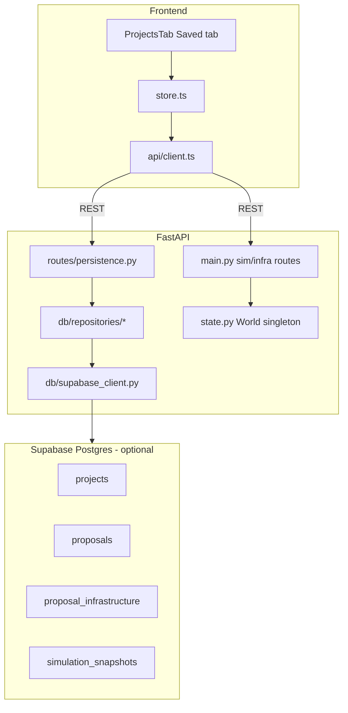

# WattIf Complete System Architecture Audit

Audit date: 2026-05-25

Purpose: document what the current repository actually implements. This is code-first audit documentation, not a roadmap and not a pitch deck.

## Executive Summary

WattIf is currently a Toronto-focused clean-energy planning demo with a polished React/deck.gl map frontend and a FastAPI backend. It has a real in-memory simulation engine, optional Supabase persistence for projects/proposals/placements/snapshots, REST APIs, and WebSocket streams for simulation and planner chat.

The system is not yet a general city-designer sandbox. There is no user dataset upload flow, no authenticated multi-user project model, no arbitrary GIS import, and no true persistent resident AI agents. Resident-like behavior is a representative-agent simulation plus sentiment vectors and rule-templated voices, optionally LLM-rewritten when real keys exist. The operator/planner agent can be real LLM-backed if configured, but the default path is a scripted/demo planner.

## Repository Structure

| Area | Current role | Evidence |
|---|---|---|
| `frontend/` | React/Vite SPA for the map, docks, planner chat, scenario controls, metrics, and persistence UI | `frontend/package.json`, `frontend/src/App.tsx`, `frontend/src/store.ts` |
| `backend/` | FastAPI app with REST routes, WebSockets, simulation, optimizer, planner, data loading, Supabase repositories | `backend/app/main.py`, `backend/app/routes/persistence.py`, `backend/app/sim/engine.py` |
| `data/processed/` | Committed processed Toronto JSON fixtures and contextual layers | `data/processed/facilities.json`, `data/processed/constraints.json`, `data/processed/flood.json` |
| `supabase/migrations/` | Manual SQL migrations for persistence schema | `supabase/migrations/20250525120000_initial_persistence.sql`, `supabase/migrations/20250526120000_snapshot_extras.sql` |
| `docs/audit/` | This audit package | `docs/audit/complete_system_architecture.md` |

Notable absence: there is no committed `ml/` source directory in the inspected tree, although the backend has an optional bridge for a repo-root `ml.inference` module.

## Frontend Stack

The frontend is a Vite React 19 TypeScript app.

| Layer | Implementation |
|---|---|
| Build/runtime | Vite, TypeScript, React 19, React DOM |
| UI | Tailwind CSS, Radix primitives, lucide-react icons |
| State | Zustand store in `frontend/src/store.ts` |
| Mapping | `react-map-gl`, MapLibre by default, Mapbox when `VITE_MAPBOX_TOKEN` exists |
| 3D/GIS rendering | deck.gl layers, `ScenegraphLayer` for GLB infrastructure models, optional Google 3D tiles |
| Charts | Recharts in `frontend/src/components/Hud.tsx` |
| API client | Fetch/WebSocket wrapper with offline fallbacks in `frontend/src/api/client.ts` |

Evidence: `frontend/package.json` lists `react`, `vite`, `zustand`, `deck.gl`, `@deck.gl/*`, `maplibre-gl`, `mapbox-gl`, `react-map-gl`, and `recharts`.

## Frontend Entry Points

| File | Responsibility |
|---|---|
| `frontend/src/main.tsx` | React app mount |
| `frontend/src/App.tsx` | Root layout: map, top bar, left/right docks, timeline, overlays, welcome/demo components |
| `frontend/src/store.ts` | Central app state and all major actions: loading, placement, scenarios, planner chat, persistence, region filtering |
| `frontend/src/api/client.ts` | REST and WebSocket client; every major call degrades to mock/local behavior |

`App.tsx` renders `MapView`, `TopBar`, `LeftDock`, `RightDock`, `Timeline`, `ScenarioBanner`, `Welcome`, `RegionSelector`, `DemoCaption`, `OverlayLegend`, `Toasts`, and `ScenarioFlash`.

## Frontend Component Tree

High-level tree:

| Component | Current role |
|---|---|
| `App` | Owns page frame and calls `useStore().init()` on mount |
| `MapView` | MapLibre/Mapbox host and deck.gl overlay; click/hover handling for zones, recommendations, infra, scenario targeting, region selection |
| `LeftDock` | Tabs: Build, Saved, Events, Priority, Map |
| `BuildTab` | Manual placement and AI auto/step planning controls |
| `ProjectsTab` | Supabase project/proposal selection, proposal creation, snapshot save, persisted placement list |
| `ScenarioControls` | Fires random/city-wide/targeted scenarios |
| `BuildPriority` | Displays ranked zones from `/api/siting-priority` |
| `LayersPanel` and `LegendContent` | Layer toggles and map legend |
| `RightDock` | Tabs: Chat, Activity, Voices, Stats, Assets |
| `ChatPanel` | Planning agent chat, live/local badge, tool events, approve/reject controls |
| `VoicesFeed` | Resident-style voice feed |
| `ActivityLog` | Human-readable sim events |
| `Hud` | Metrics dashboard and trend chart |
| `InfrastructureInspector` | Current placement details and actions |

## State Management

`frontend/src/store.ts` is the single application store. It holds:

| State group | Examples |
|---|---|
| Loaded world | `zones`, `agents`, `infra`, `metrics`, `history`, `recommendations` |
| Region filtering | `selectedRegion`, `allZones`, `allAgents`, `setSelectedRegion()` |
| Map layers | `layers`, `setLayers()`, `setPrimaryOverlay()` |
| Simulation | `playing`, `step()`, `play()`, `pause()`, `reset()` |
| Scenarios | `scenarios`, `scenarioTargeting`, `pendingScenarioType`, `triggerScenario()` |
| Sentiment/voices | `sentiment`, `voices`, `approvalHistory`, `subjectApproval` |
| Planner/chat | `chat`, `chatConnected`, `chatBusy`, `sendChat()`, `approveStep()`, `rejectStep()` |
| Persistence | `projects`, `proposals`, `selectedProjectId`, `selectedProposalId`, `proposalInfrastructure`, `latestSnapshot`, `persistedInfraIds` |
| UX/demo | `showWelcome`, docks, legend, guided demo state, toasts |

Selection persistence is only client-local for selected IDs via `localStorage` keys `wattif:selectedProjectId` and `wattif:selectedProposalId`; proposal data itself persists only through Supabase when configured.

## Backend Stack

The backend is a Python 3.11+ FastAPI app.

| Layer | Implementation |
|---|---|
| API framework | FastAPI, Pydantic v2 |
| Server | Uvicorn expected by `backend/pyproject.toml` |
| Simulation math | NumPy vectorized arrays |
| Optional optimization | OR-Tools dependency exists, but default route uses greedy optimizer |
| Optional LLM | Anthropic or OpenAI-compatible Feather gateway; scripted demo fallback |
| Optional persistence | Supabase Python client with service role key |
| Tests | Pytest under `backend/tests/` |

Evidence: `backend/pyproject.toml` declares `fastapi`, `uvicorn`, `pydantic`, `websockets`, `numpy`, `ortools`, `anthropic`, `openai`, `python-dotenv`, `scikit-learn`, `joblib`, and `supabase`.

## Backend Entry Points

| File | Responsibility |
|---|---|
| `backend/app/main.py` | Creates FastAPI app, CORS, health route, simulation routes, scenario routes, planner routes, WebSockets |
| `backend/app/routes/persistence.py` | Supabase-backed project/proposal/infrastructure/snapshot/asset routes |
| `backend/app/state.py` | Singleton `World`, loaded zones/agents, simulation engine, scenario/session state |
| `backend/app/config.py` | Runtime env vars, LLM provider selection, persistence provider selection |
| `backend/app/models.py` | Pydantic API models for simulation/world data |
| `backend/app/persistence_models.py` | Pydantic API models for persistence data |

The backend stores the live simulation world in one process-wide singleton. It is not a durable multi-session simulation server.

## REST API Routes

Routes implemented in `backend/app/main.py`:

| Route | Method | Purpose |
|---|---:|---|
| `/api/health` | GET | Health and capability flags: data source, LLM, ML, persistence, Supabase |
| `/api/zones` | GET | List loaded zones |
| `/api/agents` | GET | List loaded agents, optionally by zone and limit |
| `/api/zones/clusters` | GET | Optional ML-backed zone clusters, otherwise unavailable |
| `/api/forecast` | GET | ML-backed demand forecast when available, otherwise baseline demand |
| `/api/siting-priority` | GET | Ranked build priority by unmet demand and energy burden; ML optional |
| `/api/rationales` | GET | Sampled agent rationales, real LLM only when configured, otherwise rule-based |
| `/api/infra` | GET/POST | List/place session infrastructure |
| `/api/infra/{infra_id}` | DELETE | Delete session infrastructure |
| `/api/sim/reset` | POST | Reset sim metrics to tick 0, preserving placed infra in engine |
| `/api/sim/step` | POST | Advance simulation ticks |
| `/api/sim/metrics` | GET | Current metrics |
| `/api/activity` | GET | Backfilled activity log |
| `/api/optimize` | POST | Greedy recommendations |
| `/api/session/reset` | POST | Clear placed infra, scenarios, and reset engine |
| `/api/scenario` | POST | Apply a scenario |
| `/api/scenarios` | GET | List active scenarios |
| `/api/sentiment` | GET | City/per-zone sentiment, or subject-specific approval |
| `/api/agents/voices` | GET | Sampled voice posts or event reactions |
| `/api/flows` | GET | Energy flows from active infrastructure to host zones |
| `/api/facilities` | GET | Processed relief/facility points when present |
| `/api/constraints` | GET | Per-zone siting constraints |
| `/api/environment` | GET | Per-zone green/pollution indicators |
| `/api/district-energy` | GET | District energy service data |
| `/api/archetypes` | GET | Current per-zone agent archetype mix |
| `/api/sbei` | GET | Toronto emissions context |
| `/api/flood` | GET | Flood risk layer |
| `/api/heat-vulnerability` | GET | Heat vulnerability layer |
| `/api/existing_infra`, `/api/existing-infra` | GET | Existing renewables/EV chargers |
| `/api/generation-mix` | GET | Ontario generation mix and marginal emissions factor |
| `/api/planner/run` | POST | Run planner to completion over REST |

Persistence routes implemented in `backend/app/routes/persistence.py`:

| Route | Method | Purpose |
|---|---:|---|
| `/api/projects` | GET/POST | List/create planning projects |
| `/api/proposals` | GET/POST | List/create proposals, optionally by project |
| `/api/proposals/{proposal_id}/infrastructure` | GET/POST | List/create persisted proposal placements |
| `/api/proposals/{proposal_id}/infrastructure/{infra_id}` | DELETE | Delete persisted placement |
| `/api/proposals/{proposal_id}/snapshots` | GET/POST | List/create snapshots |
| `/api/proposals/{proposal_id}/snapshots/latest` | GET | Latest snapshot |
| `/api/assets/definitions` | GET/POST | Asset definition metadata |

When Supabase is not configured, persistence routes return HTTP 503 with `available: false`.

## WebSocket Flows

| Socket | Current behavior | Evidence |
|---|---|---|
| `/ws/sim` | Sends initial `state`, accepts play/pause/step/reset/speed/scenario controls, streams `tick_start`, `tick`, `activity`, `voices`, `tick_complete` | `backend/app/main.py` |
| `/ws/planner` | Accepts `user_message`, `scenario`, `approve`, `reject`, `stop`; streams planner events including thoughts, tool calls/results, placements, scenario observations, approvals, done | `backend/app/main.py`, `backend/app/planner.py` |

Frontend client behavior:

| File | Behavior |
|---|---|
| `frontend/src/api/client.ts` | `openSimSocket()` reconnects only after a successful connection; otherwise frontend stays on local stepping |
| `frontend/src/api/client.ts` | `createPlannerSession()` uses `/ws/planner` when live, otherwise streams deterministic mock planner events |
| `frontend/src/store.ts` | Planner placement events update map state and refresh simulation/sentiment/priority |

## Persistence Architecture

Supabase persistence is optional and server-side only.

| Layer | Details |
|---|---|
| Env gating | `backend/app/config.py` enables Supabase only when `SUPABASE_URL` and `SUPABASE_SERVICE_ROLE_KEY` exist |
| Migrations | Manual SQL files under `supabase/migrations/`; app does not auto-migrate |
| Repositories | `backend/app/db/repositories/*.py` wrap Supabase table operations |
| Routes | `backend/app/routes/persistence.py` exposes project/proposal/snapshot APIs |
| Frontend | `ProjectsTab` enables UI only when `/api/health` reports `persistenceProvider: "supabase"` |

Schema from migrations:

| Table | Purpose |
|---|---|
| `projects` | Top-level workspace with `name`, `description`, `city`, `metadata` |
| `proposals` | Saved planning scenarios within projects |
| `proposal_infrastructure` | Persisted placements linked to a proposal |
| `simulation_snapshots` | Metrics plus Phase 3 `scenarios` and `infrastructure` JSONB payload columns |
| `asset_definitions` | Metadata-only asset definitions |
| `uploaded_datasets` | Metadata registry only; no file upload/storage flow |
| `agent_profiles` | Future cohort persona table, not wired into runtime resident voices |
| `agent_concerns` | Future concerns table, not wired into runtime resident voices |
| `planner_runs` | Planner output log table; not part of the primary frontend flow |

Important truth: Phase 3 persistence exists for proposals, infrastructure placements, and snapshots. It is not full app/session persistence. The live backend simulation is still process memory.

## Proposal, Project, Snapshot Flow

Current flow:

1. Frontend loads backend health in `frontend/src/store.ts`.
2. If Supabase is active, `loadProjects()` calls `/api/projects`.
3. User creates/selects a project in `ProjectsTab`.
4. User creates/selects a proposal.
5. Selecting a proposal resets the live session, loads proposal infrastructure from `/api/proposals/{id}/infrastructure`, re-places compatible rows into the live simulation through `/api/infra`, loads latest snapshot, and refreshes metrics/sentiment/flows.
6. New manual placements call `/api/infra` and, if a proposal is selected, also call `/api/proposals/{id}/infrastructure`.
7. Save Snapshot posts current metrics, active scenarios, and current infrastructure to `/api/proposals/{id}/snapshots`.

Limitations:

| Limitation | Evidence |
|---|---|
| Snapshot reload does not restore full sim state by itself | `selectProposal()` restores persisted infrastructure and loads `latestSnapshot`, but does not replay snapshot scenarios/metrics into engine |
| Persistence only supports server-side Supabase service role | `backend/app/config.py`, `backend/app/db/supabase_client.py` |
| No auth/RLS enforcement is implemented in app logic | Migration comments defer RLS/auth |

## Simulation Engine

The main simulation is real, deterministic, and rule-based.

| Concern | Implementation |
|---|---|
| Engine | `backend/app/sim/engine.py` |
| Tick unit | One simulated month |
| Demand | Zone baseline demand with monthly growth and scenario multipliers |
| Supply | Placed infrastructure supply, rooftop adoption supply scaled from sampled agents to full zone demand |
| Infrastructure | Solar, wind, battery, microgrid only |
| Batteries | Peak shaving/enabling credit, not net generation |
| Microgrids | Supply and blackout resilience behavior |
| Emissions | Unmet demand multiplied by marginal gas-peaker factor |
| Equity score | Coverage weighted by blended energy burden, pollution, green score, heat vulnerability |
| Sentiment | Separate vectorized opinion model in `backend/app/sim/sentiment.py` |
| Activity | Human-readable tick messages generated from changes |

The engine mutates in-process state. It is suitable for a demo/session simulator, not yet for reproducible, durable planning studies across users.

## Optimizer and Planner

Optimizer:

| Aspect | Current implementation |
|---|---|
| File | `backend/app/optimizer.py` |
| Default route | Greedy optimizer via `/api/optimize` |
| Candidate generation | One or more suitable infrastructure kinds per zone |
| Scoring | Coverage gain plus equity gain minus cost/constraints/existing infra/district-energy penalties/diversity penalty |
| OR-Tools | Code exists in `optimize_ortools()`, but default `optimize()` strategy is greedy |

Planner:

| Aspect | Current implementation |
|---|---|
| File | `backend/app/planner.py` |
| Tools | `get_city_state`, `get_metrics`, `get_budget`, `optimize`, `place_infrastructure`, `remove_infrastructure`, `run_simulation`, `launch_program` |
| Real LLM support | Anthropic or Feather when configured |
| Default | Scripted `demo` provider is on by default via `WATTIF_DEMO_LLM=1` |
| No-key mode | Deterministic planner-lite/demo planner, not autonomous LLM reasoning |
| Step mode | WebSocket approval gate for mutating tools |
| Memory | `PlannerChat` keeps message history during a WebSocket session; not persisted |

## Data Loading Pipeline

Runtime data loading lives in `backend/app/data/loader.py`.

| Data | Current behavior |
|---|---|
| Zones | Looks for `data/processed/zones.json`; if absent/invalid, falls back to seed data |
| Agents | Looks for `data/processed/agents.json`; if absent, synthesizes agents from loaded zones |
| Facilities | Loads `facilities.json` if present |
| Constraints | Loads `constraints.json` if present |
| Existing infra | Loads `existing_infra.json` if present |
| Environment | Loads `environment.json` if present |
| Flood | Loads `flood.json` if present |
| Heat vulnerability | Loads `heat_vulnerability.json` if present |
| District energy | Loads `district_energy.json` if present |
| SBEI | Loads `sbei.json` if present |
| Archetypes | Loads `archetypes.json` if present and re-samples agent archetypes |
| Generation mix | Loads `generation_mix.json` if present |
| Attitudes | Loader exists for `attitudes.json`; sentiment model may use priors |

There is no user-facing upload pipeline. The migration has `uploaded_datasets`, but runtime code does not accept files, parse arbitrary datasets, or bind uploaded datasets to projects.

## Map and GIS Layers

Map rendering is substantial and real for committed data layers.

| Layer | Source | Implementation |
|---|---|---|
| Base map | CARTO dark MapLibre by default; Mapbox Standard if token exists | `frontend/src/components/MapView.tsx` |
| Optional 3D buildings | Google 3D Tiles if `VITE_GOOGLE_MAPS_KEY`; MapLibre building extrusion fallback | `MapView.tsx` |
| Zones | Backend processed/seed zones or frontend fixture fallback | `buildLayers()` in `frontend/src/map/layers.ts` |
| Equity | Zone energy burden | `layers.ts` |
| Sentiment | Per-zone sentiment | `layers.ts` |
| Demand | Hexagon layer over agents | `layers.ts` |
| People | Sampled agents as moving dots | `layers.ts`, `frontend/src/store.ts` |
| Infrastructure | GLB scenegraph models plus halos/ripples | `layers.ts`, `frontend/src/types.ts` |
| Recommendations | Beam/ring markers | `layers.ts` |
| Flows | TripsLayer from infra to zones | `layers.ts` |
| Facilities | Text/icon markers from processed facilities | `layers.ts` |
| Existing infra | Scatterplot markers from processed existing infra | `layers.ts` |
| Constraints | Per-zone no-build/siting penalty tint | `layers.ts` |
| Flood | Per-zone flood risk tint | `layers.ts` |
| District energy | Per-zone service tint | `layers.ts` |
| Rooftop glints | Frontend sampled candidate points, revealed by adoption | `frontend/src/store.ts`, `layers.ts` |
| Build priority | `/api/siting-priority` ranking | `layers.ts` |

GIS limitation: the app renders known committed layers. It does not import user-supplied GIS files, run spatial joins for uploaded data, or manage arbitrary layer schemas.

## ML Integrations

ML is optional, not required for the app to run.

| Integration | Current behavior | Evidence |
|---|---|---|
| `ml_bridge` | Attempts to import `ml.inference` from repo root; returns `None` on failure | `backend/app/ml_bridge.py` |
| Demand forecast | `/api/forecast` returns ML prediction if available, otherwise baseline demand | `backend/app/main.py` |
| Zone clusters | `/api/zones/clusters` returns unavailable if ML is absent | `backend/app/main.py` |
| Scenario adoption | `_apply_ml_adaptation()` no-ops if ML unavailable | `backend/app/scenarios.py` |
| Siting priority | Uses ML if available, otherwise heuristic | `backend/app/main.py` |

This is an integration hook, not proof that trained models are present or production-grade. The inspected tree did not show a committed `ml/` package.

## LLM Integrations

| Surface | Real LLM path | Fallback path |
|---|---|---|
| Rationales | `generate_rationales()` calls Anthropic/Feather for sampled agents when real provider configured | Rule-based rationale strings |
| Voice enrichment | `enrich_voices()` rewrites generated voices only with real provider | Original templated text |
| Planner run/chat | Anthropic tool use or Feather function calling | Scripted demo planner or deterministic planner-lite |

Provider selection in `backend/app/config.py`:

1. `ANTHROPIC_API_KEY` wins.
2. `FEATHER_API_KEY` plus `FEATHER_BASE_URL` next.
3. `WATTIF_DEMO_LLM=1` default enables a scripted demo provider.
4. Otherwise no LLM provider.

Important truth: health `llmEnabled: true` may mean the scripted demo provider, not a network LLM. `realLlm` is the honest field for real LLM provider presence.

## Environment Variables

Frontend:

| Variable | Purpose | Evidence |
|---|---|---|
| `VITE_API_URL` | Backend base URL, default `http://localhost:8000` | `frontend/src/api/client.ts` |
| `VITE_GOOGLE_MAPS_KEY` | Optional Google 3D Tiles | `frontend/src/components/MapView.tsx` |
| `VITE_MAPBOX_TOKEN` | Optional Mapbox renderer/style | `frontend/src/components/MapView.tsx` |

Backend:

| Variable | Purpose | Evidence |
|---|---|---|
| `ANTHROPIC_API_KEY` | Real Anthropic planner/rationales/voice enrichment | `backend/app/config.py` |
| `WATTIF_CLAUDE_MODEL` | Anthropic model name | `backend/app/config.py` |
| `FEATHER_API_KEY` | OpenAI-compatible gateway key | `backend/app/config.py` |
| `FEATHER_BASE_URL` | OpenAI-compatible gateway base URL | `backend/app/config.py` |
| `FEATHER_MODEL` | Gateway model name | `backend/app/config.py` |
| `WATTIF_DEMO_LLM` | Scripted demo LLM provider toggle, default on | `backend/app/config.py` |
| `WATTIF_LLM_AGENT_SAMPLE` | Number of sampled agents for rationales | `backend/app/config.py` |
| `WATTIF_TICK_SECONDS` | WebSocket sim tick cadence | `backend/app/config.py` |
| `WATTIF_START_YEAR` | Sim start year | `backend/app/config.py` |
| `WATTIF_SEED` | Deterministic seed | `backend/app/config.py` |
| `WATTIF_NUM_AGENTS` | Synthetic agent count when no processed agents file exists | `backend/app/config.py` |
| `WATTIF_CORS_ORIGINS` | CORS allowlist | `backend/app/config.py` |
| `SUPABASE_URL` | Supabase endpoint | `backend/app/config.py` |
| `SUPABASE_SERVICE_ROLE_KEY` | Supabase service-role key, server-side | `backend/app/config.py` |

## Mock, Demo, and Fallback Paths

| Path | Current behavior |
|---|---|
| Frontend API fallback | Every major REST call in `frontend/src/api/client.ts` falls back to `frontend/src/data/mock.ts` or local deterministic behavior |
| Frontend sim fallback | If `/ws/sim` is absent, local `step()` uses mock metrics/scenario impacts |
| Planner fallback | `createPlannerSession()` streams `mockPlannerEvents()` when `/ws/planner` is unreachable |
| Backend data fallback | `load_world()` falls back from processed JSON to synthetic seed world |
| Backend ML fallback | `ml_bridge` returns `None`; routes use baseline or heuristic |
| Backend LLM fallback | Rationales/voices use rules; planner uses scripted demo/planner-lite |
| Persistence fallback | If Supabase env is missing, frontend labels memory mode and persistence routes return 503 |

This fallback architecture makes the demo robust, but it also means frontend behavior can look more capable than the live backend actually is.

## Key Data Models

Simulation models in `backend/app/models.py` and `frontend/src/types.ts`:

| Model | Meaning |
|---|---|
| `Zone` | Neighbourhood polygon, centroid, demographics, demand, solar/wind potential |
| `Agent` | Representative household/business record with archetype, demand, income, rooftop, EV, adoption flags |
| `Infra` | Placed solar/wind/battery/microgrid asset with position, capacity, cost, status |
| `SimMetrics` | Tick, year, demand, renewable supply, coverage, grid load, emissions, cost, equity, approval |
| `ZoneDelta` | Per-zone demand/supply/coverage/adoption/approval/outage per tick |
| `Scenario` | Rule-based event with effects and optional gathering hints |
| `AgentVoice` | Generated opinion post tied to an agent id, zone id, stance, topic, text, optional position |
| `Recommendation` | Optimizer candidate with position, kind, score, coverage/equity gains, rationale |
| `Flow` | Energy flow from an infrastructure id to a zone id |

Persistence models in `backend/app/persistence_models.py`:

| Model | Meaning |
|---|---|
| `Project` | Top-level saved planning workspace |
| `Proposal` | Saved scenario/proposal within project |
| `ProposalInfrastructure` | Persisted placement row |
| `SimulationSnapshot` | Saved point-in-time metrics/scenarios/infrastructure payload |
| `AssetDefinition` | Metadata-only asset definition |

## Important Files and Responsibilities

| File | Responsibility |
|---|---|
| `frontend/src/App.tsx` | Shell layout and app initialization |
| `frontend/src/store.ts` | Central behavior and state orchestration |
| `frontend/src/api/client.ts` | Runtime API, WebSocket, mock fallback boundary |
| `frontend/src/data/mock.ts` | Offline zones/agents/metrics/scenarios/voices/planner |
| `frontend/src/components/MapView.tsx` | Map provider, click/hover/fly-to behavior, optional 3D tiles |
| `frontend/src/map/layers.ts` | All deck.gl layer construction |
| `frontend/src/components/ProjectsTab.tsx` | Project/proposal/snapshot persistence UI |
| `frontend/src/components/ChatPanel.tsx` | Operator/planner chat UI |
| `backend/app/main.py` | Main REST/WebSocket API |
| `backend/app/routes/persistence.py` | Persistence REST API |
| `backend/app/state.py` | In-memory world singleton and facade |
| `backend/app/sim/engine.py` | Core tick simulation |
| `backend/app/sim/agents.py` | Rooftop solar and EV adoption arrays |
| `backend/app/sim/sentiment.py` | Public-opinion model |
| `backend/app/sim/voices.py` | Rule-template resident voices and reactions |
| `backend/app/sim/llm.py` | Optional LLM rationales and voice enrichment |
| `backend/app/scenarios.py` | Rule-based scenario engine |
| `backend/app/optimizer.py` | Siting recommendations |
| `backend/app/planner.py` | Tool-calling planner and chat |
| `backend/app/data/loader.py` | Processed data loaders and seed fallback |
| `backend/app/ml_bridge.py` | Optional ML integration |
| `supabase/migrations/*.sql` | Persistence schema |

## Architecture Risks

| Risk | Why it matters |
|---|---|
| Single process-wide world | Multiple users or tabs can mutate the same backend simulation state |
| Frontend fallback masks backend absence | Demo may appear functional even when backend/ML/LLM/persistence are offline |
| Type drift | Frontend `ScenarioType` only lists older scenario names while backend supports more types |
| Persistence is partial | Proposal placements and snapshots persist, but full simulation/session state does not |
| Agent tables are not runtime agents | `agent_profiles` and `agent_concerns` exist in SQL but are not wired into voices/planner |
| Real LLM status can be overstated | `llmEnabled` includes scripted demo; use `realLlm` for truth |
| Dataset upload table is metadata-only | No upload API, storage, parsing, validation, or project-bound data use |

## Key Takeaways

- WattIf has a real React/FastAPI simulation demo with meaningful map layers, rule-based simulation, optimizer, planner tooling, and Phase 3 Supabase persistence for proposals, placements, and snapshots.
- The current architecture is still demo/session-oriented: one in-memory world, strong fallbacks, and limited durable state.
- The resident layer is not true resident AI. It is representative agents plus sentiment arrays plus templated voices, with optional LLM rewriting only when real keys exist.
- The operator/planner agent can be LLM-backed, but the default behavior is scripted/demo. Pitch it carefully as an agentic planning interface with real and fallback modes.
- The largest architectural gap is turning committed Toronto fixtures and in-memory simulation into project-scoped, uploaded-data-grounded, reproducible planning workspaces.
# WattIf — Complete System Architecture (Audit)

**Audit date:** Reflects codebase after Phase 3 proposal persistence.  
**Trust order:** Running code → [schema_contracts.md](../schema_contracts.md) → this audit → older vision notes.

When this document disagrees with pre–Phase 3 audit copies, **trust the code**.

---

## Executive summary

WattIf is a **React + FastAPI** Toronto energy-equity simulator with an optional **Supabase Postgres** persistence layer (Phase 2–3). The **live simulation** still runs in a singleton in-memory `World`; **saved projects, proposals, proposal-scoped infrastructure, and manual simulation snapshots** persist to Supabase when configured.

There is **no frontend Supabase client** (backend service role only). There is **no auth/RLS**, **no dataset upload**, and **no automatic full sim-state persistence on every tick**.

---

## Persistence architecture (current)

| Layer | Persisted? | Mechanism |
|-------|------------|-----------|
| Live sim tick / metrics | **No** (in-memory) | `World` / `SimEngine` |
| Session infra (`POST /api/infra`) | **In-memory only** | Until proposal reload or reset |
| Proposal infrastructure | **Yes** (when Supabase on) | `proposal_infrastructure` table |
| Manual snapshots | **Yes** | `simulation_snapshots` (metrics, scenarios, infrastructure JSONB) |
| Project/proposal metadata | **Yes** | `projects`, `proposals` |

---

## Supabase configuration

[`backend/app/config.py`](../../backend/app/config.py):

- `SUPABASE_URL`, `SUPABASE_SERVICE_ROLE_KEY`
- `supabase_enabled()` — both vars set
- `persistence_provider()` → `"supabase"` or `"memory"`

[`backend/app/db/supabase_client.py`](../../backend/app/db/supabase_client.py): lazy client; returns `None` when unset; logs warning on init failure.

[`GET /api/health`](../../backend/app/main.py): `persistenceProvider`, `supabaseConfigured` (plus existing LLM/ML fields).

---

## Database migrations

| File | Purpose |
|------|---------|
| [`supabase/migrations/20250525120000_initial_persistence.sql`](../../supabase/migrations/20250525120000_initial_persistence.sql) | Base tables: projects, proposals, proposal_infrastructure, simulation_snapshots, asset_definitions, uploaded_datasets, agent_profiles, agent_concerns, planner_runs |
| [`supabase/migrations/20250526120000_snapshot_extras.sql`](../../supabase/migrations/20250526120000_snapshot_extras.sql) | Adds `simulation_snapshots.scenarios` and `simulation_snapshots.infrastructure` JSONB columns |

Migrations are **manual** (SQL editor or Supabase CLI) — not applied at app startup. RLS/auth deferred.

---

## Persistence REST API

Module: [`backend/app/routes/persistence.py`](../../backend/app/routes/persistence.py)

| Method | Path | Repository |
|--------|------|------------|
| GET | `/api/projects` | `projects.list_projects` |
| POST | `/api/projects` | `projects.create_project` |
| GET | `/api/proposals?projectId=` | `proposals.list_proposals` |
| POST | `/api/proposals` | `proposals.create_proposal` |
| GET | `/api/proposals/{id}/infrastructure` | `proposal_infrastructure.list_by_proposal` |
| POST | `/api/proposals/{id}/infrastructure` | `proposal_infrastructure.create` |
| DELETE | `/api/proposals/{id}/infrastructure/{infraId}` | `proposal_infrastructure.delete` |
| GET | `/api/proposals/{id}/snapshots` | `simulation_snapshots.list_by_proposal` |
| POST | `/api/proposals/{id}/snapshots` | `simulation_snapshots.create` |
| GET | `/api/proposals/{id}/snapshots/latest` | `simulation_snapshots.get_latest` |
| GET/POST | `/api/assets/definitions` | `assets` (metadata registry only) |

When Supabase is not configured: **503** with `{ available: false }`. Live sim routes unchanged.

Models: [`backend/app/persistence_models.py`](../../backend/app/persistence_models.py). Shapes documented in [`docs/schema_contracts.md`](../schema_contracts.md).

---

## Repository layer

[`backend/app/db/repositories/`](../../backend/app/db/repositories/):

| Module | Phase 3 status |
|--------|----------------|
| `projects.py` | create, list, get |
| `proposals.py` | create, list, get |
| `proposal_infrastructure.py` | list_by_proposal, create, update_metadata, delete |
| `simulation_snapshots.py` | list_by_proposal, get_latest, create (metrics + scenarios + infrastructure) |
| `assets.py` | create, list definitions |
| `datasets.py`, `agents.py`, `planner_runs.py` | list/get skeletons only |

---

## Frontend persistence flow

**Saved tab:** [`frontend/src/components/ProjectsTab.tsx`](../../frontend/src/components/ProjectsTab.tsx) in LeftDock tab `"saved"`.

**State:** [`frontend/src/store.ts`](../../frontend/src/store.ts):

- `projects`, `proposals`, `selectedProjectId`, `selectedProposalId` (also `localStorage` keys `wattif:selectedProjectId`, `wattif:selectedProposalId`)
- `proposalInfrastructure`, `latestSnapshot`, `persistedInfraIds`
- `persistenceMode`: `"memory"` | `"supabase-no-proposal"` | `"supabase-proposal"`

**API client:** [`frontend/src/api/client.ts`](../../frontend/src/api/client.ts) — all persistence via FastAPI (no Supabase JS SDK).

### Select proposal → reload infrastructure

`selectProposal()` ([`store.ts`](../../frontend/src/store.ts) ~L749):

1. `resetSession()` clears live sim
2. `GET /api/proposals/{id}/infrastructure`
3. Each row → `persistedToInfra()` → `POST /api/infra` to repopulate live sim
4. `GET /api/proposals/{id}/snapshots/latest` for display metadata
5. Refresh sentiment, flows, siting priority

### Place infrastructure → dual write

`addInfraAt()` (~L1203): when a proposal is selected and `persistenceProvider === "supabase"`:

1. `POST /api/infra` (live sim)
2. `POST /api/proposals/{id}/infrastructure` (persisted row)
3. Maps live infra id → persisted row id in `persistedInfraIds`

### Save snapshot

`saveSnapshot()` (~L804): `POST /api/proposals/{id}/snapshots` with current `metrics`, `scenarios`, and `infra` array. Does **not** replace proposal_infrastructure rows.

### Remove infrastructure

`removeInfra()` deletes persisted row when `persistedInfraIds` mapping exists.

**Note:** Snapshot JSON is stored but **not automatically applied** to restore sim state on select — reload uses `proposal_infrastructure` rows, not snapshot payload.

---

## Live simulation (unchanged core)

Still in-memory [`World`](../../backend/app/state.py) + [`SimEngine`](../../backend/app/sim/engine.py):

- `POST /api/infra`, `/api/sim/step`, `/ws/sim` operate on live world
- No DB write on tick
- Template voices on hot path; optional LLM enrich on REST only

---

## Mock / fallback paths

| Condition | Behavior |
|-----------|----------|
| No Supabase env | Persistence routes 503; Saved tab shows Memory mode |
| Backend offline | Frontend mock in `mock.ts`; no persistence |
| Supabase env but tables missing | Persistence routes 502 |
| Demo planner / template voices | Unchanged from Phase 1 |

---

## Key Takeaways

1. **Persistence is partially implemented** — projects, proposals, proposal infrastructure, and manual snapshots in Supabase when configured.
2. **Live sim remains in-memory** — persistence is proposal-scoped, not a full simulation database.
3. **Backend-only Supabase writer** — frontend uses FastAPI REST exclusively.
4. **Infrastructure reload on proposal select is real**; **snapshot restore to live sim** replays stored infra JSON without modifying `proposal_infrastructure`.
5. **Auth, dataset upload, and report export are still missing.**
