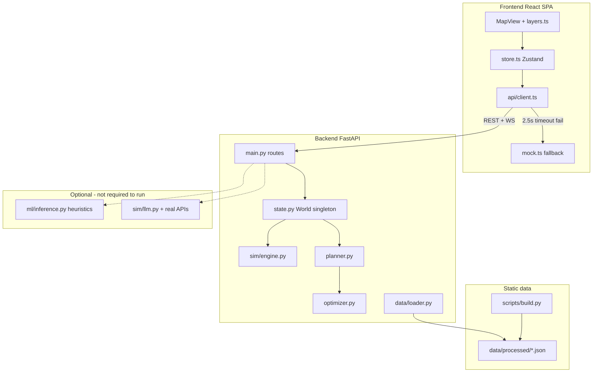

# WattIf — Complete System Architecture (Audit)

**Audit date:** Based on inspection of the repository as it exists today.  
**Purpose:** Document what is actually implemented — not the intended product vision.  
**Companion docs:** [current_project_details.md](./current_project_details.md), [vision_gap_analysis.md](./vision_gap_analysis.md)

When this document disagrees with [`docs/OVERVIEW.md`](../OVERVIEW.md) or [`docs/ARCHITECTURE.md`](../ARCHITECTURE.md), **trust the code**.

---

## Executive summary

WattIf is a **monorepo** with a React map frontend and a FastAPI simulation backend. It models **44 Toronto neighbourhood zones** and **~4,001 representative agents** (not individual LLM agents). The core loop is a **deterministic, rule-based monthly tick simulation** with an equity-weighted greedy optimizer and a **scripted demo planner** (default when no LLM API keys are set).

There is **no database**, **no dataset upload API**, **no session persistence**, and **no true autonomous resident AI agents**. Public opinion is a **vectorized drift model** plus **template-based voice strings** (optionally LLM-rewritten when real API keys exist).

---

## Repository structure

```
wattif/
├── frontend/          React 19 + Vite + TypeScript SPA
├── backend/           FastAPI + Python 3.11+ simulation server
├── data/processed/    16 committed JSON fixtures (13 loaded at backend boot)
├── scripts/           Offline data pipeline (build.py + fetch/extract scripts)
├── ml/                Optional sklearn training/inference (no .joblib shipped)
└── docs/              Project documentation (including this audit)
```

| Path | Responsibility |
|------|----------------|
| [`frontend/src/App.tsx`](../../frontend/src/App.tsx) | Single-page layout shell |
| [`frontend/src/store.ts`](../../frontend/src/store.ts) | Zustand state + side effects |
| [`frontend/src/api/client.ts`](../../frontend/src/api/client.ts) | REST/WS client with mock fallback |
| [`frontend/src/data/mock.ts`](../../frontend/src/data/mock.ts) | Full offline simulation when backend unreachable |
| [`backend/app/main.py`](../../backend/app/main.py) | FastAPI entry, all routes |
| [`backend/app/state.py`](../../backend/app/state.py) | Singleton `World` |
| [`backend/app/sim/engine.py`](../../backend/app/sim/engine.py) | Tick simulation orchestrator |
| [`backend/app/planner.py`](../../backend/app/planner.py) | Planner tools + demo/real LLM chat |
| [`backend/app/optimizer.py`](../../backend/app/optimizer.py) | Greedy siting (+ unused OR-Tools path on REST) |
| [`backend/app/data/loader.py`](../../backend/app/data/loader.py) | Processed JSON loaders |
| [`scripts/build.py`](../../scripts/build.py) | Regenerates `data/processed/*.json` |

**Not in repo:** `docs/PLAN.md` (referenced in code comments), `data/README.md` (referenced in `build.py`), `data/raw/` (gitignored cache), trained ML `.joblib` files (gitignored).

---

## System context



---

## Frontend stack and component tree

**Stack:** React 19, Vite 8, TypeScript, Tailwind, Radix UI, Zustand, deck.gl, MapLibre GL / Mapbox GL, Recharts.

**No client-side router** — one view.

```
main.tsx
└── App.tsx
    ├── TooltipProvider
    ├── MapView                    ← full-screen map (deck.gl layers)
    ├── TopBar                     ← brand, Live/Mock badge, guided demo trigger
    ├── ScenarioBanner
    ├── LeftDock
    │   ├── BuildTab               ← manual / AI auto / AI step, optimizer
    │   ├── ScenarioControls       ← 7 presets + random + reset
    │   └── LayersPanel            ← 13+ overlay toggles
    ├── RightDock
    │   ├── MiniStats              ← coverage, approval, tick/year strip
    │   ├── ChatPanel              ← planner WebSocket chat
    │   ├── ActivityLog            ← tick narration lines
    │   ├── VoicesFeed             ← resident opinion posts
    │   ├── Hud                    ← full metrics + charts
    │   └── InfrastructureInspector
    ├── Timeline                   ← play / pause / step / reset
    ├── Welcome                    ← onboarding modal
    ├── DemoCaption                ← guided demo captions
    ├── OverlayLegend, Toasts, ScenarioFlash
    └── ui/*                       ← shadcn-style primitives
```

### Central state (`frontend/src/store.ts`)

Single Zustand store (~1,285 lines) owns:

| Domain | Key fields / actions |
|--------|---------------------|
| World | `zones`, `agents`, `infra`, `metrics`, `sentiment`, `flows`, `voices` |
| Map overlays | `layers` object (equity, demand, sentiment, flood, etc.) |
| Simulation | `tick`, `playing`, `step()`, `play()`, `pause()`, `reset()` |
| Placement | `placementMode`: `manual` \| `auto` \| `step`; `placeKind`, `addInfraAt()` |
| AI planner | `chatMessages`, `chatSession`, `sendChat()`, `approveStep()`, `rejectStep()` |
| Scenarios | `activeScenarios`, `triggerScenario()`, localized outage/gathering state |
| Animation | `sampledAgents` (~320 dots), `agentTargets` (mobilization during events) |
| Live flag | `live: boolean` — **true only when `/api/zones` returns non-empty data** |

**Init sequence** (`init()`, ~L460–590):

1. Fetch zones (5 retries) → sets `live`
2. Fetch agents; subsample ~320 for map animation (`filter` every Nth, cap 360)
3. `seedInfra()` — **always client-side** 4 mock placements (not from backend)
4. Parallel: `resetSim`, `getSentiment`, `getFlows`, `getVoices`
5. Background fetch of v3 layers (facilities, flood, constraints, etc.)
6. Open `WS /ws/sim` if backend available

### API client and mock fallback (`frontend/src/api/client.ts`)

- Base URL: `VITE_API_URL` default `http://localhost:8000`
- Every REST call uses `tryFetch()` with **2,500 ms timeout**; failure → `null` → mock
- **`live` badge is misleading granularity:** zones succeeding but sentiment failing still shows "Live API" with mock sentiment

**WebSockets:**

| Socket | Path | Fallback |
|--------|------|----------|
| Sim stream | `/ws/sim` | Local `step()` / `play()` in store |
| Planner session | `/ws/planner` | `mockPlannerEvents()` generator per message |
| One-shot planner | `/ws/planner` (legacy) | Same mock after 600 ms |

### Map / GIS layers (`frontend/src/map/layers.ts`, `MapView.tsx`)

**Basemap:**

- No `VITE_MAPBOX_TOKEN` → MapLibre + CARTO dark + extruded building footprints
- With token → Mapbox Standard 3D buildings
- Optional `VITE_GOOGLE_MAPS_KEY` → Google Photorealistic 3D Tiles (`Tile3DLayer`)

**deck.gl layers** (toggleable unless noted):

| Layer | Data source | Notes |
|-------|-------------|-------|
| Zone choropleths | `zones`, `sentiment`, `floodRisk` | equity, sentiment, flood |
| Demand hexbins | `agents[].demandKwh` | optional 3D extrusion |
| Animated agents | `sampledAgents` (~320) | **visual sample**, not full 4,001 |
| Infra 3D models | placed `infra` | GLB: solar, wind, battery, microgrid |
| Energy flows | `/api/flows` | particle arcs infra → zones |
| Existing infra | `/api/existing_infra` | read-only; includes EV chargers |
| Facilities | `/api/facilities` | cooling centres, libraries (scenario gathering) |
| Constraints | `/api/constraints` | no-build / penalty zones |
| District energy | `/api/district-energy` | Enwave-style service areas |
| Speech bubbles | latest 4 `voices` | clickable |
| Outage overlay | scenario state | microgrid zones stay lit during blackout |

**Not a map layer:** heat vulnerability — fetched but shown in **hover tooltips only** (`MapView.tsx`).

---

## Backend stack and entry points

**Stack:** FastAPI, Uvicorn, Pydantic v2, NumPy, OR-Tools (optional knapsack), Anthropic/OpenAI SDKs (optional).

**Entry:** [`backend/app/main.py`](../../backend/app/main.py) — lifespan logs zone/agent counts and LLM/ML availability.

**Configuration:** [`backend/app/config.py`](../../backend/app/config.py) via `.env` (see Environment variables section).

### Central state: `World` singleton

[`backend/app/state.py`](../../backend/app/state.py) — `get_world()` returns one in-memory instance:

| Field | Source |
|-------|--------|
| `zones`, `agents` | `load_world()` from processed JSON or synthetic seed |
| `source` | `"processed"` or `"seed"` |
| `engine` | `SimEngine` instance |
| `active_scenarios` | append-only list |

**No persistence:** process restart loses all placed infrastructure and scenario history. `session_reset()` clears infra + scenarios and resets tick to 0 but does not reload JSON from disk.

---

## REST API routes

All defined in [`backend/app/main.py`](../../backend/app/main.py):

| Method | Path | Handler | Notes |
|--------|------|---------|-------|
| GET | `/api/health` | `health()` | `dataSource`, `llmProvider`, `realLlm`, `mlAvailable` |
| GET | `/api/zones` | `get_zones()` | 44 zones |
| GET | `/api/agents` | `get_agents()` | ~4,001 agents; optional `zoneId`, `limit` |
| GET | `/api/zones/clusters` | `get_zone_clusters()` | ML or `{available: false}` |
| GET | `/api/forecast` | `get_forecast()` | ML or zone baseline |
| GET | `/api/rationales` | `get_rationales()` | LLM or rule-based; **not on tick path** |
| GET | `/api/infra` | `list_infra()` | User-placed infra |
| POST | `/api/infra` | `place_infra()` | `InfraCreate` — solar/wind/battery/microgrid only |
| DELETE | `/api/infra/{infra_id}` | `delete_infra()` | |
| POST | `/api/sim/reset` | `sim_reset()` | Tick → 0; keeps infra |
| POST | `/api/sim/step` | `sim_step()` | `{ticks: N}` |
| GET | `/api/sim/metrics` | `sim_metrics()` | |
| GET | `/api/activity` | `get_activity()` | |
| POST | `/api/optimize` | `optimize_endpoint()` | **Greedy only** — never calls OR-Tools |
| POST | `/api/session/reset` | `session_reset()` | Full session clear |
| POST | `/api/scenario` | `post_scenario()` | |
| GET | `/api/scenarios` | `get_scenarios()` | |
| GET | `/api/sentiment` | `get_sentiment()` | |
| GET | `/api/agents/voices` | `get_voices()` | Templated; optional LLM enrich |
| GET | `/api/flows` | `get_flows()` | |
| GET | `/api/facilities` | `get_facilities()` | |
| GET | `/api/constraints` | `get_constraints()` | |
| GET | `/api/environment` | `get_environment()` | |
| GET | `/api/district-energy` | `get_district_energy()` | |
| GET | `/api/archetypes` | `get_archetypes()` | |
| GET | `/api/sbei` | `get_sbei()` | Display-only GHG headline |
| GET | `/api/flood` | `get_flood()` | |
| GET | `/api/heat-vulnerability` | `get_heat_vulnerability()` | |
| GET | `/api/existing_infra` | `get_existing_infra()` | Read-only map layer |
| GET | `/api/generation-mix` | `get_generation_mix()` | Ontario grid context |
| POST | `/api/planner/run` | `planner_run()` | One-shot; **forces `mode=auto`** |

**No upload/import endpoints exist anywhere in the backend.**

---

## WebSocket flows

### `/ws/sim` (`ws_sim` in `main.py`)

**Client → server:**

| Message | Effect |
|---------|--------|
| `{action: "play"}` | Start auto-stepping loop |
| `{action: "pause"}` | Stop loop |
| `{action: "step", ticks: k}` | Advance k ticks (1–120) |
| `{action: "reset"}` | Reset sim |
| `{action: "speed", seconds: s}` | Tick interval |
| `{action: "scenario", scenarioType, ...}` | Apply scenario |

**Server → client (per tick, `stream_tick()` ~L604–628):**

1. `tick_start`
2. `tick` (full `SimTick` with metrics + zoneDeltas)
3. `activity` (3–5 narration strings)
4. `voices` — **3 rule-templated voices, explicitly no LLM** (comment L623)
5. `tick_complete`

### `/ws/planner` (`ws_planner` in `main.py`)

**Client → server:**

- `{type: "user_message", text, mode: "auto"|"step", budgetCad?}`
- `{action: "approve"|"reject"}` — step-mode gate
- `{action: "scenario", ...}` — mid-turn injection
- `{action: "stop"}`

**Server → client:**

`turn_start`, `thought`, `tool_call`, `tool_result`, `placement`, `scenario`, `voices`, `awaiting_approval`, `done`

**Default behavior without API keys:** `PlannerChat.turn()` routes to `_demo_turn()` using `parse_intent()` — **keyword matching, not LLM** (`planner.py` L685–731, L760–761).

---

## Simulation engine

[`backend/app/sim/engine.py`](../../backend/app/sim/engine.py) — **1 tick = 1 simulated month**.

### Per-tick pipeline (`step()`)

1. **`adoption_step()`** — rooftop solar adoption hazard draw ([`sim/agents.py`](../../backend/app/sim/agents.py))
2. **`sentiment.step()`** — opinion drift toward targets ([`sim/sentiment.py`](../../backend/app/sim/sentiment.py))
3. **`_compute()`** — aggregate metrics
4. **`_build_activity()`** — human-readable log lines

### Metrics computed (`_compute()`)

| Metric | Implementation |
|--------|----------------|
| **Demand** | `zone_base_demand × 1.004^tick × scenario_multiplier` |
| **Supply** | Infra capacity × capacity factor × 730 h + scaled rooftop adoption |
| **Coverage** | `total_supply / total_demand` (can exceed 100%) |
| **Emissions** | Unmet demand × 0.00045 t/kWh (marginal gas peaker assumption) |
| **Grid load** | Net peak vs effective grid capacity (scenario can shrink capacity) |
| **Equity score** | Burden/HVI/pollution/green-weighted mean of zone coverage |
| **Approval** | Mean agent opinion 0–1 from `SentimentModel` |

**Scaling:** Agents are a **sample** (~4,001). `zone_representation = zone_demand / sampled_demand` scales adoption and supply to neighbourhood totals (`engine.py` L73–78).

**Not modeled:** EV charging as infrastructure, per-building placement, real weather time series, social networks between agents.

---

## Optimizer and planner

### Optimizer ([`backend/app/optimizer.py`](../../backend/app/optimizer.py))

Greedy ranking score:

```
W_COVERAGE × coverage_gain  (1.0)
+ W_EQUITY × equity_gain    (1.2)
- W_COST × cost             (0.5)
- W_DIVERSITY × kind_count  (0.18)
- W_CONSTRAINT × penalty    (0.8)
- W_EXISTING × existing_renewables (0.3)
- W_DISTRICT × district_energy     (0.5, microgrid only)
```

- Skips `no_build` zones; wind excluded from densest third of zones
- One candidate per zone per pass
- **`optimize_ortools()` exists but REST `/api/optimize` never passes `strategy="ortools"`**

### Planner ([`backend/app/planner.py`](../../backend/app/planner.py))

Seven tools via `PlannerTools.execute()`:

`get_city_state`, `get_metrics`, `get_budget`, `optimize`, `place_infrastructure`, `remove_infrastructure`, `run_simulation`

| Provider | Function | Network? |
|----------|----------|----------|
| `None` (demo off, no keys) | `_planner_lite()` | No |
| `"demo"` (default) | `_planner_demo()` — scripted tool loop | No |
| `"anthropic"` / `"feather"` | Real tool-calling LLM | Yes |
| LLM failure | Falls back to `_planner_lite()` | No |

Chat path: `PlannerChat.turn()` uses `_demo_turn()` + `parse_intent()` when provider is `None` or `"demo"`.

---

## Data loading pipeline

### Boot-critical ([`backend/app/data/loader.py`](../../backend/app/data/loader.py))

| File | Fallback |
|------|----------|
| `data/processed/zones.json` | Full synthetic via `seed.build_world()` |
| `data/processed/agents.json` | Synthetic agents for loaded zones |

### Optional layers (return empty/None if missing)

`attitudes.json`, `facilities.json`, `constraints.json`, `existing_infra.json`, `environment.json`, `flood.json`, `heat_vulnerability.json`, `district_energy.json`, `sbei.json`, `archetypes.json`, `generation_mix.json`

### Built but **not loaded at runtime**

| File | Actual use |
|------|------------|
| `demand.json` | Build artifact; demand lives on `Zone.demandKwhMonthly` |
| `solar.json` | Build artifact; solar on `Zone.solarPotential` |
| `buildings.json` | Read only by `ml/features.py` for ML training |

### Offline pipeline ([`scripts/build.py`](../../scripts/build.py))

Regenerates all processed JSON from Toronto Open Data + optional raw caches in `data/raw/toronto-open-data/` (gitignored, not shipped). Mix of **real boundaries/census** and **modeled/synthetic** fields per the build script header.

---

## ML integration

[`backend/app/ml_bridge.py`](../../backend/app/ml_bridge.py) defensively imports `ml/inference.py`.

| Function | Wired to | Current state (this checkout) |
|----------|----------|-------------------------------|
| `forecast_demand()` | `GET /api/forecast` | **Heuristic fallback** — no `.joblib` on disk |
| `zone_clusters()` | `GET /api/zones/clusters` | Returns `{available: false}` |
| `scenario_adoption()` | `scenarios._apply_ml_adaptation()` | Heuristic multipliers in `inference.py` |
| `adoption_prob()` | **Not called from backend** | Dead wiring |

Train: `python -m ml.train` → `ml/models/*.joblib` (gitignored). `metadata.json` exists; model files do not.

---

## LLM integration

Config: [`backend/app/config.py`](../../backend/app/config.py)

| Priority | Provider | Condition |
|----------|----------|-----------|
| 1 | Anthropic | `ANTHROPIC_API_KEY` |
| 2 | Feather | `FEATHER_API_KEY` + `FEATHER_BASE_URL` |
| 3 | Demo | `WATTIF_DEMO_LLM=1` (default) |
| 4 | None | Demo disabled |

| Function | File | Uses real LLM? | Hot path? |
|----------|------|----------------|-----------|
| `generate_rationales()` | `sim/llm.py` | Only `real_llm_provider()` | No — `/api/rationales` |
| `enrich_voices()` | `sim/llm.py` | Only `real_llm_provider()` | No — `/api/agents/voices?enrich=true` |
| WS sim tick voices | `main.py` L623–627 | **Never** | Yes — templates only |
| `run_planner()` / `PlannerChat` | `planner.py` | Demo script by default | No |

**Important:** `llm_enabled()` includes demo, but `enrich_voices()` and `generate_rationales()` check `real_llm_provider()` which **excludes demo**. Default deployment gets **no LLM text generation** for voices/rationales.

---

## Mock / demo / fallback paths

| Layer | Real behavior | Fallback |
|-------|---------------|----------|
| Frontend zones/agents | Backend REST | `zonesFixture.json` + generated agents in `mock.ts` |
| Frontend sim metrics | `/api/sim/step` or WS | `metricsForTick()` local formula |
| Frontend planner chat | WS `/ws/planner` | `mockPlannerEvents()` — deterministic scripted stream |
| Frontend v3 layers | Backend REST | Empty arrays / `{}` |
| Backend world data | `data/processed/` | `seed.build_world()` synthetic Toronto |
| Backend ML | Trained joblib | Heuristics in `ml/inference.py` |
| Backend LLM planner | Anthropic/Feather | `_planner_demo()` or `_planner_lite()` |
| Backend voices (tick) | Template library | Same — no LLM on hot path |
| Backend voices (REST) | Templates | + LLM rewrite only with real API key |

---

## Key data models

[`backend/app/models.py`](../../backend/app/models.py) — Pydantic v2, camelCase JSON aliases.

### Placeable infrastructure

```python
InfraKind = Literal["solar", "wind", "battery", "microgrid"]
```

**No EV charger** as placeable type. EV appears only in read-only `existing_infra.json`.

### Agent (simulation object, not LLM agent)

```python
# models.py — Agent fields
id, zone_id, position, archetype, demand_kwh, income_bracket,
has_rooftop, ev_owner, solar_adopted
```

`ev_owner` is a **static boolean** — affects seed demand (+250 kWh) and rationale templates, not charging infrastructure simulation.

### Scenario types (16 + custom)

Including: `blackout`, `heatwave`, `ice_storm`, `earthquake`, `gas_spike`, `ev_surge`, `flood`, `turbine_noise_complaint`, etc. — see `ScenarioType` in `models.py`.

---

## Environment variables

### Backend (`backend/.env`)

| Variable | Default | Purpose |
|----------|---------|---------|
| `ANTHROPIC_API_KEY` | — | Real LLM (Anthropic) |
| `FEATHER_API_KEY`, `FEATHER_BASE_URL`, `FEATHER_MODEL` | — | OpenAI-compatible gateway |
| `WATTIF_DEMO_LLM` | `1` | Scripted demo planner |
| `WATTIF_CLAUDE_MODEL` | `claude-opus-4-7` | Claude model |
| `WATTIF_NUM_AGENTS` | `3000` | Seed fallback agent count |
| `WATTIF_SEED` | `42` | RNG seed |
| `WATTIF_TICK_SECONDS` | `1.0` | Real-time seconds per sim month (WS) |
| `WATTIF_CORS_ORIGINS` | localhost:5173 | CORS |

### Frontend (`frontend/.env`)

| Variable | Default | Purpose |
|----------|---------|---------|
| `VITE_API_URL` | `http://localhost:8000` | REST + WS base |
| `VITE_MAPBOX_TOKEN` | — | Mapbox 3D basemap |
| `VITE_GOOGLE_MAPS_KEY` | — | Google 3D tiles overlay |

---

## Request flow examples

### Manual infrastructure placement

```
User clicks map (BuildTab manual mode)
  → store.addInfraAt()
  → POST /api/infra {kind, zoneId, position}
  → World.place_infra() → SimEngine.add_infra()
  → POST /api/sim/reset (implicit via store.reset())
  → refresh sentiment, flows, voices
```

### Simulation step (live)

```
Timeline step/play
  → POST /api/sim/step OR WS {action: "step"}
  → SimEngine.step_many()
    → adoption_step + sentiment.step + _compute
  → return SimMetrics + activity + 3 templated voices (WS)
```

### AI planner chat (default — no API key)

```
ChatPanel send message
  → WS /ws/planner {type: "user_message", text, mode}
  → PlannerChat.turn() → _demo_turn()
  → parse_intent() keyword match
  → tool calls: get_metrics → optimize → place_infrastructure → run_simulation
  → stream thought/tool_call/placement/done events
```

---

## Important files index

| Concern | Path |
|---------|------|
| Frontend entry | `frontend/src/main.tsx`, `App.tsx` |
| State + demo | `frontend/src/store.ts` |
| API + mock | `frontend/src/api/client.ts`, `frontend/src/data/mock.ts` |
| Map layers | `frontend/src/map/layers.ts`, `components/MapView.tsx` |
| Types contract | `frontend/src/types.ts` |
| Backend routes | `backend/app/main.py` |
| World singleton | `backend/app/state.py` |
| Sim tick | `backend/app/sim/engine.py` |
| Adoption | `backend/app/sim/agents.py` |
| Opinion model | `backend/app/sim/sentiment.py` |
| Voice templates | `backend/app/sim/voices.py` |
| LLM (optional) | `backend/app/sim/llm.py` |
| Planner | `backend/app/planner.py` |
| Optimizer | `backend/app/optimizer.py` |
| Scenarios | `backend/app/scenarios.py` |
| Data loaders | `backend/app/data/loader.py`, `data/seed.py` |
| ML bridge | `backend/app/ml_bridge.py`, `ml/inference.py` |
| Data build | `scripts/build.py` |
| Processed fixtures | `data/processed/*.json` |

---

## Key Takeaways

1. **Architecture is a single-process FastAPI backend + React SPA** with static JSON fixtures — not a multi-tenant platform with upload or persistence.
2. **The simulation hot path is 100% rule-based NumPy** — LLM and ML are optional garnish on specific endpoints.
3. **The default "AI planner" is a scripted demo** (`_planner_demo` / `_demo_turn` + `parse_intent`) unless real API keys are configured.
4. **Agents are simulation records**, not LLM-powered autonomous residents; voices are **template strings** with optional LLM rewrite.
5. **Frontend offline mock is first-class** — the app is designed to demo without any backend.
6. **EV chargers exist as a read-only map layer** from `existing_infra.json`, not as placeable/simulated infrastructure.
7. **Three processed JSON files are not loaded at runtime** despite being committed; prior docs overstating "16 files loaded at boot" were incorrect.
