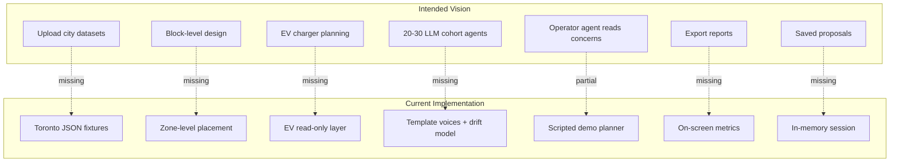

# WattIf — Vision Gap Analysis (Audit)

**Audit date:** Based on inspection of the repository as it exists today.  
**Purpose:** Compare the **intended city-designer sandbox vision** against **what the code actually implements**.  
**Architecture reference:** [complete_system_architecture.md](./complete_system_architecture.md)  
**Product snapshot:** [current_project_details.md](./current_project_details.md)

---

## Intended vision summary

The target product is a **Figma/SimCity-style sandbox** for clean-energy infrastructure planning aimed at **city designers, urban planners, energy planners, and infrastructure decision-makers**.

They should be able to **prototype infrastructure decisions before spending real money** by:

1. Uploading or using relevant city datasets
2. Exploring a GIS/3D map
3. Proposing infrastructure changes (solar, wind, EV chargers, batteries, microgrids)
4. Seeing generation impact, demand matching, cost, grid/load, equity, resident sentiment, cohort concerns, and disaster resilience

Two agent types are envisioned:

| Agent type | Vision |
|------------|--------|
| **Resident / cohort agents** | Small set (20–30 for demo) with personalities grounded in datasets; react to proposals; voice concerns (noise, equity, EV access, outages) |
| **Operator / planner agent** | Works with the designer; interprets concerns; recommends infrastructure; explains tradeoffs |

---

## Current capabilities (honest snapshot)

| Area | Today |
|------|-------|
| **Geography** | Fixed 44 Toronto zones; no city picker |
| **Data ingest** | Offline `scripts/build.py` only; no user upload |
| **Placeable infra** | Solar, wind, battery, microgrid — **not EV chargers** |
| **Simulation** | Monthly ticks; rule-based adoption + sentiment drift |
| **Agents** | ~4,001 records; ~320 map dots; template voices |
| **Planner agent** | Scripted demo default; real LLM optional |
| **Disasters** | 16 scenario levers (blackout, heatwave, ice storm, etc.) |
| **Metrics** | Coverage, equity, approval, emissions, grid load, cost |
| **Persistence** | None |
| **Reports / export** | None |

---

## Implementation status matrix

| Vision capability | Status | Notes |
|-------------------|--------|-------|
| GIS/3D map exploration | **Implemented** | MapLibre/Mapbox + deck.gl; Toronto-only |
| Block/house-level solar placement | **Missing** | Zone-level + coordinate click |
| Wind turbine placement | **Partial** | Placeable; no noise contour / sleep disruption modeling |
| EV charger placement | **Missing** | 82 existing chargers as read-only layer only |
| Battery / microgrid placement | **Implemented** | Full sim + outage resilience |
| Cost impact | **Partial** | Cumulative capital cost; no O&M, no per-zone breakdown |
| Generation impact | **Partial** | Zone supply from capacity factors; not hourly dispatch |
| Demand matching | **Partial** | Coverage ratio; not temporal matching |
| Grid/load impact | **Partial** | Simplified peak load %; not network topology |
| Equity impact | **Implemented** | Weighted equity score + burden overlays |
| Resident sentiment | **Partial** | Drift model + templates; not survey-linked |
| Cohort-specific concerns | **Partial** | Archetype templates mention renters/EV/business |
| Disaster resilience testing | **Partial** | Outage + microgrid supply; no physical damage cascade |
| Upload city datasets | **Missing** | No API, no UI |
| Current energy infrastructure layer | **Partial** | Existing renewables + EV display; not full grid |
| EV ownership patterns | **Partial** | Static `ev_owner` boolean per agent |
| EV owner sentiment | **Partial** | Template lines; `ev_surge` scenario |
| Citizen feedback / survey data | **Partial** | 2021 attitudes JSON seeds priors; no live feedback |
| Weather patterns | **Missing** | Climatology constants in ML features only |
| Heatwave / snowstorm risk GIS | **Partial** | HVI modeled; ice storm is scenario not geodata |
| Zoning / restricted areas | **Partial** | `constraints.json` penalties and no-build |
| Demographic / census data | **Implemented** | On zones from Toronto Open Data |
| Public complaints data | **Missing** | Voices are synthetic templates |
| Resident AI agents | **Missing** | Simulation objects + templates |
| Operator AI agent (real) | **Partial** | Optional LLM; default is scripted demo |
| Persistent agent memory | **Missing** | Opinions drift in-session only |
| Small-town 20–30 agent demo | **Missing** | 4,001 agents; 320 animated |
| Saved proposals / sessions | **Missing** | In-memory singleton |

**Legend:** Implemented = works as described in code. Partial = simplified, incomplete, or fallback-heavy. Missing = no meaningful implementation.

---

## Truth table

| Claim | Current status | Evidence from code | Can we pitch today? | What is needed to make it real |
|-------|----------------|-------------------|---------------------|--------------------------------|
| "Explore Toronto in 3D and place renewables" | **Implemented** | `MapView.tsx`, `POST /api/infra`, GLB models | **Yes** | — |
| "Equity-weighted siting recommendations" | **Implemented** | `optimizer.py` W_EQUITY=1.2, burden weights | **Yes** | — |
| "Simulate months of adoption and metrics" | **Implemented** | `SimEngine.step()`, `agents.py`, `sentiment.py` | **Yes** | — |
| "Stress-test blackouts and heatwaves" | **Partial** | `scenarios.py` levers; no weather GIS | **Yes, with caveats** | Real hazard layers; grid topology |
| "4,000 resident agents react to your plan" | **Partial** | 4,001 records; sentiment drift; not individual reasoning | **Qualified** | True agent model or cohort agents |
| "Residents voice concerns like real people" | **Partial** | `voices.py` templates; optional LLM rewrite | **Qualified** | Survey-linked or LLM agents with context |
| "AI planner helps you design infrastructure" | **Partial** | Default `_planner_demo()` / `_demo_turn()` | **Only with disclosure** | Real LLM default; deeper tool integration |
| "Upload your city's data" | **Missing** | No upload routes; `grep` finds no FormData/import | **No** | Ingest API + schema validation + UI |
| "Plan EV charging infrastructure" | **Missing** | `InfraKind` excludes EV; existing layer read-only | **No** | New infra kind + demand model + placement UX |
| "See noise complaints near wind turbines" | **Partial** | `turbine_noise_complaint` scenario shifts sentiment | **Weak** | Distance-based noise model + cohort filtering |
| "Machine learning demand forecasting" | **Fallback only** | No `.joblib` in repo; `inference.py` heuristics | **No** | Ship models; wire UI; validate accuracy |
| "Grounded in real city open data" | **Partial** | 13 processed layers; mixed real/modeled | **Yes, for Toronto** | More cities; commit raw cache docs |
| "Block-level rooftop solar design" | **Missing** | Zone + point placement | **No** | Building footprints + parcel picker |
| "Persistent saved proposals" | **Missing** | `World` singleton, no DB | **No** | Persistence layer + auth |
| "Export planning reports" | **Missing** | No export code | **No** | Report generator |
| "Integrate live citizen surveys" | **Missing** | Static `attitudes.json` from 2021 study | **No** | Ingest pipeline + API |
| "SimCity-style sandbox for any city" | **Missing** | Toronto-only fixtures | **No** | City abstraction + upload |
| "Autonomous LLM resident agents" | **Missing** | Templates + drift model | **No** | Agent framework with memory + tools |
| "Operator agent interprets resident concerns" | **Missing** | Planner optimizes; does not read voice feed | **No** | Concern aggregation + planner context |
| "Snowstorm risk planning" | **Missing** | `ice_storm` scenario only | **No** | Weather GIS + grid fragility model |
| "Works offline for demos" | **Implemented** | `mock.ts` full fallback | **Yes** | — |

---

## Product gaps

| Gap | Vision expectation | Current state |
|-----|-------------------|---------------|
| **City agnostic** | Any city/town via upload | Toronto hardcoded |
| **Dataset upload** | Designer brings own GIS/CSV | Developer runs `build.py` |
| **EV infrastructure** | First-class placeable type | Read-only map dots |
| **Parcel/building granularity** | Block-level solar on houses | Zone choropleth + point |
| **Consultation replacement** | Synthetic survey from agent reactions | Template quotes |
| **Report output** | Decision-ready summary | On-screen metrics only |
| **Proposal persistence** | Save/share/compare plans | Session lost on restart |
| **Cost realism** | Full project economics | Static unit costs in optimizer |
| **Grid topology** | Real load flow | Aggregate peak % |
| **Multi-user** | Planner collaboration | Single browser session |

---

## Architecture gaps

| Gap | Impact |
|-----|--------|
| **No persistence layer** | Cannot save proposals, agent state, or uploaded data |
| **Singleton in-memory World** | No multi-tenant, no horizontal scale |
| **No ingest API** | Blocks entire "upload datasets" vision |
| **Frontend mock is parallel sim** | Live vs mock behavior diverges (e.g. scenario demand multiplier only when `!live` in `store.ts` L793) |
| **OR-Tools not exposed** | Better optimization exists in code but unused on REST |
| **`adoption_prob()` unwired** | ML adoption model trained but never called |
| **3 processed files unused** | Pipeline/build docs misaligned with runtime |
| **No auth / RBAC** | Not suitable for municipal deployment as-is |

---

## Data gaps

| Vision dataset | Exists? | Gap |
|--------------|---------|-----|
| City location / boundaries | Toronto only | No generalization |
| Energy infrastructure (full grid) | Partial | Existing renewables + EV; no transmission |
| EV charger locations | Read-only | Not sim-linked |
| EV ownership patterns | Static boolean | No dynamic adoption of EV ownership |
| EV owner sentiment | Templates | No cohort agent |
| Citizen feedback / surveys | 2021 attitudes priors | No import; voices synthetic |
| Weather patterns | ML constants only | No spatiotemporal weather |
| Heatwave / snowstorm risk | HVI modeled; ice storm scenario | No snowstorm; no official HVI |
| Power demand | Zone monthly baseline | No hourly; `demand.json` unused at runtime |
| Zoning / restrictions | `constraints.json` | Limited to ESAs/flood overlap |
| Demographics / census | On zones | Real for Toronto |
| Public complaints | **None** | Templates simulate complaints |
| Upload custom data | **None** | — |

**Raw data cache** (`data/raw/`) is gitignored and empty in this checkout — reproducible builds require re-fetching or local cache.

---

## AI / agent gaps

### Operator / planner agent

| Vision | Current |
|--------|---------|
| Interprets resident concerns | Does not consume voices feed |
| Explains tradeoffs in dialogue | Demo: fixed narration; LLM: generic tool loop |
| Uses all available data/tools | 7 tools; no noise model, no EV tool, no upload |
| Works with designer iteratively | WS chat exists; demo uses keyword intent |

**Gap severity:** High for "true operator agent"; moderate for "optimizer with chat UI."

### Resident / cohort agents

See dedicated section below.

---

## Simulation gaps

| Dimension | Vision | Current |
|-----------|--------|---------|
| Time resolution | Possibly hourly/daily | 1 tick = 1 month |
| Spatial resolution | Block/building | Zone polygon |
| Wind noise / sleep | Resident complaints | Sentiment nudge scenario only |
| EV charging load | Demand from chargers | `ev_owner` static; no charger infra |
| Battery dispatch | Grid services | Peak shave approximation |
| Weather-driven demand | Heatwave/snowstorm data | Scenario multipliers |
| Social diffusion | Neighbours influence neighbours | No social graph (`sentiment.py` L5–7) |
| Population scale | 20–30 cohort agents for clarity | 4,001 statistical agents |
| Damage / recovery | Infrastructure lifecycle | Binary damaged status |

---

## UX gaps

| Vision UX | Current |
|-----------|---------|
| Upload dataset wizard | None |
| City picker | None |
| Block-level click-to-solar on buildings | Zone-level |
| EV charger placement tool | None |
| Compare two proposals side-by-side | None |
| Export PDF/report | None |
| Resident concern inbox for planner | Voices feed is separate from chat |
| Noise/sleep overlay for wind | None |
| Honest "demo mode" badge for AI | Shows "Live API" when only zones succeed |
| Step-mode scenario targeting UX | Zone click fires immediately; some banner text stale |

---

## Dedicated section: resident agents

### Are individual humans currently modeled?

**Partially.** The backend holds **~4,001 `Agent` records** (`data/processed/agents.json`) with fields: `archetype`, `incomeBracket`, `demandKwh`, `hasRooftop`, `evOwner`, `solarAdopted`, `zoneId`, `position`.

These are **simulation entities**, not personas with names, biographies, or independent goals. The frontend animates **~320 subsampled dots** (`store.ts` L476: `filter` every Nth agent, cap 360).

### Are they actual LLM-powered agents?

**No.** No agent calls an LLM during simulation. Evidence:

- `SimEngine.step()` calls `adoption_step()` (NumPy hazard) and `sentiment.step()` (matrix drift) — [`engine.py`](../../backend/app/sim/engine.py)
- WS tick voices: `world.voices(n=3)` with comment **"rule-based on the hot loop — no LLM call here"** — [`main.py`](../../backend/app/main.py) L623–627
- `/api/rationales` uses LLM optionally but is **not wired into main UI flow**

### Are they persistent?

**No.** Agents reload from JSON on server boot. Opinion values persist **within a server process session** but are lost on restart. No agent remembers prior conversations or proposals across sessions.

### Do they reason independently?

**No.** All agents of the same archetype in a zone share sentiment **target shifts** from scenarios/placements. Drift is per-agent but targets are cohort-level. No agent-specific reasoning chain.

### Do they have memory?

**No.** `SentimentModel` holds current opinion matrix; no episodic memory, no record of past placements affecting future dialogue.

### Do they react to infrastructure changes?

**Partially — via rules, not reasoning:**

| Reaction | Mechanism | File |
|----------|-----------|------|
| Opinion shift | `SentimentModel.on_placement()` sets targets | `sentiment.py` |
| Voice posts | `reaction_voices()` / `generate_voices()` templates | `voices.py` |
| Rooftop adoption | `adoption_step()` hazard increase near infra | `agents.py` |
| Map animation | Frontend mobilizes sampled agents to facilities | `store.ts` |

### Are voices templated, rule-based, LLM-generated, or mock data?

| Path | Type |
|------|------|
| WS sim tick (every month during play) | **Templated** — always |
| REST `/api/agents/voices` | **Templated**; LLM rewrite only if `real_llm_provider()` |
| Frontend offline | **Mock templates** in `mock.mockVoices()` |
| Survey quotes | **Not used** — no citizen feedback database |

Template structure in [`voices.py`](../../backend/app/sim/voices.py): pools by `stance × archetype × topic × scenario` with `{zone}` and `{topic}` interpolation — hundreds of lines, intentionally varied prose.

LLM path [`enrich_voices()`](../../backend/app/sim/llm.py) rewrites draft text but **requires Anthropic or Feather keys**; demo provider excluded via `real_llm_provider()`.

### Where in the code does this happen?

| Concern | File | Key functions |
|---------|------|---------------|
| Agent data model | `backend/app/models.py` | `Agent` |
| Agent generation | `scripts/build.py`, `backend/app/data/seed.py` | population-weighted creation |
| Adoption | `backend/app/sim/agents.py` | `adoption_step()` |
| Opinion state | `backend/app/sim/sentiment.py` | `SentimentModel.step()`, `on_placement()` |
| Voice text | `backend/app/sim/voices.py` | `generate_voices()`, `reaction_voices()` |
| Optional LLM | `backend/app/sim/llm.py` | `enrich_voices()`, `generate_rationales()` |
| API exposure | `backend/app/main.py` | `get_voices()`, WS `stream_tick()` |
| Frontend display | `frontend/src/components/VoicesFeed.tsx`, `layers.ts` speech bubbles | |
| Frontend mock | `frontend/src/data/mock.ts` | `mockVoices()` |

### What would be required to upgrade to true resident/cohort AI agents?

**Minimum viable cohort agents (20–30 personas):**

1. **Reduce/agent selection** — Named cohort personas with explicit backstory fields stored in JSON
2. **Grounding pipeline** — Link each cohort to real dataset slices (census tract, survey row, complaint theme)
3. **Per-agent state** — Memory of proposals seen, placements nearby, scenario history
4. **LLM or rules+LLM hybrid** — On placement/scenario, cohort agent produces structured concern object (support/oppose, themes, quotes)
5. **Planner integration** — Operator agent reads aggregated `Concern[]` from resident agents before recommending
6. **UI** — Cohort panel showing agent cards, not just anonymous feed lines

**Full vision alignment:**

- Upload survey CSV → embed into cohort priors
- Distance-based concerns (wind noise, EV walk distance)
- Persistent session save
- Replace or augment template library with LLM generation validated against dataset claims
- Social diffusion optional layer

**Effort estimate (architectural):** New `cohort/` module, persistence, ingest API, planner context injection — **major feature track**, not a config toggle.

---

## Claims: safe vs misleading

### Safe to make today

- Interactive Toronto renewable siting demo with equity lens
- Real open-data overlays (within Toronto fixture set)
- Working simulation of coverage, approval, equity, emissions over time
- Scenario stress-testing (blackout resilience via microgrids)
- Offline-capable frontend demo
- Optional LLM enhancement when keys provided

### Misleading if stated without qualification

- "AI agents represent Toronto residents"
- "Upload your city data"
- "Plan EV charging networks"
- "Replace public consultation"
- "ML-powered forecasting" (without noting heuristics)
- "AI planner" (without noting scripted default)
- "SimCity for energy" (block-level control not present)
- "Thousands of autonomous agents"

---

## Minimum next steps toward vision (MVP alignment)

Ordered by leverage:

1. **Honest mode labeling** — UI badges: "Demo planner" vs "Live LLM"; "Template voices" vs "LLM voices"
2. **EV charger as placeable infra kind** — Extend `InfraKind`, sim demand hook, optimizer cost, GLB/icon
3. **Cohort agent prototype** — 20–30 named personas with structured concerns on placement (LLM or rich rules)
4. **Planner reads concerns** — Pass recent voices/concerns into planner context
5. **Dataset upload MVP** — CSV/GeoJSON zones + points ingest endpoint + validation
6. **Session persistence** — Save/load proposal JSON (infra + tick + scenarios)
7. **Ship ML models or remove ML claims** — Commit joblib or document heuristic-only
8. **Wind noise proxy** — Distance decay affecting nearby agent sentiment targets
9. **Export summary** — One-page PDF/markdown report from current metrics

---

## Stretch goals (post-MVP)

- Multi-city template + full upload pipeline
- Hourly dispatch simulation
- Grid network topology layer
- Real-time survey ingest
- Multi-user collaborative planning
- Building-footprint rooftop picker (OSM integration)
- OR-Tools optimizer exposed in UI
- Authenticated municipal deployment
- Mobile / presentation mode for council meetings

---

## Vision vs reality diagram

---

## Key Takeaways

1. **The core simulation + map + equity optimizer is real and demo-ready for Toronto** — but it is one city, one session, one simplified model.
2. **The vision's central promise — upload datasets and prototype any city's infrastructure with authentic resident agents — is largely unbuilt.**
3. **Resident "agents" today are statistical simulation objects with template dialogue** — the audit answer to "are they LLM agents?" is **no**.
4. **The operator agent is a UX wrapper over the optimizer** — scripted by default, not an interpreter of community concerns.
5. **EV charging, block-level design, surveys, weather GIS, persistence, and export are the largest product gaps.**
6. **Safe pitching requires explicit qualification** of demo planner, template voices, Toronto-only scope, and heuristic ML.
7. **Closing the gap is a multi-track effort** (ingest, agents, sim depth, UX, persistence) — not a single feature fix.
