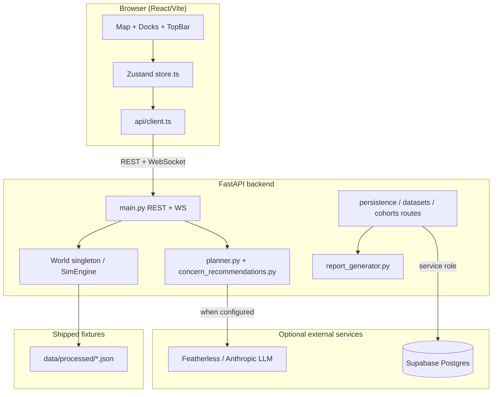

# WattIf — Complete Architecture & System Design

**Last updated:** 26 May 2026 (post Phase 12)

This document describes the **current** WattIf system as implemented in the repository. It is written for developers onboarding to the codebase. For stakeholder-facing language, see [`project_summary_overview_current.md`](./project_summary_overview_current.md).

**Related docs:** [`status_contract.md`](./status_contract.md) · [`schema_contracts.md`](./schema_contracts.md) · [`supabase_setup.md`](./supabase_setup.md) · [`demo_phase_12_final_qa.md`](./demo_phase_12_final_qa.md)

---

## 1. Executive summary

WattIf is a **Toronto-focused clean-energy city-planning sandbox** with a React map UI, a FastAPI simulation/planner backend, and optional Supabase persistence. Users place infrastructure on a neighbourhood map, run a monthly-tick demo simulation, upload datasets for planner context, generate **synthetic cohort concerns**, ask an **operator/planner agent** for recommendations, save snapshots, and export a **deterministic decision-support memo**.

The system is intentionally honest about scope:

- **Not** engineering-grade grid validation.
- **Not** public consultation or validated survey results.
- **Not** autonomous LLM resident agents (sim voices are template-based).
- **Not** city regeneration from uploaded datasets (uploads are metadata/preview/context only).
- **No** auth/RLS, PDF export, or full RAG today.

When Featherless (or Anthropic) is configured, the **planner/operator** can use a real LLM with tool calling. Resident/sim voices remain template-based by design.

---

## 2. Product purpose

WattIf helps planners, students, and hackathon judges **explore equity-weighted clean-energy siting** in a visual sandbox. It combines:

1. A **map-first build experience** (solar, wind, battery, microgrid, EV charger).
2. A **rule-based monthly simulation** with stress-test scenarios.
3. **Proposal persistence** (projects, proposals, placements, snapshots) via Supabase.
4. **Dataset-grounded synthetic cohort concerns** (deterministic, not real residents).
5. A **concern-aware operator/planner** that reads uploaded context and can recommend or place infrastructure.
6. A **decision-support memo** summarizing the proposal for stakeholders.

Results are **decision-support artifacts** for demos and product discovery — not municipal approval evidence.

---

## 3. System architecture



| Layer | Technology | Role |
|-------|------------|------|
| Frontend | React 19, Vite, TypeScript, Zustand, Tailwind, Radix/shadcn | Map UI, docks, Saved-tab review flow |
| Map | Mapbox GL / MapLibre fallback, deck.gl | Toronto basemap, infra layers, overlays |
| Backend | FastAPI, NumPy | Simulation, optimizer, planner, persistence API |
| Persistence | Supabase Postgres (optional) | Projects, proposals, datasets, concerns, snapshots, planner runs |
| LLM | Anthropic or Featherless OpenAI-compatible gateway | Operator/planner tool-calling when keys set |
| Demo fallback | Scripted demo LLM + planner-lite | Works offline / without API keys |

---

## 4. End-to-end data flow

### 4.1 Frontend load

1. `App.tsx` calls `store.init()` on mount.
2. `init()` fetches `/api/zones`, agents sample, infra, metrics, sentiment, voices, and **`GET /api/health`**.
3. If backend unreachable → `live: false`, frontend uses `frontend/src/data/mock.ts`.
4. If `persistenceProvider === "supabase"` → `loadProjects()` restores project/proposal selection from `localStorage` keys (`wattif:selectedProjectId`, `wattif:selectedProposalId`).

### 4.2 Backend world load

1. `state.get_world()` returns a process-wide `World` singleton.
2. `data/loader.py` loads `data/processed/zones.json` and `agents.json` when present; otherwise synthesizes from seed.
3. `SimEngine` initializes zone/agent arrays; scenarios and placed infra live in memory until session reset.

### 4.3 Project / proposal selection

1. User opens **Saved** tab (`ProjectsTab.tsx`).
2. `selectProject` / `selectProposal` in `store.ts` call persistence REST routes.
3. On proposal select: load `proposal_infrastructure`, snapshots, datasets, cohort concerns; restore infra into live sim via `POST /api/infra`; check `GET /api/proposals/{id}/operator-recommendation-status` for persisted operator rec.

### 4.4 Infrastructure placement

1. **Build** tab → user picks kind → map click → `POST /api/infra`.
2. If a proposal is selected and Supabase is on → row inserted in `proposal_infrastructure`.
3. Live sim `World.engine.infra` updated immediately (in-memory).

### 4.5 Dataset upload

1. **Saved** tab → `DatasetUploadPanel` → `POST /api/datasets/upload` (multipart).
2. Backend parses CSV/JSON/GeoJSON → stores **metadata + column list + preview rows** in `uploaded_datasets` (not full file bytes as a blob pipeline).
3. Classifier assigns `dataset_type` (e.g. `ev_chargers`, `energy_demand`, `ev_owner_feedback`).
4. **Does not** rebuild zones, agents, or simulation geometry.

### 4.6 Synthetic concern generation

1. `POST /api/projects/{id}/cohorts/generate` (optional `proposalId` query).
2. `concern_generator.py` deterministically maps dataset previews + proposal infra → cohort profiles + structured concerns.
3. Persisted to `agent_profiles` / `agent_concerns`.
4. No LLM required; not real residents.

### 4.7 Operator / planner recommendation

1. **Chat** tab → WebSocket `/ws/planner` (fallback `POST /api/planner/run`).
2. Concern-aware intent → `concern_recommendations.py` + optional real LLM tool loop in `planner.py`.
3. Events streamed: `thought`, `tool_call`, `tool_result`, `recommendation`, `placement`, `done`.
4. Concern recommendations logged to `planner_runs` (mode `concern_recommendation`) when Supabase is on.
5. Frontend readiness checklist updates only when a recommendation has a non-empty summary or persisted run exists.

### 4.8 Snapshot save / restore / compare

1. **Save snapshot** → `POST /api/proposals/{id}/snapshots` with tick, metrics, scenarios, infra JSON.
2. **Restore** → replays infra JSON into live sim only; does not mutate `proposal_infrastructure` rows.
3. **Compare** → `SnapshotCompare.tsx` shows live metrics vs selected snapshot (coverage, approval, equity, emissions, grid load, cost).

### 4.9 Decision memo generation

1. **Generate decision memo** → `GET /api/proposals/{id}/report` (JSON default; `?format=markdown|html` also supported).
2. `report_generator.py` collects persisted data deterministically — **no LLM required**.
3. Frontend `DecisionMemoPanel` supports copy markdown, download `.md`, download `.html`.
4. Returns **503** when Supabase is not configured.

---

## 5. Frontend architecture

### 5.1 Framework and libraries

| Library | Use |
|---------|-----|
| React 19 + Vite | SPA shell |
| TypeScript | Types shared via `frontend/src/types.ts` |
| Zustand | Central `store.ts` (~2k lines) |
| Tailwind + shadcn/Radix | UI primitives under `components/ui/` |
| deck.gl + react-map-gl | Map layers in `MapView.tsx`, `map/layers.ts` |
| lucide-react | Icons |
| recharts | Charts where used |

### 5.2 Layout

| Region | Component | Purpose |
|--------|-----------|---------|
| Top | `TopBar.tsx` | Live/mock, planner/voices/persistence honesty badges, guided demo |
| Left dock | `LeftDock.tsx` | Tabs: Build, **Saved**, Events, Priority, Map |
| Center | `MapView.tsx` | Interactive map |
| Right dock | `RightDock.tsx` | Tabs: Stats, Voices, **Chat**, Activity, Inspector |
| Bottom | `Timeline.tsx` | Sim playback controls |

### 5.3 Important Saved-tab components

| Component | Role |
|-----------|------|
| `ProjectsTab.tsx` | Project/proposal CRUD, hosts review sub-panels |
| `ProposalReviewPanel.tsx` | Summary stats + 8-item readiness checklist |
| `DatasetUploadPanel.tsx` | CSV/JSON/GeoJSON upload |
| `CohortConcernsPanel.tsx` | Generate/list synthetic cohort concerns |
| `SnapshotCompare.tsx` | Snapshot history, restore, live vs saved comparison |
| `DecisionMemoPanel.tsx` | Generate/copy/download decision memo |

### 5.4 Zustand store (`store.ts`)

Central application state:

- **Sim state:** zones, agents, infra, metrics, history, scenarios, sentiment, flows, voices.
- **Persistence:** projects, proposals, proposalInfrastructure, snapshots, datasets, cohorts, concerns.
- **Planner chat:** chat messages, busy/awaiting flags, WebSocket session.
- **UI:** panel open state, selected region, demo mode, toasts.
- **Health:** `backendHealth` from `/api/health`.
- **Readiness:** `operatorRecommendationReady`, `decisionMemo`.

Selection persists in `localStorage`; operator-rec flag also uses `sessionStorage` per proposal as a fast path, with Supabase `planner_runs` as source of truth after refresh.

### 5.5 API client (`api/client.ts`)

- Base URL: `VITE_API_URL` (default `http://localhost:8000`).
- `tryFetch` for sim endpoints with mock fallback.
- `persistenceFetch` for Supabase-backed routes; handles **503** gracefully.
- Planner: WebSocket session (`createPlannerSession`) with REST fallback.

**Note:** Frontend `VITE_SUPABASE_*` env vars exist in `.env.example` as placeholders; **persistence goes through the backend** with the service role key. The frontend does not use a Supabase client for writes today.

### 5.6 TopBar status labels (Phase 12)

| Label | Condition |
|-------|-----------|
| **Live API** / **Live + WS** | Backend reachable |
| **Mock data** | Backend unreachable |
| **Real LLM planner** | `health.realLlm` set (Anthropic or Feather) |
| **Demo planner** | Live backend, no `realLlm` |
| **Template voices** | Always shown — sim voices are template-based |
| **Supabase · no proposal** / **Saving to "…"** | Persistence mode |
| **In-memory** | No Supabase configured |

See [`status_contract.md`](./status_contract.md) and [`demo_phase_12_final_qa.md`](./demo_phase_12_final_qa.md).

---

## 6. Backend architecture

### 6.1 Entry point

`backend/app/main.py` — FastAPI app with CORS, lifespan logging, routers:

- `routes/persistence.py` — projects, proposals, infra, snapshots, report, operator status
- `routes/datasets.py` — upload and dataset context
- `routes/cohorts.py` — cohort/concern generation and listing

### 6.2 Simulation world / state

`backend/app/state.py` — `World` class:

- Loads zones/agents once at startup.
- Owns `SimEngine`, active scenarios, session reset.
- **Single in-memory singleton** — not multi-tenant; not auto-persisted between restarts.

### 6.3 Simulation engine

`backend/app/sim/engine.py` — monthly ticks:

- Coverage, equity, emissions, grid load, cost, approval proxies.
- Infrastructure kinds: `solar`, `wind`, `battery`, `microgrid`, `ev_charger`.
- EV chargers: simplified per-zone demand bump and sentiment nudges (not power-flow analysis).

Supporting modules: `sim/sentiment.py`, `sim/voices.py`, `scenarios.py`, `optimizer.py`.

### 6.4 Planner / operator

`backend/app/planner.py`:

- Tool schemas: `get_city_state`, `get_metrics`, `get_budget`, `optimize`, `place_infrastructure`, `launch_program`, etc.
- Provider selection: Anthropic → Feather → demo LLM → planner-lite (no key).
- WebSocket `/ws/planner` for multi-turn chat; `POST /api/planner/run` for one-shot.
- Concern mode: `_concern_recommendation_turn` uses `concern_recommendations.py`.

### 6.5 Report generator

`backend/app/report_generator.py`:

- `collect_report_data()` — queries Supabase repos.
- `build_report_sections()` — deterministic markdown sections.
- `generate_proposal_report()` — JSON + markdown + HTML.
- `fetch_operator_recommendation()` — reads latest `planner_runs` concern recommendation.

### 6.6 Config / env loading

`backend/app/config.py`:

- **Always** loads `backend/.env` via absolute path (cwd-independent).
- LLM: `ANTHROPIC_*`, `FEATHER_*` or `FEATHERLESS_*` aliases.
- `WATTIF_DEMO_LLM=1` default when no real key; real keys take precedence.
- Supabase: `SUPABASE_URL` + `SUPABASE_SERVICE_ROLE_KEY`.

---

## 7. Supabase persistence architecture

Schema migrations under `supabase/migrations/`:

| Table | Purpose |
|-------|---------|
| `projects` | Top-level workspace (default city: Toronto) |
| `proposals` | Saved scenarios within a project |
| `proposal_infrastructure` | Durable placement records per proposal |
| `simulation_snapshots` | Manual point-in-time metrics + scenarios + infra JSON |
| `uploaded_datasets` | Dataset registry: type, columns, preview rows, metadata |
| `agent_profiles` | Synthetic cohort personas |
| `agent_concerns` | Structured concerns linked to cohorts/datasets |
| `planner_runs` | Planner output log (incl. concern recommendations) |
| `asset_definitions` | Custom asset metadata (skeleton; limited UI) |

**RLS / auth:** explicitly deferred — backend uses service role only.

### Persisted vs in-memory

| Persisted (when Supabase on) | In-memory only |
|------------------------------|----------------|
| Project/proposal metadata | Full agent population (~8000 records in sim) |
| Proposal infrastructure rows | Live tick counter between saves |
| Snapshot records | Automatic sim state between sessions |
| Dataset metadata/previews | WebSocket planner session state |
| Cohort profiles/concerns | Scenario effects until snapshot/reset |
| Planner run outputs | Map viewport, UI panel state |

Live sim ticks always run in the backend `World` singleton. Snapshots are **manual**.

---

## 8. LLM / provider architecture

### Provider precedence (`config.llm_provider()`)

1. **Anthropic** — if `ANTHROPIC_API_KEY` set.
2. **Feather** — if `FEATHER_API_KEY` + `FEATHER_BASE_URL` (or `FEATHERLESS_*` aliases).
3. **Demo** — scripted deterministic provider if `WATTIF_DEMO_LLM=1` (default).
4. **None** — bare planner-lite if demo disabled and no keys.

`real_llm_provider()` returns Anthropic or Feather only (excludes demo).

### `/api/health` fields

```json
{
  "llmEnabled": true,
  "llmProvider": "feather",
  "realLlm": "feather",
  "persistenceProvider": "supabase",
  "supabaseConfigured": true
}
```

- `llmEnabled` includes the scripted demo provider — use **`realLlm`** for network-backed LLM truth.

### Real LLM planner vs template voices

| Surface | With Featherless/Anthropic | Without real LLM |
|---------|---------------------------|------------------|
| Operator/planner chat | Real tool-calling LLM (or concern rules + demo) | Scripted demo or planner-lite |
| Sim tick voices | **Template library** (`sim/voices.py`) | Template library |
| TopBar planner label | Real LLM planner | Demo planner |
| TopBar voices label | **Template voices** (always) | Template voices |
| Cohort concerns | Deterministic generator (no LLM) | Same |
| Decision memo | Deterministic report (no LLM) | Same |

Optional REST voice enrichment via `sim/llm.py` exists but is **not** the hot-path sim experience and is not autonomous resident agents.

---

## 9. Simulation architecture

### Zones and agents

- Source: `data/processed/zones.json` (~140 Toronto neighbourhoods when shipped).
- Agents: `agents.json` or synthesized to `WATTIF_NUM_AGENTS` (default 8000).
- Archetype mix from `archetypes.json` when available.

### Monthly ticks

- `POST /api/sim/step` advances `SimEngine` by N ticks.
- Metrics: coverage, equity score, emissions, grid load, cumulative cost, approval.
- WebSocket `/ws/sim` streams tick updates when connected.

### Infrastructure effects (simplified)

| Kind | Sim effect (high level) |
|------|-------------------------|
| solar / wind | Generation, coverage, emissions offset |
| battery | Storage / smoothing proxy |
| microgrid | Local resilience / equity nudge |
| ev_charger | Zone demand increase, charger-access sentiment, adoption nudges |

### Scenarios

`scenarios.py` — heatwave, blackout, ice storm, earthquake, ev_surge, etc. Localized or city-wide; affects demand, grid capacity, sentiment, infra damage flags.

---

## 10. Dataset / cohort architecture

### Upload scope

- Formats: CSV, JSON, GeoJSON (via `dataset_parse.py`).
- Stored: name, type, columns, row/feature counts, preview rows (capped), timestamps.
- Endpoints: project-level and proposal-level listing; `dataset_context` summaries for planner.

### No full RAG

Uploaded data is surfaced as **structured previews and summaries** to the planner and concern generator. There is no vector store, embedding index, or retrieval-augmented generation pipeline.

### Deterministic cohort concerns

`concern_generator.py` maps dataset types and proposal state to cohort profiles and concerns with severity, stance, topic, evidence, and related dataset IDs. Re-running with the same inputs yields the same outputs (seed-driven where applicable).

---

## 11. Operator / planner architecture

### Inputs read

- Uploaded dataset summaries/previews (`dataset_context.py`).
- Persisted cohort concerns (`cohort_context.py`).
- Live sim metrics, budget, zone equity state (via tools).
- Optional `projectId` / `proposalId` from frontend session.

### Outputs

- Natural-language recommendation summary.
- Structured actions (infra kinds, zones, tradeoffs).
- Optional `place_infrastructure` tool calls (auto or step-confirm mode).
- Persisted to `planner_runs` on concern recommendations.

### Provider behavior

- **Featherless configured:** real LLM tool-calling for general planner turns; concern mode combines rules + optional LLM phrasing paths.
- **No real provider:** scripted demo LLM simulates tool loop; concern recommendations still work via deterministic rules.

---

## 12. Decision memo / report architecture

### Properties

- **Deterministic** — assembled from Supabase records; no API key required.
- **Decision-support only** — explicit caveats section; not engineering validation.

### Report sections (10)

1. Executive Summary  
2. Proposal Infrastructure  
3. Uploaded Data Sources  
4. Simulation Metrics / Snapshot  
5. Synthetic Resident & Cohort Concerns  
6. Operator Recommendations  
7. Key Tradeoffs  
8. Resilience / Stress-Test Notes  
9. Recommended Next Steps  
10. Caveats  

### Export formats

| Format | Endpoint |
|--------|----------|
| JSON (default) | `GET /api/proposals/{id}/report` |
| Markdown | `?format=markdown` |
| HTML | `?format=html` |
| PDF | **Not implemented** |

Frontend downloads `.md` / `.html` client-side from JSON response fields.

---

## 13. Route / API inventory

### Health and meta

| Method | Path | Notes |
|--------|------|-------|
| GET | `/api/health` | Capability flags |

### Simulation core

| Method | Path | Notes |
|--------|------|-------|
| GET | `/api/zones`, `/api/agents` | World data |
| GET/POST/DELETE | `/api/infra` | Live placements |
| POST | `/api/sim/step`, `/api/sim/reset` | Tick / reset |
| GET | `/api/sim/metrics` | Current metrics |
| POST | `/api/session/reset` | Clear infra + scenarios |
| POST | `/api/scenario` | Apply stress test |
| GET | `/api/scenarios` | Active scenarios |
| GET | `/api/sentiment`, `/api/agents/voices`, `/api/flows` | Derived state |
| POST | `/api/optimize` | Equity-weighted siting recommendations |
| GET | `/api/siting-priority` | Build-priority ranking |
| WS | `/ws/sim` | Live tick stream |

### Planner

| Method | Path | Notes |
|--------|------|-------|
| POST | `/api/planner/run` | One-shot planner |
| WS | `/ws/planner` | Multi-turn chat |

### Persistence (503 when Supabase off)

| Method | Path | Notes |
|--------|------|-------|
| GET/POST | `/api/projects`, `/api/proposals` | CRUD |
| GET/POST/DELETE | `/api/proposals/{id}/infrastructure` | Saved placements |
| GET/POST | `/api/proposals/{id}/snapshots` | Snapshot history |
| GET | `/api/proposals/{id}/snapshots/latest` | Latest snapshot |
| GET | `/api/proposals/{id}/operator-recommendation-status` | Phase 12 readiness restore |
| GET | `/api/proposals/{id}/report` | Decision memo |

### Datasets

| Method | Path | Notes |
|--------|------|-------|
| POST | `/api/datasets/upload` | Parse + store preview |
| GET | `/api/projects/{id}/datasets` | List |
| GET | `/api/proposals/{id}/datasets` | List |
| GET | `/api/projects/{id}/dataset-context` | Summaries for planner |
| DELETE | `/api/datasets/{id}` | Remove registry row |

### Cohorts / concerns

| Method | Path | Notes |
|--------|------|-------|
| POST | `/api/projects/{id}/cohorts/generate` | Deterministic generation |
| GET | `/api/projects/{id}/cohorts`, `/concerns` | List |
| GET | `/api/proposals/{id}/cohorts`, `/concerns` | Proposal-scoped list |
| DELETE | `/api/concerns/{id}` | Remove concern |

### Reference / overlay data (Toronto fixtures)

| GET paths | Purpose |
|-----------|---------|
| `/api/facilities`, `/api/existing_infra`, `/api/constraints`, `/api/environment`, `/api/generation-mix`, `/api/flood`, `/api/heat-vulnerability`, `/api/district-energy`, `/api/sbei`, `/api/archetypes` | Read-only map layers; degrade gracefully when files absent |

---

## 14. Environment variables

### Backend (`backend/.env`)

| Variable | Required | Purpose |
|----------|----------|---------|
| `SUPABASE_URL` | For persistence | Supabase project URL |
| `SUPABASE_SERVICE_ROLE_KEY` | For persistence | Server-side DB access (**secret**) |
| `ANTHROPIC_API_KEY` | Optional | Primary LLM if set |
| `FEATHER_API_KEY` / `FEATHERLESS_API_KEY` | Optional | OpenAI-compatible gateway |
| `FEATHER_BASE_URL` / `FEATHERLESS_BASE_URL` | With feather key | Gateway base URL |
| `FEATHER_MODEL` / `FEATHERLESS_MODEL` | Optional | Model id (default `gpt-4o-mini`) |
| `WATTIF_DEMO_LLM` | Optional (default `1`) | Scripted demo planner when no real key |
| `WATTIF_CORS_ORIGINS` | Optional | CORS allowlist |
| `WATTIF_NUM_AGENTS`, `WATTIF_SEED`, `WATTIF_START_YEAR`, `WATTIF_TICK_SECONDS` | Optional | Sim tuning |

See `backend/.env.example` for full list.

### Frontend (`frontend/.env`)

| Variable | Required | Purpose |
|----------|----------|---------|
| `VITE_API_URL` | Optional (defaults localhost:8000) | Backend base URL |
| `VITE_MAPBOX_TOKEN` | Optional | Mapbox 3D basemap |
| `VITE_GOOGLE_MAPS_KEY` | Optional | Photorealistic 3D tiles overlay |
| `VITE_SUPABASE_URL`, `VITE_SUPABASE_ANON_KEY` | Optional | Placeholders; **not used for persistence writes today** |

See `frontend/.env.example`.

---

## 15. Implemented vs fallback vs missing

| Area | Status | Notes |
|------|--------|-------|
| Map + infra placement | **Implemented** | All five kinds incl. EV charger |
| Monthly sim + scenarios | **Implemented** | Rule-based, not power-flow |
| Optimizer / siting priority | **Implemented** | Greedy + optional OR-Tools path |
| Supabase persistence | **Implemented** | Optional; 503 when off |
| Dataset upload MVP | **Implemented** | Preview/metadata only |
| Synthetic cohort concerns | **Implemented** | Deterministic |
| Concern-aware operator | **Implemented** | Rules + optional real LLM |
| Snapshots + compare + restore | **Implemented** | Manual save |
| Decision memo JSON/MD/HTML | **Implemented** | Deterministic |
| Proposal review checklist | **Implemented** | 8 items, Saved tab |
| Featherless real LLM planner | **Implemented** | When keys configured |
| Frontend offline mock | **Mocked** | `mock.ts` fallback |
| Demo planner / demo LLM | **Fallback** | Default without keys |
| ML forecast / clustering | **Fallback** | Heuristics without `.joblib` |
| Template sim voices | **Fallback** | By design, not missing |
| Auth / RLS | **Missing** | Service role only |
| PDF export | **Missing** | |
| Full RAG | **Missing** | |
| Autonomous resident LLM agents | **Missing** | |
| City rebuild from uploads | **Missing** | |
| Auto live-sim persistence | **Missing** | Manual snapshots only |
| Multi-city upload | **Missing** | Toronto fixtures |

---

## 16. Known risks and limitations

1. **Single-world singleton** — one in-memory sim per backend process; not multi-user isolated.
2. **No auth** — anyone with backend access and service role can read/write all proposals.
3. **Metrics are directional** — suitable for demo tradeoffs, not utility interconnection studies.
4. **Synthetic concerns ≠ consultation** — do not present as validated public feedback.
5. **Upload scope** — previews may be incomplete vs full source files; no blob storage pipeline.
6. **Restore semantics** — snapshot restore updates live sim only, not proposal infra table.
7. **LLM cost/latency** — real planner calls are network-bound; tests isolate via `conftest.py`.
8. **Stale docs** — older files like `architecture.md` may predate Phases 7–12; prefer this doc and `status_contract.md`.

---

## 17. Future architecture direction

Planned or discussed — **not implemented**:

| Direction | Description |
|-----------|-------------|
| **Phase 15: optional Featherless synthetic resident agents** | LLM-generated resident personas distinct from today's template voices |
| **Auth / RLS** | User-scoped projects; anon key on frontend with policies |
| **Real dataset-driven city regeneration** | Rebuild zones/agents/sim from uploaded GIS — major pipeline |
| **Full RAG** | Embeddings + retrieval over uploaded documents |
| **PDF export / deployment** | Branded report PDF; hosted demo environment |
| **Automatic sim persistence** | Continuous checkpointing vs manual snapshots |
| **Custom GLB asset upload** | User-provided 3D models beyond shipped presets |

---

## 18. Key source files (quick index)

| Path | Responsibility |
|------|----------------|
| `frontend/src/store.ts` | Application state and orchestration |
| `frontend/src/api/client.ts` | HTTP/WS client |
| `frontend/src/components/ProjectsTab.tsx` | Saved-tab hub |
| `backend/app/main.py` | FastAPI routes |
| `backend/app/state.py` | World singleton |
| `backend/app/planner.py` | Agentic planner |
| `backend/app/concern_recommendations.py` | Concern-aware recommendations |
| `backend/app/report_generator.py` | Decision memo |
| `backend/app/data/concern_generator.py` | Synthetic cohorts |
| `backend/app/config.py` | Env and provider detection |
| `supabase/migrations/*.sql` | Postgres schema |
