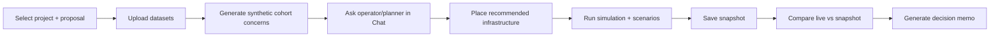

# WattIf — Project Summary & Current Overview

**Last updated:** 26 May 2026 (post Phase 12)

---

## One-paragraph summary

WattIf is a **Toronto clean-energy planning sandbox** that lets users place solar, wind, battery, microgrid, and EV-charging infrastructure on a neighbourhood map, run a demo simulation with stress-test scenarios, persist proposals in Supabase, upload datasets for context, generate **synthetic cohort concerns**, ask a **Featherless-backed operator/planner** for recommendations, save snapshots, and export a **decision-support memo**. It is built for demos, hackathons, and product discovery — **not** as engineering-grade grid validation or a substitute for public consultation.

---

## What WattIf is

An interactive **map-first energy-equity simulator** with:

- A visual **build and simulate** loop on real Toronto neighbourhood geometry (when shipped data is present).
- **Saved proposals** that bundle infrastructure, uploaded dataset context, synthetic concerns, snapshots, and exportable summaries.
- An **AI operator/planner** that can reason about concerns, budgets, and geography — using a real LLM (Featherless or Anthropic) when configured.

WattIf helps teams **show** how clean-energy siting, equity weighting, and stakeholder concerns might fit together in a planning workflow — with clear labels about what is real vs simulated.

---

## Who it is for

| Audience | How they use it |
|----------|-----------------|
| **Hackathon judges / demo viewers** | Guided flow: upload Islington CSVs → concerns → operator → snapshot → memo |
| **Product / policy teammates** | Explore UX for proposal review, readiness checklists, and decision memos |
| **Developers** | Extend persistence, planner tools, or simulation — see [`complete_architecture_system_design.md`](./complete_architecture_system_design.md) |
| **Urban / energy planners (exploratory)** | Stress-test ideas directionally — not for formal sign-off |

---

## The core user journey

1. **Create or open** a project and proposal in the **Saved** tab.  
2. **Upload** CSV/JSON/GeoJSON datasets (e.g. Islington EV charger, feedback, demand files).  
3. **Generate synthetic cohort concerns** from dataset previews.  
4. **Open Chat** and ask the operator to address concerns using uploaded context.  
5. **Place infrastructure** on the map (manually or via planner placements).  
6. **Run the simulation** and optionally fire stress-test scenarios.  
7. **Save a snapshot** of metrics and infra state.  
8. **Compare** live results to the saved snapshot.  
9. **Generate a decision memo** — copy or download Markdown/HTML.

Detailed demo steps: [`demo_phase_12_final_qa.md`](./demo_phase_12_final_qa.md) · [`demo_phase_11_review_flow.md`](./demo_phase_11_review_flow.md)

---

## Key features currently built

### Map and sandbox

- Mapbox or free MapLibre basemap over Toronto neighbourhoods.
- deck.gl layers: equity, demand, sentiment, flows, agents, existing infra.
- Region filter and 3D extrusion options.

### Infrastructure placement

- Place **solar, wind, battery, microgrid, EV charger** on the map.
- Equity-weighted **optimizer** and **build priority** suggestions.
- 3D GLB models for placed assets.

### EV chargers (Phase 6)

- First-class placeable kind with simplified sim effects (demand, sentiment, access proxies).
- Persisted to proposals and included in snapshots and memos.

### Simulation and scenarios

- Monthly tick simulation with coverage, approval, equity, emissions, grid load, cost.
- Scenarios: heatwave, blackout, ice storm, earthquake, EV surge, and more.
- Timeline playback and live WebSocket updates.

### Supabase proposal persistence (Phase 3+)

- Projects, proposals, proposal infrastructure, snapshots.
- Backend-only writes via service role — no auth/RLS yet.

### Dataset upload (Phase 7)

- CSV, JSON, GeoJSON → stored metadata, column list, and preview rows.
- Used as **planner and concern context** — does **not** rebuild the city.

### Synthetic cohort concerns (Phase 8)

- Deterministic personas and structured concerns from uploaded dataset previews.
- **Not real residents** and **not validated survey results**.

### Featherless operator / planner (Phases 9–12)

- Concern-aware recommendations with tradeoffs and optional auto-placement.
- Real LLM tool-calling when Featherless or Anthropic keys are configured.
- Demo/scripted fallback when no keys.

### Snapshots and comparison (Phase 5)

- Manual save of tick, metrics, scenarios, and infra JSON.
- Restore into live sim; side-by-side metric comparison.

### Decision memo export (Phase 10)

- Deterministic report from persisted proposal data.
- Copy Markdown; download `.md` or `.html`.
- **No PDF.**

### Proposal review checklist (Phase 11–12)

- **Saved** tab hub with 8-item readiness checklist:
  - Project selected · Proposal selected · Infrastructure placed · Dataset uploaded · Cohort concerns generated · Operator recommendation generated · Snapshot saved · Decision memo generated

---

## What is real / implemented

These work on the happy path when the backend is running and (where noted) Supabase is configured:

- Full map UI with live backend connection.
- Infrastructure placement and simulation ticks.
- Supabase-backed projects, proposals, placements, snapshots, datasets, concerns, planner runs.
- Dataset upload and deterministic concern generation.
- Operator/planner with concern mode and optional real LLM (Featherless).
- Snapshot save, restore, and comparison.
- Decision memo generation (JSON / Markdown / HTML).
- TopBar honesty labels: Live vs Mock, Real LLM vs Demo planner, Template voices, Supabase vs in-memory.
- EV chargers end-to-end in build, sim, persistence, and export.

---

## What is deterministic / fallback / demo

| Feature | Behavior |
|---------|----------|
| **Cohort concerns** | Rule-based generation from dataset previews — same inputs → same outputs |
| **Decision memo** | Assembled from DB records — no LLM required |
| **Sim voices** | Template library on tick path — not LLM residents |
| **Demo planner** | Scripted tool-calling loop when no real API key (`WATTIF_DEMO_LLM=1` default) |
| **Planner-lite** | Greedy optimizer path when demo LLM disabled and no keys |
| **ML forecast / clustering** | Heuristic fallback when ML model files absent |
| **Frontend mock** | Built-in Toronto sample data when backend offline |
| **Metrics** | Directional proxies — not utility-grade forecasting |

---

## What is not built yet

- **Authentication and Row Level Security (RLS)**
- **PDF export** for decision memos
- **Full RAG** over uploaded documents
- **Autonomous resident LLM agents** (simulated people do not independently reason via LLM)
- **Engineering-grade grid validation** or power-flow analysis
- **Real public consultation** or validated survey ingestion
- **City regeneration** from uploaded datasets (Toronto fixtures remain the sim world)
- **Automatic persistence** of live sim state (only manual snapshots)
- **Multi-city** “upload your city” pipeline
- **Production deployment** packaging (runs locally for demo)

---

## What is hardcoded or scoped for demo

| Area | Demo scope |
|------|------------|
| **Geography** | Toronto neighbourhoods from `data/processed/` fixtures; Islington CSVs are upload **context**, not a new city mesh |
| **Agents** | Thousands of representative synthetic records — not real individuals |
| **Voices** | Template quotes — TopBar always shows **Template voices** |
| **Datasets** | Preview rows and summaries only; full files are not a rebuild pipeline |
| **Concerns** | Synthetic cohort signals for decision-support — label clearly in UI |
| **Costs / emissions** | Presets and heuristics — not audited financial or carbon accounting |
| **Persistence** | Optional; app runs in-memory without Supabase |

---

## What Featherless does — and does not do

### Featherless **does**

- Power the **operator/planner** chat agent when `FEATHERLESS_API_KEY` and `FEATHERLESS_BASE_URL` (or `FEATHER_*` aliases) are set in `backend/.env`.
- Enable real tool-calling loops (optimize, place infrastructure, read metrics) for general planner turns.
- Surface in `/api/health` as `llmProvider: "feather"` and `realLlm: "feather"`.
- Show **Real LLM planner** in the TopBar when the backend is live.

Real keys take precedence over the scripted demo LLM (`WATTIF_DEMO_LLM`).

### Featherless **does not**

- Power **resident/sim voices** on the map — those remain **template-based**.
- Turn **synthetic cohort concerns** into real residents or validated public feedback.
- Generate the **decision memo** — that report is deterministic from Supabase data.
- Rebuild the **Toronto simulation** from uploaded CSVs.
- Replace **public consultation**, **engineering sign-off**, or **municipal approval** processes.

---

## Demo flow summary

**~10 minutes** — ideal judge path:

1. Confirm TopBar: **Live API**, **Real LLM planner**, **Template voices**, **Supabase**.
2. Saved tab → create project (e.g. *Islington EV Pilot*) and proposal.
3. Upload sample CSVs from repo root (`ev_chargers_islington_city_centre_west.csv`, etc.).
4. **Generate synthetic cohort concerns.**
5. Chat → *“Based on synthetic cohort concerns, what should we change in this proposal?”*
6. Place recommended infrastructure (including EV charger if suggested).
7. Run sim → **Save snapshot** → open comparison panel.
8. **Generate decision memo** → copy or download.
9. Refresh browser — proposal state and operator-rec status should reload from Supabase.

Full checklist: [`demo_phase_12_final_qa.md`](./demo_phase_12_final_qa.md)

---

## Honest caveats

Always disclose when presenting WattIf:

1. **Decision-support only** — memos and recommendations are demo artifacts, not engineering validation.
2. **Synthetic concerns** — generated from dataset previews; not real residents or public consultation.
3. **Template voices** — illustrative quotes, not autonomous AI stakeholders.
4. **Directional metrics** — useful for comparing scenarios in the sandbox, not for utility interconnection studies.
5. **No auth** — proposals are not user-scoped or access-controlled today.
6. **Uploads are context** — they inform the planner and concern generator; they do not replace Toronto base data.
7. **Snapshots are manual** — live sim state is in-memory until you explicitly save.

The UI includes caveat copy on the Decision Memo panel and Proposal Review panel reinforcing these points.

---

## Next feature opportunities

| Opportunity | Value |
|-------------|-------|
| **True synthetic resident LLM agents (Phase 15)** | Richer stakeholder simulation — still labelled synthetic, not real people |
| **Better dataset ingestion / re-simulation** | Upload GIS to reshape zones or demand — large engineering effort |
| **Auth / RLS** | Multi-user deployments with secure proposal ownership |
| **Full RAG** | Deeper document Q&A over uploaded materials |
| **PDF export + branded reports** | Stakeholder handouts from decision memos |
| **Hosted deployment** | Stable demo URL for judges and partners |
| **Automatic sim checkpointing** | Reduce reliance on manual snapshots |

See also [`project_plan.md`](./project_plan.md) and audit notes in [`audit/vision_gap_analysis.md`](./audit/vision_gap_analysis.md).

---

## Final positioning statement

**WattIf is a visual clean-energy planning sandbox for exploring equity-weighted infrastructure choices, synthetic stakeholder concerns, and operator-guided recommendations — with optional real LLM planning via Featherless, Supabase-backed proposal review, and exportable decision-support memos. It demonstrates a compelling workflow for energy-equity conversations; it does not replace engineering studies, utility analysis, or public consultation.**

---

## Related documentation

| Document | Audience |
|----------|----------|
| [`complete_architecture_system_design.md`](./complete_architecture_system_design.md) | Developers — full system design |
| [`status_contract.md`](./status_contract.md) | Implemented vs fallback labels |
| [`schema_contracts.md`](./schema_contracts.md) | API/DB type contracts |
| [`supabase_setup.md`](./supabase_setup.md) | Persistence setup |
| [`demo_phase_12_final_qa.md`](./demo_phase_12_final_qa.md) | Pre-demo verification |
| [`demo_phase_11_review_flow.md`](./demo_phase_11_review_flow.md) | Saved-tab walkthrough |
