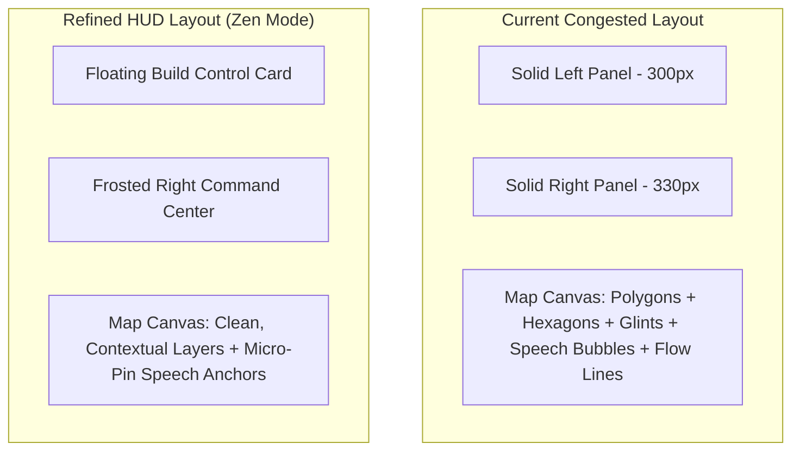

# WattIf UI Refinement & Decluttering Plan

This document diagnoses the visual congestion and cognitive distraction in the current layout and proposes a modern, premium **Sci-Fi Zen HUD** aesthetic. It details structural changes, contextual rendering rules, and code skeletons to achieve a state-of-the-art interface.

---

## 1. Visual Diagnosis: Why the UI Feels Congested

The current layout thrashes the user's attention with three distinct forms of noise:

1. **Solid Column Docks**: The Left Dock (300px) and Right Dock (330px) span the full height of the viewport as solid sidebar panels. They overlap up to **40% of the screen**, constricting the 3D map viewport into a narrow central corridor.
2. **Overlapping 3D Annotations**: Huge, persistent speech bubbles representing agent voices spawn directly on the map. As soon as multiple agents speak, these boxes collide, overlap, and completely obscure the zone topology.
3. **Data Churn Congestion**: Rooftop solar glints, moving flow trip particles, and agent dots render simultaneously citywide. This is both a WebGL performance burden and a visual overload.



---

## 2. The Refinement Vision: Sci-Fi Zen HUD

To transform WattIf into a wowed-at-first-glance premium product, we will implement three design pillars:

### A. The "Floating Glass" Sidebar Layout
* **Visual Style**: Replace the solid, screen-blocking panels with floating, absolutely-positioned, rounded cards (`rounded-2xl`) using frosted glass backgrounds (`backdrop-blur-lg bg-background/45 border-white/10`).
* **Acoustics**: By padding the panels away from the screen borders, the map canvas flows behind them, creating a rich 3D immersion.

### B. Interactive Speech Pins (No More Bubble Collision)
* **Visual Style**: Instead of rendering full text bubbles persistently on the map, replace them with tiny, pulsing **glowing conversation anchors** (e.g., small circular icons styled with HSL sentiment colors).
* **Behavior**: Hovering or clicking a pin expands it into a sleek, beautifully-formatted speech card. This hides 95% of text noise by default.

### C. Contextual Map Layering (Only Draw What Matters)
* **Solar Glints & Flows**: Hide individual home rooftop solar glints and flow particles when zoomed out (zoom < 12). Only fade them in when the user zooms in closely to inspect a borough.
* **Primary Overlays**: Force choropleth overlays (Equity, Demand, Sentiment) to fade out gracefully when Build Mode is active, letting the user place assets on a clean base style.

---

## 3. Structural Code Idea: Unified Right Panel

Instead of dividing Chat, Activity logs, and Voices into three congested tabs with separate unread counters, we combine them into a single, unified **Interactive Timeline & Co-Pilot Stream**. AI actions, public opinion voices, and simulation tick results flow together in a single conversational scroll!

Here is the proposed React code structure for the refined, decluttered `RightDock.tsx`:

```tsx
import { useState } from "react";
import { MessageSquare, BarChart3, Boxes } from "lucide-react";
import { useStore } from "@/store";
import { Hud } from "@/components/Hud";
import { ChatPanel } from "@/components/ChatPanel";
import { InfrastructureInspector } from "@/components/InfrastructureInspector";
import { Card } from "@/components/ui/card";

export function RefinedRightDock() {
  const [tab, setTab] = useState("timeline"); // unified timeline vs stats vs assets
  const selectedInfraId = useStore((s) => s.selectedInfraId);

  return (
    <div className="pointer-events-none absolute right-4 top-20 bottom-4 z-30 flex w-[340px] flex-col gap-3">
      {/* Floating Header Stats HUD */}
      <Card className="pointer-events-auto glass rounded-2xl p-4 shadow-xl border border-white/5 bg-background/50 backdrop-blur-md">
        <div className="flex items-center justify-between text-xs font-semibold">
          <span className="text-muted-foreground">ENERGY SYSTEM STATUS</span>
          <span className="h-2 w-2 animate-pulse rounded-full bg-emerald-400" />
        </div>
        
        {/* Sleek inline status readout */}
        <div className="mt-3 grid grid-cols-2 gap-3 text-sm font-bold tabular-nums">
          <div className="flex flex-col rounded-xl bg-white/5 p-2.5">
            <span className="text-[10px] text-muted-foreground uppercase font-normal">Coverage</span>
            <span className="text-primary mt-0.5 text-base">78.4%</span>
          </div>
          <div className="flex flex-col rounded-xl bg-white/5 p-2.5">
            <span className="text-[10px] text-muted-foreground uppercase font-normal">Approval</span>
            <span className="text-sky-300 mt-0.5 text-base">64.0%</span>
          </div>
        </div>
      </Card>

      {/* Main Frosted Workspace */}
      <Card className="pointer-events-auto glass flex min-h-0 flex-1 flex-col overflow-hidden rounded-2xl border border-white/5 bg-background/45 backdrop-blur-lg shadow-2xl transition-all duration-300">
        
        {/* Sleek segment bar */}
        <div className="m-2 flex justify-between p-1 rounded-xl bg-secondary/40 border border-white/5">
          <button
            onClick={() => setTab("timeline")}
            className={`flex-1 py-1.5 rounded-lg text-xs font-semibold transition-all flex items-center justify-center gap-1.5 ${
              tab === "timeline" ? "bg-background/80 text-foreground shadow" : "text-muted-foreground hover:text-foreground"
            }`}
          >
            <MessageSquare className="h-3.5 w-3.5" /> Stream
          </button>
          <button
            onClick={() => setTab("stats")}
            className={`flex-1 py-1.5 rounded-lg text-xs font-semibold transition-all flex items-center justify-center gap-1.5 ${
              tab === "stats" ? "bg-background/80 text-foreground shadow" : "text-muted-foreground hover:text-foreground"
            }`}
          >
            <BarChart3 className="h-3.5 w-3.5" /> Analysis
          </button>
          <button
            onClick={() => setTab("assets")}
            className={`flex-1 py-1.5 rounded-lg text-xs font-semibold transition-all flex items-center justify-center gap-1.5 ${
              tab === "assets" ? "bg-background/80 text-foreground shadow" : "text-muted-foreground hover:text-foreground"
            }`}
          >
            <Boxes className="h-3.5 w-3.5" /> Assets
          </button>
        </div>

        {/* Dynamic Contextual Workspace Content */}
        <div className="flex-1 overflow-hidden">
          {selectedInfraId ? (
            /* Context-Aware Inspector takes priority over standard tabs when an asset is clicked */
            <InfrastructureInspector />
          ) : tab === "timeline" ? (
            /* Stream unifies Chat messages, public opinion voices, and sim events */
            <ChatPanel />
          ) : tab === "stats" ? (
            <Hud />
          ) : (
            <InfrastructureInspector />
          )}
        </div>
      </Card>
    </div>
  );
}
```

---

## 4. Key Refinement Actions & TODO Checklist

> [!NOTE]
> **Refined Stream Integration**: Merging the separate text logs (AI chats, voice notifications, scenario alerts) into `ChatPanel.tsx` keeps the simulator's storytelling perfectly intact while cleaning up 66% of the RightDock tabs.

### Action Plan Checklist

- [ ] **Create Refined CSS Layout Tokens**: Add custom styling variables in `index.css` for Sci-Fi glassmorphism borders and floating shadow accents.
- [ ] **Convert Solid Columns to Absolute Floating Cards**:
  - Update `LeftDock.tsx` to mount with floating absolute positioning (`absolute left-4 top-20 bottom-4`).
  - Update `RightDock.tsx` using our `RefinedRightDock` structure with absolute floats.
- [ ] **Refine 3D Agent Speech Bubbles**:
  - Replace the large `TextLayer` speech bubbles in `map/layers.ts` with small, elegant message icon pins.
  - Expand speech bubble strictly on hover/click interaction.
- [ ] **Implement Contextual Map Rendering**:
  - Add zoom thresholds inside `layers.ts` for glints and flows to declutter the landscape when viewed from a high altitude.
