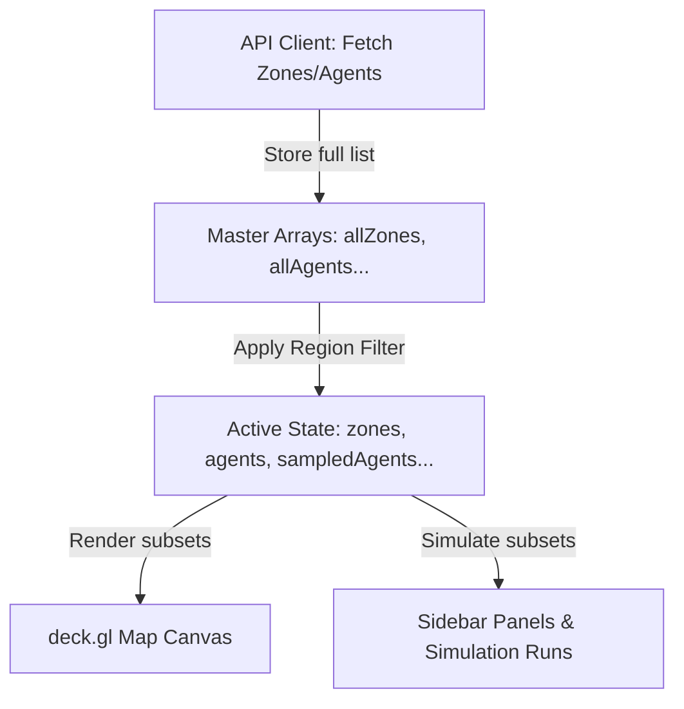

# Toronto Regional Simulator Selection Plan

This plan details the introduction of a premium regional scoping system for WattIf to resolve performance bottlenecks. By allowing the user to select a specific region of Toronto (or the full city), we drastically reduce GeoJSON rendering, agent model counts, and active calculation overhead. 

---

## 1. Visual Design & Concept

WattIf will feature a hybrid region selector allowing both **modal selection** and **interactive map cursor selection**:

### Option A: Premium Glassmorphism Modal
* A beautiful, blur-backed dark modal that appears on initial load (integrated with or right after the Welcome screen).
* Displays distinct grid cards for each region: **All Toronto, Downtown, Midtown, North York, Scarborough, Etobicoke, East Toronto, West Toronto**.
* Each card shows quick stats: a themed icon, name, neighborhood count, and simulation load rating (e.g., "All Toronto" = "Heavy", "Scarborough" = "Very Light").
* Premium CSS animations (hover lift, border-glowing gradients, active selection pulses).

### Option B: Interactive Map Cursor Selection
* A "Map Cursor Selection" option in the modal that lets the user click directly on the map.
* Once activated, a sleek banner overlay says: `Hover and click any neighborhood to lock its region`.
* Hovering over any neighborhood dynamically lights up **all neighborhoods in that entire region** in a glowing emerald/cyan color on the map.
* A floating deck.gl tooltip shows information about the highlighted region (neighborhood count and population).
* Clicking any zone locks in its region, filters the simulation, and flies the camera to center on the selected region.

---

## 2. Technical Architecture & File Changes

The filtering is performed entirely in the frontend **Zustand store** to avoid server-side mutations or complex sync problems. By retaining master copies of the raw lists in the store, we can dynamically filter on-the-fly without repeating network fetches or breaking existing simulation flows.



### [MODIFY] [store.ts](file:///c:/Users/sakib/Desktop/seneca%20hackathon-2026/code/frontend/src/store.ts)
We will add master state fields, cursor states, and a new `setSelectedRegion` action to manage filtering.

```typescript
// 1. Add fields to State definition
allZones: Zone[];
allAgents: Agent[];
allSampledAgents: Agent[];
allFacilities: Facility[];
allExistingInfra: ExistingInfra[];

selectedRegion: string; // "All" | "Downtown" | "Midtown" | "North York" | "Scarborough" | "Etobicoke" | "East Toronto" | "West Toronto"
showRegionSelector: boolean;
regionCursorMode: boolean;
hoveredRegion: string | null;

// 2. Add actions
setSelectedRegion: (region: string) => void;
setRegionCursorMode: (on: boolean) => void;
setHoveredRegion: (region: string | null) => void;
```

#### Filtering logic in `setSelectedRegion`:
```typescript
setSelectedRegion: (region) => {
  const { allZones, allAgents, allSampledAgents, allFacilities, allExistingInfra } = get();
  set({ selectedRegion: region });
  
  if (region === "All") {
    set({
      zones: allZones,
      agents: allAgents,
      sampledAgents: allSampledAgents,
      facilities: allFacilities,
      existingInfra: allExistingInfra,
    });
    get().resetView(); // Centered at Toronto initial view
  } else {
    const filteredZones = allZones.filter(z => getZoneRegion(z.name) === region);
    const zIds = new Set(filteredZones.map(z => z.id));
    
    set({
      zones: filteredZones,
      agents: allAgents.filter(a => zIds.has(a.zoneId)),
      sampledAgents: allSampledAgents.filter(a => zIds.has(a.zoneId)),
      facilities: allFacilities.filter(f => !f.zoneId || zIds.has(f.zoneId)),
      existingInfra: allExistingInfra.filter(e => !e.zoneId || zIds.has(e.zoneId)),
    });

    // Fly camera to the average centroid of the selected region
    if (filteredZones.length > 0) {
      const avgLng = filteredZones.reduce((s, z) => s + z.centroid[0], 0) / filteredZones.length;
      const avgLat = filteredZones.reduce((s, z) => s + z.centroid[1], 0) / filteredZones.length;
      set({ flyTo: { target: [avgLng, avgLat], zoom: 12.5, nonce: Date.now() } });
    }
  }
}
```

---

### [NEW] [RegionSelector.tsx](file:///c:/Users/sakib/Desktop/seneca%20hackathon-2026/code/frontend/src/components/RegionSelector.tsx)
A gorgeous, modern overlay with tailormade cards, descriptive texts, loads indicators, and cursor-selection triggers.

### [MODIFY] [App.tsx](file:///c:/Users/sakib/Desktop/seneca%20hackathon-2026/code/frontend/src/App.tsx)
Add `<RegionSelector />` to the main DOM hierarchy and auto-open it on startup or if `showRegionSelector` is active.

### [MODIFY] [TopBar.tsx](file:///c:/Users/sakib/Desktop/seneca%20hackathon-2026/code/frontend/src/components/TopBar.tsx)
Add an elegant button badge showing the active region `📍 Region: Scarborough` next to the zone badge, giving a clean access point to change the scope.

### [MODIFY] [MapView.tsx](file:///c:/Users/sakib/Desktop/seneca%20hackathon-2026/code/frontend/src/components/MapView.tsx)
* Wire map-hover in cursor selection mode to update the store's `hoveredRegion`.
* Wire map-click to capture region clicks and set selected region.
* Render a custom HUD overlay at the top when in Map Cursor Selection mode (`Esc to exit`).

### [MODIFY] [layers.ts](file:///c:/Users/sakib/Desktop/seneca%20hackathon-2026/code/frontend/src/map/layers.ts)
* Pass `regionCursorMode` and `hoveredRegion` into `buildLayers`.
* Render a glowing GeoJSON boundary highlight of all zones in the hovered region, giving a satisfying interactive feedback on hover.

---

## 3. Help & Key Details

> [!TIP]
> **Performance Improvements**: Selecting a region like Scarborough drops the zone count from 44 to 3 and active agents from 4,000 to ~250. This decreases WebGL buffers by 90% and eliminates all CPU overhead for calculations, instantly solving the frame rate drops.

> [!IMPORTANT]
> **Defensive Fallbacks**: Keeping master copies (`allZones`, etc.) preserves offline/online states. When the live stream reconnects, it updates the master lists and naturally preserves the active regional filters without having to reload the page.

---

## 4. Verification Plan

### Automated/Code Verification
* Check that TypeScript builds cleanly without any errors.
* Validate that Zustand updates and filters properly without mutations.

### Manual Verification
1. Launch the frontend and verify the gorgeous **Simulation Region selector** pops up.
2. Select **Scarborough** -> Observe that only Scarborough zones, agents, existing installations, and recommend spots show on the map, with the map flying to Scarborough.
3. Observe the dramatic performance improvement (solid 60 FPS, completely lag-free).
4. Click the top-right `📍 Scarborough` pill -> Select **Use map cursor** -> Hover over Downtown and see all Downtown zones glow green -> Click to select, verifying it centers on Downtown and simulates only Downtown.
5. Choose **All Toronto** to verify it recovers the full city seamlessly.
